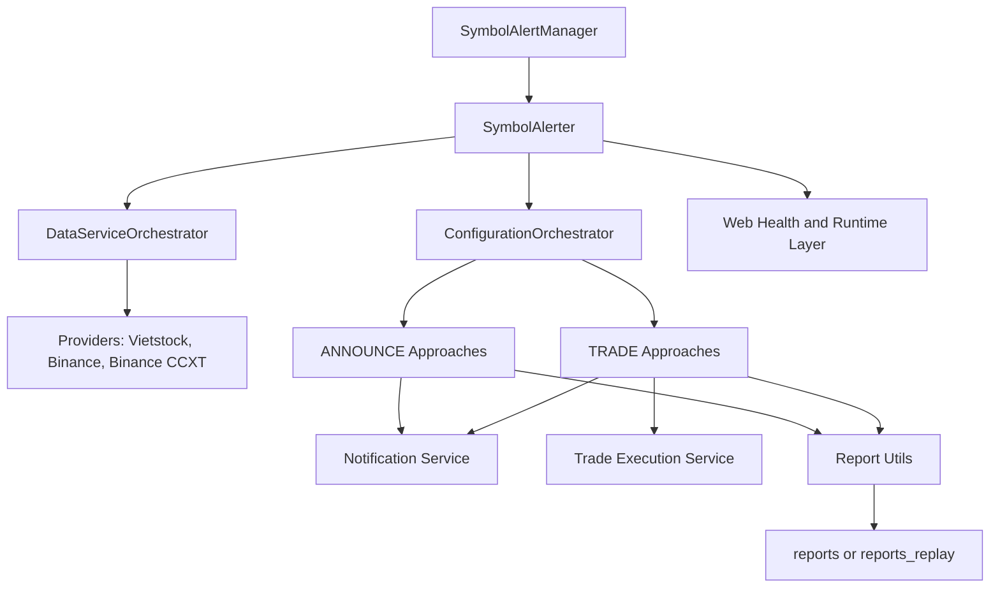
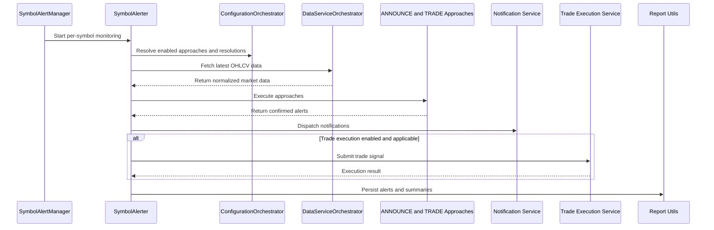

# Stock Trading Alert System

This repository contains a real-time trading alert and execution platform for monitoring configured symbols, detecting market events across multiple strategies, dispatching alerts through multiple channels, and producing replay and performance analysis outputs.

At a high level, the system orchestrates market data collection, per-symbol monitoring, multi-resolution signal evaluation, notification delivery, reporting, and optional live trade execution. The detailed design lives in [docs/ARCHITECTURE/README.md](docs/ARCHITECTURE/README.md); this README is the business-and-developer entry point.

## What The System Does

The platform is designed to:

- Monitor multiple symbols across supported market data providers.
- Run configured ANNOUNCE and TRADE approaches at symbol-specific resolutions.
- Validate and deduplicate alerts before delivery.
- Deliver alerts through configured notification channels.
- Store alert outputs for live monitoring and replay analysis.
- Run deterministic historical replay and performance measurement workflows.
- Optionally execute live Binance perpetual futures trades in deployment mode.

The architecture documentation describes the operating model as:

- `LIVE` mode for continuous monitoring and production alerting.
- `REPLAY` mode for deterministic historical simulation and backtesting.
- Deployment-aware behavior for credentials, notifications, and trade execution.

In the current codebase, these behaviors are configured through [src/stockreports/config/settings.py](src/stockreports/config/settings.py), with replay-style output separation additionally controlled by `DEBUG_REPLAY_START_TIME`.

## End-To-End Orchestration

The system is organized as a coordinated workflow rather than a single script:

1. A multi-symbol orchestrator starts monitoring for configured symbols.
2. Each symbol runs in its own monitoring loop with symbol-specific trading hours and approach mappings.
3. A configuration layer resolves which approaches run and at which resolutions.
4. Data services fetch and prepare market data from supported providers.
5. ANNOUNCE and TRADE approaches evaluate the latest data and emit confirmed alerts.
6. Alert outputs are deduplicated, recorded, and delivered through notification channels.
7. Optional downstream workflows perform replay analysis, reporting, and live trade execution.

For the authoritative system flow, start with [docs/ARCHITECTURE/SYSTEM_ARCHITECTURE_OVERVIEW.md](docs/ARCHITECTURE/SYSTEM_ARCHITECTURE_OVERVIEW.md).

## Architecture Component Diagram



## End-To-End Sequence Diagram



## Primary Capabilities

### Business View

- Multi-symbol market monitoring with isolated per-symbol execution.
- Strategy-driven alerting across multiple alert approaches and resolutions.
- Multi-channel alert delivery for operational responsiveness.
- Historical replay and performance reporting for strategy evaluation.
- Optional automated execution path for Binance perpetual futures.

### Developer View

- Layered orchestration from entry point through reporting and execution.
- Separate architecture reference and implementation guide documentation.
- Config-driven approach selection, trading hours, and notification behavior.
- Multiple data providers with orchestration and caching layers.
- Deployment-aware credentials and environment detection model.

## Repository At A Glance

- [src/stockreports](src/stockreports) contains the application code for alerting, data services, notification delivery, configuration, reporting, and trade execution.
- [tests](tests) contains unit and integration coverage for the system.
- [docs/ARCHITECTURE](docs/ARCHITECTURE) contains the main architecture, implementation, and audience-specific documentation.
- [reports](reports) is the default alert and report output tree.
- [reports_replay](reports_replay) is used when replay-style output separation is enabled through `DEBUG_REPLAY_START_TIME`.
- [deployment](deployment) and root deployment manifests contain operational launch and infrastructure assets.

## Setup And Configuration

### 1. Install Dependencies

For local development, create a virtual environment and install the project requirements.

```bash
python3 -m venv .venv
source .venv/bin/activate
pip install -r requirements.txt
```

### 2. Configure Runtime Mode

The main runtime behavior is controlled in [src/stockreports/config/settings.py](src/stockreports/config/settings.py).

The most important settings are:

- `MODE`: use `DEVELOPMENT` for historical replay and testing, `DEPLOYMENT` for continuous live monitoring.
- `DEV_DATA_DATE_RANGE`: controls the replay window in development mode.
- `DEBUG_REPLAY_START_TIME`: when set, report output is redirected to `reports_replay`.
- `MONITORING_INTERVAL_SECONDS`: polling interval for deployment mode.
- `LOG_LEVEL` and `LOGS_DIR`: logging behavior.
- `ENABLE_GCS_REPORT_STORAGE`: optional Cloud Storage upload behavior.

### 3. Configure Symbols And Approaches

Symbol enablement and per-approach behavior are driven by [src/stockreports/config/executor_approach_configuration.json](src/stockreports/config/executor_approach_configuration.json).

Use this file to:

- Enable or disable symbols.
- Enable or disable specific approaches per symbol.
- Set approach type and resolution.
- Bind symbols to trading-hours definitions.
- Configure per-approach validation and notification options.

This is the configuration the alert manager reads to determine which symbols and approaches actually run.

### 4. Configure Data Providers

Provider registration and supported symbol mappings live in [src/stockreports/config/data_provider_settings.py](src/stockreports/config/data_provider_settings.py).

Use this file to:

- Choose enabled providers through `ENABLED_DATA_PROVIDERS`.
- Confirm provider-specific supported symbols.
- Adjust provider timeouts, retries, and cache TTL values.

### 5. Configure Notifications And Secrets

Notification credentials are loaded by [src/stockreports/config/secrets_loader.py](src/stockreports/config/secrets_loader.py) in this priority order:

1. Environment variables
2. Secret managers
3. Local `.env` file
4. Non-sensitive defaults

For local development, place a `.env` file at the repository root and keep it out of source control.

Common variables include:

```env
EMAIL_ENABLED=true
EMAIL_SENDER=your-email@example.com
EMAIL_APP_PASSWORD=your-app-password
EMAIL_RECEIVERS=ops@example.com

NTFY_ENABLED=false
NTFY_TOPICS=your_topic_name

TWILIO_ENABLED=false
TWILIO_ACCOUNT_SID=
TWILIO_AUTH_TOKEN=
TWILIO_PHONE_NUMBER=
SMS_RECEIVER_PHONE_NUMBER=

SLACK_WEBHOOK_URLS=https://hooks.slack.com/services/...
```

Email, ntfy, and Twilio credentials and env-backed enablement are defined in [src/stockreports/config/notification_settings.py](src/stockreports/config/notification_settings.py).

Channel routing by symbol, approach, and signal is defined separately in [src/stockreports/config/notification_service_config.json](src/stockreports/config/notification_service_config.json). Slack webhook credentials are loaded from `SLACK_WEBHOOK_URLS`, but Slack activation is controlled in this routing file rather than by a global `SLACK_ENABLED` flag.

### 6. Validate Configuration Before Running

You can inspect the effective runtime configuration and credential loading with:

```bash
python -m src.stockreports.cli verify-config
python -m src.stockreports.cli test-credentials
```

## Running The Project

### Local Service Runtime

The primary service entrypoint is [src/stockreports/web.py](src/stockreports/web.py). It exposes a Flask `/health` endpoint and launches the symbol alert manager in a background thread.

```bash
python -m src.stockreports.web
```

By default this binds to port `8080`, or to `PORT` if that environment variable is set.

### Run The Alert Manager Directly

For direct execution without the Flask wrapper:

```bash
python -m src.stockreports.alert.symbol_alert_manager --generate-alerts
```

This uses the enabled symbols from [src/stockreports/config/executor_approach_configuration.json](src/stockreports/config/executor_approach_configuration.json) and the active mode from [src/stockreports/config/settings.py](src/stockreports/config/settings.py).

### Run Consolidated Analysis

To run the consolidated profitability analysis workflow:

```bash
python -m src.stockreports.alert.symbol_alert_manager --run-analysis
```

This is only meaningful when `MODE` is set to `DEVELOPMENT` and consolidated profitability is enabled in [src/stockreports/config/settings.py](src/stockreports/config/settings.py).

### Docker Runtime

The repository Docker runtime starts the web entrypoint from [Dockerfile](Dockerfile):

```bash
docker compose up --build
```

For containerized local runs, Docker Compose reads `.env` through [docker-compose.yml](docker-compose.yml). The current compose file publishes `5000:5000`, while [src/stockreports/web.py](src/stockreports/web.py) defaults to port `8080`, so set `PORT=5000` in `.env` or adjust the port mapping if you want the container port and published port to align.

### Outputs

- Default alert outputs are written under [reports](reports).
- Replay-separated outputs are written under [reports_replay](reports_replay) when `DEBUG_REPLAY_START_TIME` is set.
- Logs are written under [logs](logs).

## Documentation Map

### Start Here

- [docs/ARCHITECTURE/README.md](docs/ARCHITECTURE/README.md): top-level documentation navigator.
- [docs/ARCHITECTURE/SYSTEM_ARCHITECTURE_OVERVIEW.md](docs/ARCHITECTURE/SYSTEM_ARCHITECTURE_OVERVIEW.md): complete end-to-end architecture.

### For Business, Stakeholders, And Operators

- [docs/ARCHITECTURE/AUDIENCE_SPECIFIC_ARCHITECTURE/BUSINESS_VALUE_FOR_STAKEHOLDERS.md](docs/ARCHITECTURE/AUDIENCE_SPECIFIC_ARCHITECTURE/BUSINESS_VALUE_FOR_STAKEHOLDERS.md): business value and stakeholder framing.
- [docs/ARCHITECTURE/AUDIENCE_SPECIFIC_ARCHITECTURE/INVESTOR_PARTNER_OVERVIEW.md](docs/ARCHITECTURE/AUDIENCE_SPECIFIC_ARCHITECTURE/INVESTOR_PARTNER_OVERVIEW.md): investor and partner overview.
- [docs/ARCHITECTURE/AUDIENCE_SPECIFIC_ARCHITECTURE/ARCHITECTURE_FOR_CLIENTS.md](docs/ARCHITECTURE/AUDIENCE_SPECIFIC_ARCHITECTURE/ARCHITECTURE_FOR_CLIENTS.md): trader and client-facing system explanation.
- [docs/ARCHITECTURE/AUDIENCE_SPECIFIC_ARCHITECTURE/ARCHITECTURE_FOR_OPERATIONS.md](docs/ARCHITECTURE/AUDIENCE_SPECIFIC_ARCHITECTURE/ARCHITECTURE_FOR_OPERATIONS.md): operational architecture, deployment, and monitoring context.

### For Developers

- [docs/ARCHITECTURE/TECHNICAL_REFERENCE/README.md](docs/ARCHITECTURE/TECHNICAL_REFERENCE/README.md): architecture patterns, layer theory, and design decisions.
- [docs/ARCHITECTURE/IMPLEMENTATION_GUIDES/README.md](docs/ARCHITECTURE/IMPLEMENTATION_GUIDES/README.md): practical implementation and extension guides.
- [docs/ARCHITECTURE/MICROSERVICE_COMPONENT_OVERVIEW.md](docs/ARCHITECTURE/MICROSERVICE_COMPONENT_OVERVIEW.md): code-mirrored component map.
- [docs/ARCHITECTURE/CONFIGURATION_SERVICE/TRADING_HOURS_AND_MULTI_APPROACH_EXECUTION.md](docs/ARCHITECTURE/CONFIGURATION_SERVICE/TRADING_HOURS_AND_MULTI_APPROACH_EXECUTION.md): symbol-centric trading hours and multi-approach execution.

### Specialized Topics

- [docs/ARCHITECTURE/BACKTESTING_AND_PERFORMANCE.md](docs/ARCHITECTURE/BACKTESTING_AND_PERFORMANCE.md): replay, simulation, consolidation, and performance reporting workflow.
- [docs/ARCHITECTURE/SECURE_CREDENTIALS_MANAGEMENT/README.md](docs/ARCHITECTURE/SECURE_CREDENTIALS_MANAGEMENT/README.md): secure credential resolution and environment-aware configuration.
- [docs/ARCHITECTURE/IMPLEMENTATION_GUIDES/LAYER_9_OPERATIONAL_SUPPORT/OPERATIONS_DEPLOYMENT_GUIDE.md](docs/ARCHITECTURE/IMPLEMENTATION_GUIDES/LAYER_9_OPERATIONAL_SUPPORT/OPERATIONS_DEPLOYMENT_GUIDE.md): deployment guide.
- [docs/ARCHITECTURE/IMPLEMENTATION_GUIDES/LAYER_9_OPERATIONAL_SUPPORT/TROUBLESHOOTING_GUIDE.md](docs/ARCHITECTURE/IMPLEMENTATION_GUIDES/LAYER_9_OPERATIONAL_SUPPORT/TROUBLESHOOTING_GUIDE.md): troubleshooting guide.
- [docs/ARCHITECTURE/TECHNICAL_REFERENCE/LAYER_10_TRADE_EXECUTION/README.md](docs/ARCHITECTURE/TECHNICAL_REFERENCE/LAYER_10_TRADE_EXECUTION/README.md): trade execution service architecture.

## Working With This Repository

If you are new to the project, the most reliable reading order is:

1. [docs/ARCHITECTURE/SYSTEM_ARCHITECTURE_OVERVIEW.md](docs/ARCHITECTURE/SYSTEM_ARCHITECTURE_OVERVIEW.md)
2. [docs/ARCHITECTURE/AUDIENCE_SPECIFIC_ARCHITECTURE/ARCHITECTURE_FOR_OPERATIONS.md](docs/ARCHITECTURE/AUDIENCE_SPECIFIC_ARCHITECTURE/ARCHITECTURE_FOR_OPERATIONS.md) if you need deployment and runtime context.
3. [docs/ARCHITECTURE/TECHNICAL_REFERENCE/README.md](docs/ARCHITECTURE/TECHNICAL_REFERENCE/README.md) if you need architecture depth.
4. [docs/ARCHITECTURE/IMPLEMENTATION_GUIDES/README.md](docs/ARCHITECTURE/IMPLEMENTATION_GUIDES/README.md) if you are modifying or extending the system.

## Current Scope

Based on the current architecture documentation, this repository is not a generic market-data utility package. It is a trading alert orchestration system with notification, replay, reporting, environment-aware configuration, and optional live execution capabilities.
