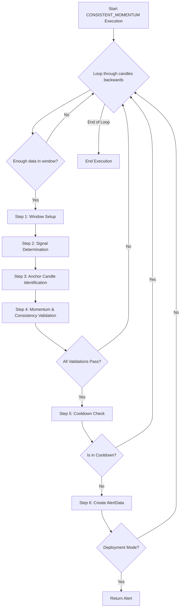

# CONSISTENT_MOMENTUM Approach v1

## 1. Objective

The CONSISTENT_MOMENTUM approach identifies strong, sustained price moves by detecting a sequence of candles with consistent color and momentum, anchored by a key candle. The last candle's color determines the signal, and the anchor is the candle with the minimum open (for BUY) or maximum open (for SELL) within the lookback window. The approach enforces strict validation of momentum, volume, and price consistency to filter for high-quality trend continuation signals.

## 2. Key Parameters

Parameters are loaded from `signal_settings.py` via `ConsistentMomentumSettings`.

| Parameter                                   | Description                                                        |
|---------------------------------------------|--------------------------------------------------------------------|
| `LOOKBACK_WINDOW`                           | Number of candles in the analysis window.                          |
| `MIN_CONSISTENT_CANDLES`                    | Minimum consecutive candles of the same color required.            |
| `MAGNITUDE_THRESHOLD`                       | Minimum price move required for alert creation.                    |
| `COOLDOWN_WINDOW`                           | Number of candles to wait before issuing a new alert.              |
| `MAX_MULTIPLIER_DIFFERENCE_VOLUME_THRESHOLD`| Max allowed volume difference multiplier for consistency.          |
| `MIN_CONFIRMATION_WINDOW_PRICE_THRESHOLD`    | Minimum price range in confirmation window.                        |
| `MAX_CONFIRMATION_WINDOW_PRICE_THRESHOLD`    | Maximum price range in confirmation window.                        |
| `MAX_CONFIRMATION_GAP_THRESHOLD`            | Maximum allowed gap between consecutive candles.                   |

## 3. Step-by-Step Logic

The executor analyzes data in a reverse loop, starting from the most recent candle. For each analysis window, it performs the following validation steps sequentially:

1.  **Step 1: Window Setup**
    *   Extract a lookback window of size `LOOKBACK_WINDOW`.
    *   If insufficient data, skip.

2.  **Step 2: Signal Determination**
    *   The last candle's color (bullish/bearish) determines the signal (BUY/SELL).
    *   If ambiguous, skip.

3.  **Step 3: Anchor Candle Identification**
    *   For BUY: Find candle with minimum open in window.
    *   For SELL: Find candle with maximum open in window.
    *   Anchor must be present; else skip.

4.  **Step 4: Momentum & Consistency Validation**
    *   Validate minimum number of consistent color candles (`MIN_CONSISTENT_CANDLES`).
    *   Validate price move magnitude (`MAGNITUDE_THRESHOLD`).
    *   Validate volume consistency (`MAX_MULTIPLIER_DIFFERENCE_VOLUME_THRESHOLD`).
    *   Validate price range in confirmation window (`MIN_CONFIRMATION_WINDOW_PRICE_THRESHOLD`, `MAX_CONFIRMATION_WINDOW_PRICE_THRESHOLD`).
    *   Validate maximum allowed gap between candles (`MAX_CONFIRMATION_GAP_THRESHOLD`).
    *   Validate anchor candle is at window boundary or among top 2 max body candles.
    *   If any validation fails, the window is discarded.

5.  **Step 5: Cooldown Check**
    *   Ensure no alert for the same symbol/signal within `COOLDOWN_WINDOW`.
    *   If in cooldown, the window is discarded.

6.  **Step 6: Alert Creation**
    *   If all validations pass, create an `AlertData` object and update `LATEST_ALERT`.

## 4. Flow Diagram

## 5. Example

- If the last 7 candles are all bullish, the last candle is bullish, and the anchor is the lowest open in the window, with all validations passing, a BUY alert is generated.
- If the last 6 candles are bearish, the last candle is bearish, and the anchor is the highest open, with all validations passing, a SELL alert is generated.

---

*This documentation is code-mirrored and verified as of May 29, 2026.*
