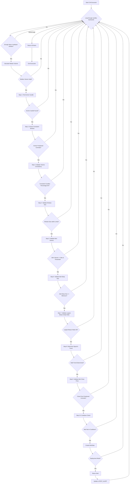

# CVA (Consistent Volume Anchor) Approach

## 1. Objective

The CVA (Consistent Volume Anchor) approach identifies high-probability reversal signals by detecting anchor candles with consistent volume patterns and confirming with alert candles showing significant volume spikes and strong body sizes. The strategy captures market turning points by analyzing volume consistency within a window, validating that the subsequent alert candle exhibits strong directional movement and positioning that contradicts the consistent volume pattern.

## 2. Key Parameters

The behavior of the CVA executor is controlled by the following parameters, configured in `src/stockreports/config/signal_settings.py`.

| Parameter                             | Default Value | Description                                                                                                                                                     |
| ------------------------------------- | ------------- | --------------------------------------------------------------------------------------------------------------------------------------------------------------- |
| `LOOKBACK_WINDOW`                     | 10            | The number of candles to analyze in the main analysis window for identifying anchor patterns.                                                                   |
| `MAX_CONSISTENT_VOLUME_MULTIPLIER`    | 1.3           | Volume filter threshold: candles included in consistent window must have volume ≤ `median_volume × 1.3`.                                                      |
| `CONSISTENT_CANDLE_PERCENTAGE`        | 0.7           | Minimum percentage of candles in the window (from anchor to penultimate candle) that must satisfy volume and body size conditions (e.g., 0.7 = 70%).            |
| `MAX_CONSISTENT_WINDOW_SIZE`          | 1.5           | Maximum allowed price range (in points) of the consistent volume window. Ensures candles are clustered in a tight range.                                       |
| `MAX_CONSISTENT_BODY_SIZE_CANDLE`     | 0.5           | Maximum body size (in points) allowed for candles within the consistent volume window. Filters out large moves within the consistency zone.                     |
| `MIN_VOLUME_CONFIRMATION_MULTIPLIER`  | 1.5           | Alert candle volume must be at least this multiple of the minimum volume in the consistent window (e.g., 1.5x).                                                |
| `MIN_BODY_SIZE_ALERT_CANDLE`          | 0.3           | Minimum body size (in points) required for the alert candle to confirm a strong directional move.                                                             |
| `MIN_BODY_RATIO`                      | 0.8           | Minimum body ratio (body / (high - low)) for the alert candle. Ensures the candle body represents at least 80% of the candle's total range, indicating a strong, decisive candle. |
| `MIN_ALERT_MAGNITUDE`                 | 2.5           | The magnitude value assigned to the generated alert after all validations pass. Used for downstream processing and alert ranking.                             |
| `COOLDOWN_WINDOW`                     | 3             | Time duration (in candle periods) after an alert is generated during which no new alert for the same symbol and signal can be issued.                         |

## 3. Step-by-Step Logic

The CVA executor analyzes data in a reverse loop, starting from the most recent candle. For each analysis window, it performs the following validation steps sequentially.

1.  **Step 1: Find Anchor Candle**
    *   Scans the `LOOKBACK_WINDOW` to identify an anchor candle.
    *   An anchor candle is the first candle where volumes from the start to this candle are **strictly decreasing**.
    *   **Validation**: The check passes if a valid anchor candle is found. If not, the window is discarded.

2.  **Step 2: Extract Consistent Volume Window**
    *   Extracts a window from the anchor candle to the penultimate candle (excluding the last alert candle).
    *   **Validation**: The check passes if the anchor is not too close to the end of the window (at least 2 candles from end). If extraction fails, the window is discarded.

3.  **Step 3: Validate Volume Consistency**
    *   **Median Volume Calculation**: Computes the median volume of the entire DataFrame from market open (09:30:00) onwards.
    *   **Sequential Filtering**:
        *   Filters candles in the consistent window where: `volume × MAX_CONSISTENT_VOLUME_MULTIPLIER ≤ median_volume`
        *   On filtered candles, further filters by body size: `body_size ≤ MAX_CONSISTENT_BODY_SIZE_CANDLE`
    *   **Percentage Validation**: Checks that the percentage of candles passing both filters meets `CONSISTENT_CANDLE_PERCENTAGE`.
    *   **Volume Range**: Calculates min and max volume from the filtered consistent volume window.
    *   **Validation**: The check passes if the consistent candles percentage threshold is met. Otherwise, the window is discarded.

4.  **Step 4: Validate Consistent Window Body Sizes**
    *   Calculates the price range (max - min) of the consistent volume window.
    *   **Validation**: The check passes if the window size is ≤ `MAX_CONSISTENT_WINDOW_SIZE`. If the window is too large, it indicates the "consistency" is broken, and the window is discarded.

5.  **Step 5: Validate Alert Candle Volume**
    *   Checks two volume conditions on the alert candle (last candle in lookback window):
        *   **Condition A**: Alert volume ≥ max volume in consistent window.
        *   **Condition B**: Alert volume ≥ `MIN_VOLUME_CONFIRMATION_MULTIPLIER × min_volume` in consistent window.
    *   **Validation**: The check passes if **both** conditions are satisfied. If either fails, the window is discarded.

6.  **Step 6: Validate Alert Candle Body Size**
    *   Checks that the alert candle's body size is ≥ `MIN_BODY_SIZE_ALERT_CANDLE`.
    *   **Validation**: The check passes if the body size meets the minimum threshold. Otherwise, the window is discarded.

7.  **Step 7: Validate Alert Candle Largest Body with Body Ratio** *(NEW)*
    *   Validates that the alert candle has the **largest body** in the lookback window AND meets a minimum body ratio threshold.
    *   **Largest Body Check**: Compares the alert candle's body size against all other candles in the lookback window.
        *   Alert candle body must be ≥ all other candle bodies in the window.
    *   **Body Ratio Check**: Calculates the body ratio as: `body_ratio = |close - open| / (high - low)`
        *   The body ratio must be ≥ `MIN_BODY_RATIO` (default 0.8, meaning the body must represent at least 80% of the candle's range).
        *   This ensures the candle is strong and decisive, with minimal wicks.
    *   **Validation**: The check passes if **both** conditions are satisfied:
        *   Alert candle has the largest body in the lookback window.
        *   Body ratio ≥ `MIN_BODY_RATIO`.
    *   If either condition fails, the window is discarded.

8.  **Step 8: Determine Signal and Trend**
    *   Determines the candle color and trend:
        *   **Green candle** (close > open) → `Signal.BUY`, `Trend.UPTREND`
        *   **Red candle** (close < open) → `Signal.SELL`, `Trend.DOWNTREND`
    *   **Validation**: The check passes if a valid trend is determined (not `NEUTRAL`). Otherwise, the window is discarded.

9.  **Step 9: Validate Alert Candle Close Price Relative to Consistent Volume Window**
    *   Validates the directional positioning of the alert candle relative to the consistent window.
    *   **For BUY Signal**: Alert close price must be **higher** than `max(open, close)` of all candles in the consistent window.
    *   **For SELL Signal**: Alert close price must be **lower** than `min(open, close)` of all candles in the consistent window.
    *   **Validation**: The check passes if the alert candle's close is positioned correctly relative to the consistent window. Otherwise, the window is discarded.

10. **Step 10: Cooldown Check**
    *   Checks if a similar alert (same symbol and signal) has been issued within the `COOLDOWN_WINDOW`.
    *   **Validation**: The check passes if sufficient time has elapsed since the last alert. If still in cooldown, the window is discarded.

11. **Step 11: Alert Generation**
    *   If all previous steps pass, a new `AlertData` object is created with:
        *   **Signal**: The determined signal (BUY or SELL)
        *   **Trend**: The determined trend (UPTREND or DOWNTREND)
        *   **Magnitude**: Set to `MIN_ALERT_MAGNITUDE` (the minimum threshold)
        *   **Details**: Information about the consistent volume window and alert candle
    *   **Deployment Mode**: In production mode, the first alert is returned immediately. In development mode, all alerts are collected and returned in reverse order.

## 4. Flow Diagram

