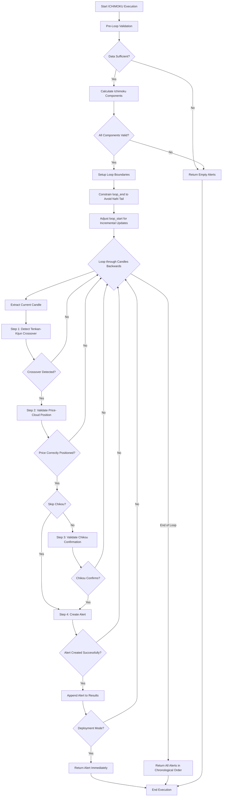

# ICHIMOKU Approach (Ichimoku Cloud Signal Detection)

## 1. Objective

The ICHIMOKU approach (Ichimoku Kinko Hyo - Japanese for "one glance equilibrium chart") is a comprehensive technical analysis indicator that identifies high-probability trend reversals and confirmations by detecting synchronized momentum, trend, and strength signals. The approach operates by:

1. **Detecting momentum shifts** - identifying when the Tenkan-sen (9-period conversion line) crosses above or below the Kijun-sen (26-period base line), signaling a change in short-term momentum
2. **Validating trend alignment** - ensuring the price is correctly positioned relative to the Ichimoku Cloud (Senkou Span A and B boundaries), confirming the signal is in harmony with the established trend
3. **Confirming signal strength** - using the Chikou Span (26-period lagging line) to verify that current price strength is superior to historical price at the same relative position, adding robustness to the signal

This three-layer validation system captures only the most high-conviction signals where momentum, price position, and strength are all aligned, making it particularly effective in identifying sustained directional moves and trend confirmations.

## 2. Key Parameters

The behavior of the ICHIMOKU executor is controlled by the following parameters, configured in `src/stockreports/config/signal_settings.py`.

| Parameter | Default Value | Description |
|-----------|---------------|-------------|
| `TENKAN_PERIOD` | 9 | Period for Tenkan-sen (Conversion Line) calculation. Represents the 9-period high/low midpoint, capturing short-term momentum shifts. |
| `KIJUN_PERIOD` | 26 | Period for Kijun-sen (Base Line) calculation. Represents the 26-period high/low midpoint, serving as medium-term support/resistance. |
| `SENKOU_B_PERIOD` | 52 | Period for Senkou Span B (Lower Cloud Boundary) calculation. Represents the longest-term 52-period high/low midpoint. |
| `CHIKOU_PERIOD` | 26 | Period for Chikou Span (Lagging Line) lag. Current close is plotted 26 candles back for strength confirmation. |
| `SENKOU_SHIFT_PERIOD` | 26 | Forward shift periods for Senkou Span A and B. Cloud boundaries are plotted 26 candles ahead for future support/resistance prediction. |
| `SKIP_CHIKOU_CONFIRMATION` | False | If set to `True`, skips Step 3 (Chikou confirmation) and generates alerts based only on Steps 1 and 2. Useful for more sensitive signal detection. |
| `SKIP_CLOUD_VALIDATION` | False | Reserved for future use. When implemented, will allow price-cloud position validation to be optional. |

### Calculated Parameter

**Lookback Window Size**: Automatically calculated as `max(TENKAN_PERIOD, KIJUN_PERIOD, SENKOU_B_PERIOD) + CHIKOU_PERIOD = 52 + 26 = 78 candles`. This is the minimum historical context required for all Ichimoku calculations.

## 3. Ichimoku Components

The ICHIMOKU approach uses five interconnected indicator components, each calculated from different lookback periods and shifts:

### Component 1: Tenkan-sen (Conversion Line)
- **Formula**: (9-period high + 9-period low) / 2
- **Meaning**: Short-term momentum indicator showing immediate price pressure
- **Role in Signal**: Primary momentum detector - crossing Kijun signals a shift in momentum
- **Range**: Plotted on current chart (no shift)

### Component 2: Kijun-sen (Base Line)
- **Formula**: (26-period high + 26-period low) / 2
- **Meaning**: Medium-term support/resistance level and equilibrium baseline
- **Role in Signal**: Crossover reference - when Tenkan crosses Kijun, momentum has shifted
- **Range**: Plotted on current chart (no shift)

### Component 3: Senkou Span A (Upper Cloud Boundary / Faster Boundary)
- **Formula**: (Tenkan-sen + Kijun-sen) / 2, shifted **26 periods forward**
- **Meaning**: Dynamic upper cloud boundary reflecting recent momentum convergence
- **Role in Signal**: Primary trend boundary - price must be above both Senkou A and B for BUY, below both for SELL
- **Range**: Plotted 26 candles into the future

### Component 4: Senkou Span B (Lower Cloud Boundary / Slower Boundary)
- **Formula**: (52-period high + 52-period low) / 2, shifted **26 periods forward**
- **Meaning**: Long-term support/resistance boundary reflecting underlying trend
- **Role in Signal**: Confirms trend strength - cloud thickness and position indicate trend establishment
- **Range**: Plotted 26 candles into the future

### Component 5: Chikou Span (Lagging Span)
- **Formula**: Current close shifted **26 periods backward** on the chart
- **Meaning**: Current price projected into the past to compare against historical prices
- **Role in Signal**: Strength confirmation - if Chikou is above historical price for BUY (below for SELL), current strength exceeds past price
- **Range**: Plotted 26 candles back on the historical chart

## 4. Step-by-Step Logic

The executor analyzes data in a reverse chronological loop, starting from the most recent candle within the valid data range. For each candle index, it performs the following validation steps sequentially.

### Step 1: Detect Tenkan-Kijun Crossover Signal

*   **Data Window**: Extract a 2-row window containing the current candle and the previous candle: `df[i-1:i+1]`
*   **Calculation**: Compare Tenkan-sen and Kijun-sen values between the two consecutive candles
*   **BUY Condition**: `previous_tenkan <= previous_kijun` **AND** `current_tenkan > current_kijun`
    - This represents Tenkan crossing **ABOVE** Kijun, signaling an uptrend momentum shift
*   **SELL Condition**: `previous_tenkan >= previous_kijun` **AND** `current_tenkan < current_kijun`
    - This represents Tenkan crossing **BELOW** Kijun, signaling a downtrend momentum shift
*   **Validation**: If neither condition is met, the candle is discarded
*   **Returns**: `Signal.BUY` or `Signal.SELL` if a crossover is detected, `None` otherwise

### Step 2: Validate Price-Cloud Position

*   **Data**: Use the current candle (at index i)
*   **Required Values**: `close`, `senkou_a`, `senkou_b`
*   **BUY Requirement**: Price must be above **BOTH** cloud boundaries
    - `close > senkou_a` **AND** `close > senkou_b`
    - Confirms the price is in an established uptrend territory, above the dynamic support zone
*   **SELL Requirement**: Price must be below **BOTH** cloud boundaries
    - `close < senkou_a` **AND** `close < senkou_b`
    - Confirms the price is in an established downtrend territory, below the dynamic resistance zone
*   **Validation**: The price must be completely outside the cloud for the signal to be valid. If price is within the cloud, the signal is rejected
*   **Validation Status**: If validation fails, the candle is discarded. If it passes, a `Validation` object is recorded

### Step 3: Validate Chikou Span Confirmation (Optional)

*   **Data Window**: Extract historical context spanning from `i - lookback_window_size` to `i` (approximately 78 candles)
*   **Current Index in Window**: `window_current_idx = lookback_window_size - 1` (last element in the window)
*   **Chikou Value**: Retrieve `chikou_span` from the current candle (which represents current close plotted 26 periods back)
*   **Historical Reference**: Look up the historical candle at `window_current_idx - chikou_period`, which is the candle that was 26 periods before the current candle
*   **Historical Price**: Retrieve the closing price of that historical candle
*   **BUY Confirmation**: Chikou must be above the historical price
    - `chikou_span > historical_price`
    - Confirms current price strength is superior to price 26 periods ago, validating bullish momentum
*   **SELL Confirmation**: Chikou must be below the historical price
    - `chikou_span < historical_price`
    - Confirms current price weakness is inferior to price 26 periods ago, validating bearish momentum
*   **Validation**: If `SKIP_CHIKOU_CONFIRMATION` is set to `True`, this step is bypassed
*   **Validation Status**: If validation fails, the candle is discarded. If it passes (or is skipped), a `Validation` object is recorded

### Step 4: Create Alert Object

*   **Candle Selection**: Use the current candle (at index i) as the signal candle
*   **Signal Determination**: Use the detected signal (BUY or SELL) from Step 1
*   **Trend Assignment**:
    - BUY signal → `Trend.UPTREND`
    - SELL signal → `Trend.DOWNTREND`
*   **Details Extraction**: Build a dictionary containing the five Ichimoku component values:
    - `tenkan_sen`: Rounded to 2 decimal places
    - `kijun_sen`: Rounded to 2 decimal places
    - `senkou_a`: Rounded to 2 decimal places
    - `senkou_b`: Rounded to 2 decimal places
    - `chikou_span`: Rounded to 2 decimal places
*   **Alert Creation**: Use base class method `_create_alert_with_details()` to construct the `AlertData` object
*   **Magnitude Calculation**: `abs(current_close - first_candle_open)` - the total price movement from the very first candle in the dataset to the signal candle
*   **Validation Status**: If alert creation succeeds, a `Validation` object is recorded

### Step 5: Return Alert

*   **Deployment Mode**: Return immediately after detecting the **first valid alert** in reverse chronological order (most recent signal)
*   **Development Mode**: Continue processing all candles to find and record all alerts in the historical dataset
*   **Chronological Ordering**: When returning multiple alerts, reverse the list to restore chronological order (earliest to latest)

## 5. Data Constraints & Boundary Management

The Ichimoku approach has critical data constraints that must be managed:

### NaN Data Regions

Due to the forward shift of Senkou Span A and B:
- **Start Region (NaN)**: Indices `[0:78]` - initialization period before enough historical data is available
- **Valid Range**: Indices `[78:195]` - clean, usable data for signal detection (in a 221-candle dataset)
- **End Region (NaN)**: Indices `[195:221]` - 26 candles at the end contaminated by forward shift (cannot calculate future cloud values)

### Loop Boundary Calculation

The executor implements intelligent boundary management:

1. **Initial Setup**: Base loop boundaries are calculated as:
   - `loop_start = max(78, len(df) - new_candle_count)` (production mode)
   - `loop_end = len(df) - 1`

2. **NaN Tail Constraint**: To prevent processing NaN-filled rows:
   - `max_usable_idx = len(df) - SENKOU_SHIFT_PERIOD`
   - `loop_end = min(loop_end, max_usable_idx)`

3. **Incremental Update Adjustment**: When new candles extend beyond the usable range:
   - `adjusted_loop_start = max(lookback_window_size, loop_end - new_candle_count)`
   - This ensures we scan the requested `new_candle_count` candles within the valid [78:195] range

This intelligent boundary system allows the executor to:
- ✅ Avoid processing NaN-contaminated data
- ✅ Efficiently scan only relevant candles in incremental updates
- ✅ Capture signals that would otherwise be missed if new candles extend into the NaN zone

## 6. Validation Tracking

All validations follow the standardized pattern defined in the executor architecture:

- **Configuration-Tied Validations**: `Validation` objects are created for all checks tied to the three core steps
- **Serialization**: All validations are serialized to JSON and included in the `AlertData.details` field as a `validations` array

**Validations tracked** (4 total):
1. **Tenkan-Kijun Crossover** (Step 1, Validation 1) - Detects momentum shift
2. **Price-Cloud Position** (Step 2, Validation 1) - Validates trend alignment
3. **Chikou Confirmation** (Step 3, Validation 1, *optional*) - Confirms strength
4. **Alert Creation** (Step 4, Validation 1) - Validates alert object generation

## 7. Flow Diagram



## 8. Architecture & Best Practices

The ICHIMOKU executor adheres to the following architectural patterns:

### Modular Component Design

- **`IchimokuAnalyzer`**: Pure calculation functions with no state or logging
  - `calculate_tenkan_sen()` - Computes 9-period conversion line
  - `calculate_kijun_sen()` - Computes 26-period base line
  - `calculate_senkou_span_a()` - Computes and shifts upper cloud boundary
  - `calculate_senkou_span_b()` - Computes and shifts lower cloud boundary
  - `calculate_chikou_span()` - Computes lagging confirmation line
  - `calculate_all_components()` - Orchestrates all calculations

- **`IchimokuValidator`**: Pure validation functions focused on business logic
  - `validate_data_sufficiency()` - Pre-execution data checks
  - `validate_components()` - Post-calculation indicator validation
  - `detect_signal()` - Tenkan-Kijun crossover detection
  - `validate_trend()` - Price-cloud position validation
  - `validate_chikou()` - Chikou confirmation validation

- **`IchimokuExecutor`**: Orchestration and step-by-step workflow
  - `_find_alerts()` - Main entry point, manages loop and boundary logic
  - `_step_detect_tenkan_kijun_signal()` - Step 1 wrapper
  - `_step_validate_price_cloud_position_current()` - Step 2 wrapper
  - `_step_validate_chikou_confirmation()` - Step 3 wrapper
  - `_step_create_alert()` - Step 4 wrapper

### Standardized Logging & Context Management

- Uses centralized `log()` factory from `src/stockreports/utils/log_factory.py`
- Maintains context variables: `current_step`, `current_window_start_time`, `current_window_end_time`
- Comprehensive debug logging at each step with signal-specific details

### Intelligent Window Management

- **2-Row Signal Window**: `df[i-1:i+1]` for crossover detection (requires current and previous)
- **Single Candle Window**: Current candle only for trend validation (only need current price vs cloud)
- **Full Lookback Window**: 78 candles for Chikou historical comparison (need 26-period context)

### Smart Boundary Handling

- Pre-calculates NaN regions to avoid processing invalid data
- Adjusts loop boundaries for incremental updates to avoid gaps
- Ensures all signal detection occurs within the valid [78:195] range (example for 221-candle dataset)

### Step Encapsulation

- Each validation step is implemented as a dedicated private method
- Each step method calls appropriate validator from `IchimokuValidator`
- Each step appends a `Validation` object on success, logs failure on rejection
- Clear separation of concerns makes the code maintainable and testable

## 9. Example Alert Output

A typical ICHIMOKU alert contains the following details:

```json
{
    "approach": "ICHIMOKU",
    "signal": "SELL",
    "alert_time": "2026-03-05T13:29:00+0700",
    "trend": "downtrend",
    "magnitude": 31.47,
    "details": {
        "tenkan_sen": 1949.22,
        "kijun_sen": 1950.41,
        "senkou_a": 1959.66,
        "senkou_b": 1963.54,
        "chikou_span": 1942.97,
        "validations": [
            {
                "name": "Tenkan-Kijun Crossover",
                "step": 1,
                "validation": 1,
                "message": "Tenkan-Kijun SELL crossover detected",
                "status": "Passed"
            },
            {
                "name": "Price-Cloud Position",
                "step": 2,
                "validation": 1,
                "message": "Price correctly positioned vs Cloud for SELL",
                "status": "Passed"
            },
            {
                "name": "Chikou Confirmation",
                "step": 3,
                "validation": 1,
                "message": "Chikou span confirms SELL signal",
                "status": "Passed"
            }
        ]
    }
}
```

## 10. Performance Notes

- **Lookback Requirement**: Minimum 78 candles required (52 for Senkou B + 26 for Chikou)
- **Calculation Overhead**: All 5 components calculated once per run, then cached in DataFrame
- **Loop Efficiency**: Smart boundaries reduce unnecessary iterations in incremental update scenarios
- **NaN Management**: Forward shift creates trailing NaN region - executor accounts for this automatically

## 11. Configuration Examples

### Conservative Setup (Current Production)
```python
TENKAN_PERIOD = 9
KIJUN_PERIOD = 26
SENKOU_B_PERIOD = 52
CHIKOU_PERIOD = 26
SENKOU_SHIFT_PERIOD = 26
SKIP_CHIKOU_CONFIRMATION = False      # Requires all 3 validations
SKIP_CLOUD_VALIDATION = False
```
*Effect*: High-conviction signals requiring all three layers of validation. Fewer alerts but higher quality.

### Sensitive Setup (Future Alternative)
```python
TENKAN_PERIOD = 9
KIJUN_PERIOD = 26
SENKOU_B_PERIOD = 52
CHIKOU_PERIOD = 26
SENKOU_SHIFT_PERIOD = 26
SKIP_CHIKOU_CONFIRMATION = True       # Requires only Tenkan-Kijun + Cloud
SKIP_CLOUD_VALIDATION = False
```
*Effect*: More responsive signal detection without Chikou confirmation. More alerts but with less confirmation delay.
