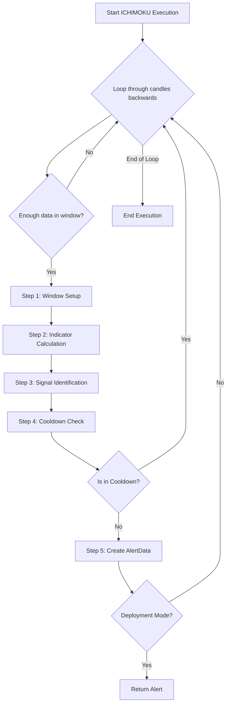

# ICHIMOKU Approach v1

## 1. Objective

The ICHIMOKU approach generates trading signals based on the Ichimoku Kinko Hyo indicator, which combines multiple moving averages and cloud components to identify trend direction, momentum, and support/resistance. The approach enforces strict validation of cloud breakouts, crossovers, and trend confirmation to filter for high-quality signals.

## 2. Key Parameters

Parameters are loaded from `signal_settings.py` via `IchimokuSettings`.

| Parameter                   | Description                                                        |
|-----------------------------|--------------------------------------------------------------------|
| `LOOKBACK_WINDOW`           | Number of candles in the analysis window.                          |
| `TENKAN_PERIOD`             | Period for Tenkan-sen (conversion line).                           |
| `KIJUN_PERIOD`              | Period for Kijun-sen (base line).                                  |
| `SENKOU_SPAN_B_PERIOD`      | Period for Senkou Span B (cloud boundary).                         |
| `DISPLACEMENT`              | Displacement for cloud projection.                                 |
| `COOLDOWN_WINDOW`           | Number of candles to wait before issuing a new alert.              |

## 3. Step-by-Step Logic

The executor analyzes data in a reverse loop, starting from the most recent candle. For each analysis window, it performs the following validation steps sequentially:

1.  **Step 1: Window Setup**
    *   Extract a lookback window of size `LOOKBACK_WINDOW`.
    *   If insufficient data, skip.

2.  **Step 2: Indicator Calculation**
    *   Calculate Ichimoku components: Tenkan-sen, Kijun-sen, Senkou Span A/B, Chikou Span.

3.  **Step 3: Signal Identification**
    *   Identify bullish or bearish signals based on crossovers, cloud breakouts, and trend confirmation.
    *   Validate signal strength and context.
    *   If any validation fails, the window is discarded.

4.  **Step 4: Cooldown Check**
    *   Ensure no alert for the same symbol/signal within `COOLDOWN_WINDOW`.
    *   If in cooldown, the window is discarded.

5.  **Step 5: Alert Creation**
    *   If all validations pass, create an `AlertData` object and update `LATEST_ALERT`.

## 4. Flow Diagram

## 5. Example

- If Tenkan-sen crosses above Kijun-sen above the cloud, and all validations pass, a bullish alert is generated.
- If Tenkan-sen crosses below Kijun-sen below the cloud, and all validations pass, a bearish alert is generated.

---

*This documentation is code-mirrored and verified as of May 29, 2026.*
