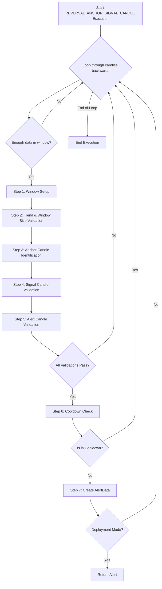

# REVERSAL_ANCHOR_SIGNAL_CANDLE Visual Flows

## Flow Diagram

```mermaid
graph TD
	A[Start REVERSAL_ANCHOR_SIGNAL_CANDLE Execution] --> B{Loop through candles backwards};
	B --> C{Enough data in window?};
	C -- No --> B;
	C -- Yes --> D[Step 1: Window Setup];
	D --> E[Step 2: Trend & Window Size Validation];
	E --> F[Step 3: Anchor Candle Identification];
	F --> G[Step 4: Signal Candle Validation];
	G --> H[Step 5: Alert Candle Validation];
	H --> I{All Validations Pass?};
	I -- No --> B;
	I -- Yes --> J[Step 6: Cooldown Check];
	J --> K{Is in Cooldown?};
	K -- Yes --> B;
	K -- No --> L[Step 7: Create AlertData];
	L --> M{Deployment Mode?};
	M -- Yes --> N[Return Alert];
	M -- No --> B;
	B -- End of Loop --> O[End Execution];
```

---

*This flow diagram is modeled after the VRA approach for consistency.*
