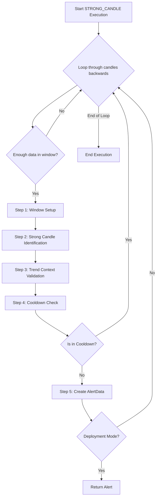

# STRONG_CANDLE Approach v1

## 1. Objective

The STRONG_CANDLE approach identifies high-momentum price moves by detecting a single candle with exceptional body size and volume, relative to its surrounding context. The approach enforces strict validation of candle strength, volume, and trend context to filter for high-quality breakout or breakdown signals.

## 2. Key Parameters

Parameters are loaded from `signal_settings.py` via `StrongCandleSettings`.

| Parameter                   | Description                                                        |
|-----------------------------|--------------------------------------------------------------------|
| `LOOKBACK_WINDOW`           | Number of candles in the analysis window.                          |
| `MIN_BODY_SIZE`             | Minimum body size required for a candle to be considered strong.    |
| `MIN_VOLUME`                | Minimum volume required for a strong candle.                       |
| `VOLUME_MULTIPLIER`         | Multiplier for volume relative to average in window.               |
| `COOLDOWN_WINDOW`           | Number of candles to wait before issuing a new alert.              |

## 3. Step-by-Step Logic

The executor analyzes data in a reverse loop, starting from the most recent candle. For each analysis window, it performs the following validation steps sequentially:

1.  **Step 1: Window Setup**
    *   Extract a lookback window of size `LOOKBACK_WINDOW`.
    *   If insufficient data, skip.

2.  **Step 2: Strong Candle Identification**
    *   Identify the candle with the largest body size in the window.
    *   Validate body size (`MIN_BODY_SIZE`).
    *   Validate volume (`MIN_VOLUME`, `VOLUME_MULTIPLIER`).
    *   If any validation fails, the window is discarded.

3.  **Step 3: Trend Context Validation**
    *   Analyze trend direction and context in the window.
    *   Optionally validate that the strong candle is at a key position (e.g., start or end of trend).

4.  **Step 4: Cooldown Check**
    *   Ensure no alert for the same symbol/signal within `COOLDOWN_WINDOW`.
    *   If in cooldown, the window is discarded.

5.  **Step 5: Alert Creation**
    *   If all validations pass, create an `AlertData` object and update `LATEST_ALERT`.

## 4. Flow Diagram

## 5. Example

- If a candle in the window has a body size and volume far exceeding its neighbors, and all validations pass, a breakout or breakdown alert is generated.

---

*This documentation is code-mirrored and verified as of May 29, 2026.*
