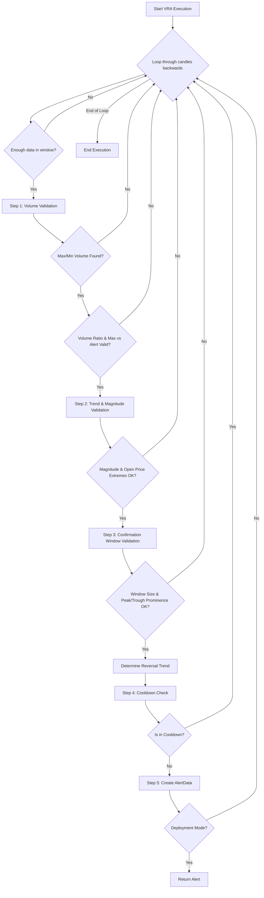

# VRA (Volume-Reversal-Anchor) Approach v3

## 1. Objective

The VRA (Volume-Reversal-Anchor) approach identifies high-probability trend reversals by detecting a comprehensive sequence of volume and trend events. It validates a significant trend with sufficient magnitude, followed by a volume spike, and then validates the confirmation window using peak/trough prominence analysis. The approach aims to capture market turning points by enforcing strict volumetric and price extremum relationships between key candles.

## 2. Key Parameters

The behavior of the VRA executor is controlled by the following parameters, configured in `src/stockreports/config/signal_settings.py`.

| Parameter                               | Default Value | Description                                                                                                                                                                         |
| --------------------------------------- | ------------- | ----------------------------------------------------------------------------------------------------------------------------------------------------------------------------------- |
| `LOOKBACK_WINDOW`                       | 15            | The number of candles to include in the analysis window.                                                                                                                            |
| `VOLUME_MULTIPLIER`                     | 4.5           | The ratio threshold for volume spike validation: max_volume must be >= min_volume × this multiplier.                                                                               |
| `MIN_TREND_MAGNITUDE`                   | 6.5           | The minimum price change required for a trend to be considered significant within the entire lookback window.                                                                       |
| `TREND_WINDOW_EDGE_SLICE`               | 3             | Number of candles from window edges for validating open price extremes (highest/lowest open positions within the trend window).                                                    |
| `MIN_CONFIRMATION_WINDOW_CANDLES`       | 3             | Minimum number of candles required in the confirmation window (from max volume candle to end) for valid reversal pattern.                                                          |
| `VOLUME_MULTIPLIER_BY_REVERSAL_TREND`   | 2.0           | The ratio threshold validating max volume candle: max_volume must be >= alert_candle_volume × this multiplier.                                                                    |
| `MIN_PEAK_TROUGH_PROMINENCE`            | 1.5           | Minimum prominence value required for peak (uptrend) or trough (downtrend) candles in the confirmation window.                                                                     |
| `MAX_PEAK_TROUGH_PROMINENCE`            | 3.0           | Maximum prominence value allowed for peak (uptrend) or trough (downtrend) candles in the confirmation window.                                                                     |
| `COOLDOWN_WINDOW`                       | 3             | Number of candles after an alert during which no new alert for the same symbol and signal can be issued.                                                                           |

## 3. Step-by-Step Logic

The VRA executor analyzes data in a reverse loop, starting from the most recent candle. For each analysis window, it performs the following validation steps sequentially.

1.  **Step 1: Volume Validation**
    *   The algorithm identifies the candles with the maximum and minimum volume within the entire lookback window.
    *   **Validation 1 (Max Volume Found)**: Confirms a max volume candle exists.
    *   **Validation 2 (Min Volume Found)**: Confirms a min volume candle exists up to the max volume candle position.
    *   **Validation 3 (Volume Ratio)**: The max_volume must be >= min_volume × `VOLUME_MULTIPLIER`.
    *   **Validation 4 (Max vs Alert Volume)**: The max_volume must be >= alert_candle_volume × `VOLUME_MULTIPLIER_BY_REVERSAL_TREND`.
    *   If any volume validation fails, the window is discarded.

2.  **Step 2: Trend & Magnitude Validation**
    *   Extracts a trend window from the min volume candle to the alert candle.
    *   Validates the trend window has at least 3 candles.
    *   Calculates the price magnitude and trend direction of the entire trend window.
    *   **Validation 1 (Magnitude)**: The magnitude must be >= `MIN_TREND_MAGNITUDE`.
    *   **Validation 2 (Open Price Extremes)**: For uptrends, the lowest open must be within `TREND_WINDOW_EDGE_SLICE` candles from the start and highest open within `TREND_WINDOW_EDGE_SLICE` candles from the end. For downtrends, the pattern is reversed (highest open near start, lowest open near end).
    *   If magnitude or open price position validations fail, the window is discarded.
    *   Determines `window_trend` (UPTREND or DOWNTREND) and calculates `window_size_val` as the magnitude.

3.  **Step 3: Confirmation Window Validation**
    *   Extracts a confirmation window from the max volume candle to the end of the lookback window.
    *   **Validation 1 (Window Extraction)**: Confirms the confirmation window was successfully extracted.
    *   **Validation 2 (Window Size)**: The confirmation window must have at least `MIN_CONFIRMATION_WINDOW_CANDLES` candles.
    *   **Validation 3 (Peak/Trough Prominence)**: Validates the prominence of the highest peak (uptrend) or lowest trough (downtrend) within the confirmation window.
        *   For UPTREND: Finds the candle with the highest peak and validates its prominence (calculated relative to surrounding candles) is within the range `[MIN_PEAK_TROUGH_PROMINENCE, MAX_PEAK_TROUGH_PROMINENCE]`.
        *   For DOWNTREND: Finds the candle with the lowest trough and validates its prominence is within the same range.
        *   Prominence measures the strength of the price extremum relative to the candles around it. Values too low indicate weak reversals; values too high indicate overextended moves.
    *   If any confirmation validation fails, the window is discarded.
    *   Computes `reversal_trend` as the opposite of `window_trend`.

4.  **Step 4: Cooldown Check**
    *   Determines the reversal signal as the opposite of the original window trend.
    *   **Validation**: Checks if a similar alert (same symbol and reversal_signal) has been issued within the `COOLDOWN_WINDOW`.
    *   If in cooldown, the window is discarded.

5.  **Step 5: Alert Creation**
    *   If all previous steps pass, a new `AlertData` object is created with the reversal signal.
    *   The class-level `LATEST_ALERT` is updated for cooldown tracking.
    *   In non-development mode, execution returns after the first alert.

## 4. Flow Diagram

