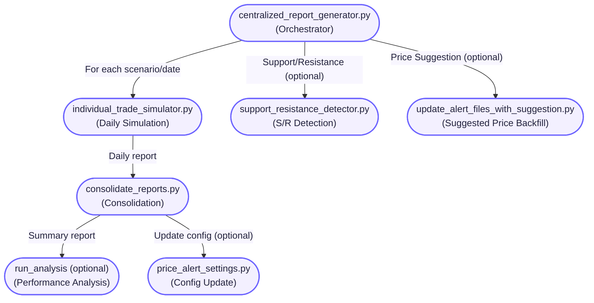
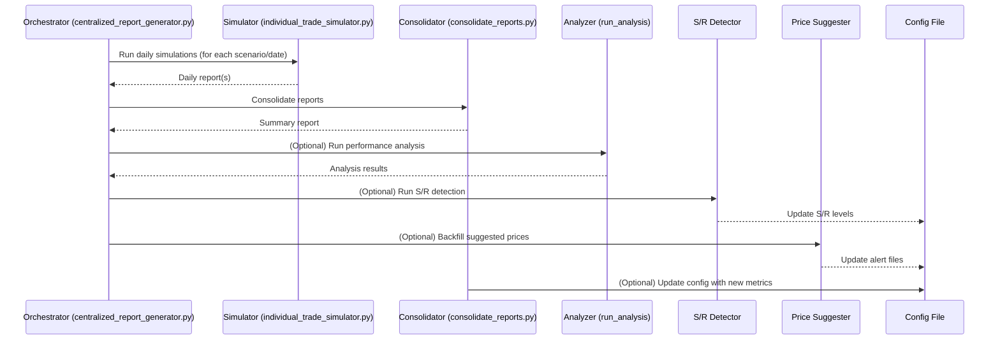

# Backtesting & Performance Measurement: Centralized Report Generator

## Overview

The backtesting and performance measurement workflow is orchestrated by the script:

```sh
python3 -m src.tools.centralized_report_generator.centralized_report_generator \
    --execution-symbol VN30F1M \
    --alert-sources VN30F1M \
    --from-date 2026-01-05 \
    --to-date 2026-01-05 \
    --mode deployment \
    --run-sr-detector \
    --sr-start-time "2026-01-01 09:00:00" \
    --sr-end-time "2026-01-15 15:00:00" \
    --sr-resolution 15 \
    --sr-min-touches 3 \
    --suggestion-type all \
    --update-price-alert-settings
```

This tool automates multi-scenario trade simulation, report consolidation, support/resistance detection, and price suggestion backfilling. It is the canonical way to generate robust, reproducible performance metrics for all trading approaches.

## End-to-End Process

### 1. **Batch Trade Simulation**
- For each profit/loss scenario (from config), and for each day in the date range:
  - Runs `individual_trade_simulator.py`:
    - Loads all alerts for the day and symbol(s).
    - Simulates each alert as a trade, using dynamic take-profit/stop-loss logic.
    - Determines entry/exit, calculates profit/loss, and records trade details.
    - Handles overlapping trades, cooldowns, and validation windows.
    - Saves a daily JSON report per scenario.

### 2. **Consolidated Reporting**
- After all daily simulations for a scenario:
  - Runs `consolidate_reports.py`:
    - Aggregates all daily reports into a single summary.
    - Computes per-approach and overall statistics (success rate, avg/worst loss, time-to-trigger, etc.).
    - Optionally updates `price_alert_settings.py` with new performance metrics.

### 3. **Performance Analysis (Optional)**
- If enabled, runs a global analysis script to compute advanced metrics and visualizations across all reports.

### 4. **Support/Resistance Detection (Optional)**
- If enabled, runs `support_resistance_detector.py`:
    - Analyzes historical price data for significant support/resistance levels.
    - Updates `price_alert_settings.py` with new levels for each symbol.

### 5. **Suggested Price Backfilling (Optional)**
- If enabled, runs `update_alert_files_with_suggestion.py`:
    - Scans all alert files in the date range.
    - Calculates and fills in `performance_suggested_price` and/or `structural_suggested_price` for each alert.


## Visual Overview

### Mermaid Flowchart: Backtesting & Performance Pipeline



### Mermaid Sequence Diagram: Backtesting & Performance Flow



## Output

- **Daily Simulation Reports:** `reports/consolidated/<mode>/profit_X.X_loss_X.X/simulation_summary_individual_trade_<SYMBOL>_<YYYYMMDD>.json`
- **Consolidated Summary:** `reports/consolidated/<mode>/profit_X.X_loss_X.X/<SYMBOL>_overall_performance_<FROM>_to_<TO>.json`
- **Updated Configs:** `src/stockreports/config/price_alert_settings.py` (if enabled)
- **Alert Files:** Updated with suggested prices (if enabled)

## Deep Dive: Key Scripts

- **centralized_report_generator.py:** Orchestrates the entire workflow, parses arguments, and triggers all sub-steps.
- **individual_trade_simulator.py:** Simulates each alert as a trade, applies dynamic thresholds, and records detailed trade outcomes.
- **consolidate_reports.py:** Aggregates daily results, computes statistics, and updates config if needed.
- **support_resistance_detector.py:** Detects and records significant price levels for each symbol.
- **update_alert_files_with_suggestion.py:** Maintains and backfills suggested price fields in alert files.

---
