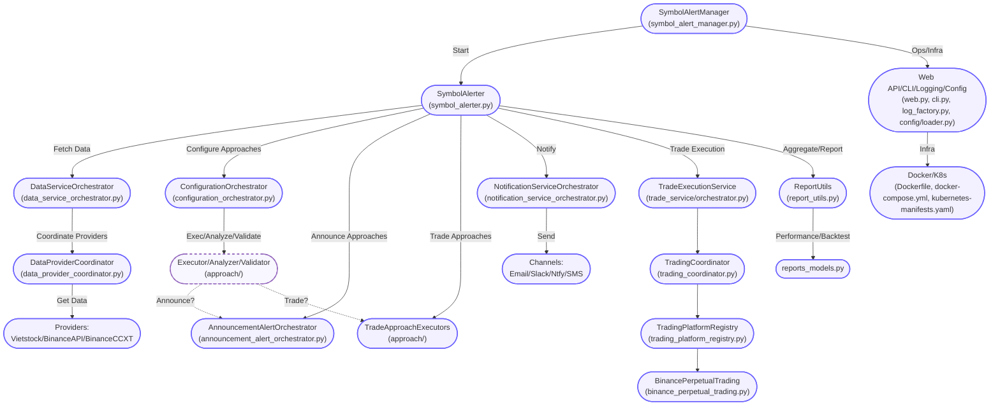
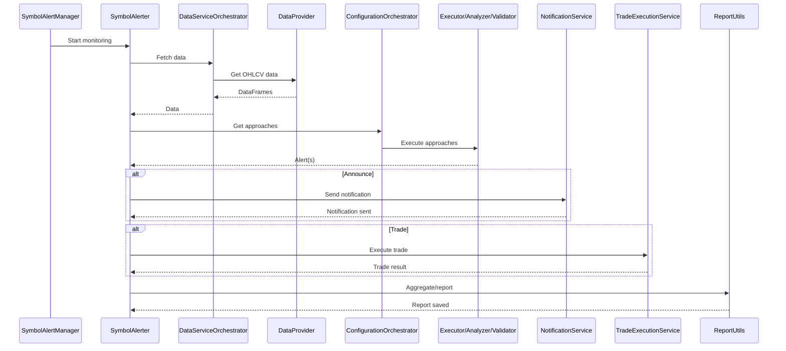

# Microservice & Component Architecture Overview

This document provides a code-mirrored, microservice/component-level overview of the trading platform. Each architectural layer/component is mapped to its actual code location, with responsibilities, interactions, and a mermaid flowchart for system-wide clarity.

---

## System Layers & Components

### 1. Entry Point: SymbolAlertManager
- **Code:** `src/stockreports/symbol_alert_manager.py`
- **Role:** Orchestrates monitoring for all configured symbols. Initializes per-symbol monitoring threads.

### 2. Symbol Monitoring: SymbolAlerter
- **Code:** `src/stockreports/alert/symbol_alerter.py`
- **Role:** Per-symbol monitoring loop. Fetches data, coordinates approaches, aggregates alerts, and triggers notifications/trade execution.

### 3. Data Services
- **Code:**
  - Orchestrator: `src/stockreports/data/data_service_orchestrator.py`
  - Coordinator: `src/stockreports/data/data_provider_coordinator.py`
  - Providers: `src/stockreports/data/providers/`
- **Role:** Fetches OHLCV data from multiple sources (Vietstock, BinanceAPI, BinanceCCXT) per symbol/resolution.

### 4. Approach Coordination & Execution
- **Code:**
  - Config: `src/stockreports/alert/configuration_orchestrator.py`, `executor_approach_configuration.json`
  - Executors: `src/stockreports/alert/approach/`
  - Analyzers/Validators: `src/stockreports/alert/approach/`
- **Role:** Determines which approaches to run per symbol. Executes ANNOUNCE and TRADE approaches using Executor → Analyzer → Validator pattern.

### 5. Alert Aggregation & Reporting
- **Code:** `src/stockreports/utils/report_utils.py`
- **Role:** Deduplicates and aggregates confirmed alerts. Saves to `reports/` (LIVE) or `reports_replay/` (REPLAY).

### 6. Notification Service
- **Code:**
  - Orchestrator: `src/stockreports/notification/notification_service_orchestrator.py`
  - Channels: `src/stockreports/notification/channels/`
- **Role:** Sends alerts to configured channels (Email, Slack, Ntfy, SMS). Each channel is independent and failure-isolated.

### 7. Trade Execution Service (DEPLOYMENT mode only)
- **Code:**
  - Orchestrator: `src/stockreports/trade_service/orchestrator.py`
  - Coordinator: `src/stockreports/trade_service/trading_coordinator.py`
  - Registry: `src/stockreports/trade_service/trading_platform_registry.py`
  - Platform: `src/stockreports/trade_service/platforms/binance_perpetual_trading.py`
- **Role:** Receives confirmed trade alerts, dispatches bracket order execution (DCA ladder, TP/SL management) in a daemon thread. Only active in deployment mode.

### 8. Trade Simulation & Backtesting
- **Code:**
  - Simulation: `src/stockreports/utils/report_utils.py`
  - Models: `src/stockreports/alert/model/reports_models.py`
- **Role:** Offline analysis of strategy performance. Generates detailed trade logs and performance metrics.

### 9. Operational Support
- **Code:**
  - Web API: `src/stockreports/web.py`
  - CLI: `src/stockreports/cli.py`
  - Logging: `src/stockreports/utils/log_factory.py`
  - Config Loader: `src/stockreports/config/loader.py`
  - Docker/K8s: `Dockerfile`, `docker-compose.yml`, `kubernetes-manifests.yaml`
- **Role:** Health checks, structured logging, error recovery, configuration management, deployment infrastructure, CLI, and mode switching.

---

## Mermaid Flowchart: System Component Interactions

---

## Mermaid Sequence Diagram: System Alert Flow

---

## Design Principles
- **Separation of Concerns:** Each component has a single responsibility.
- **Thread Safety:** Per-symbol isolation, no shared state.
- **Error Isolation:** Failures are contained to their component.
- **Deterministic Testing:** REPLAY mode for reproducibility.
- **Type Safety:** Enums and type hints throughout.
- **Scalability:** New approaches, data providers, and notification channels are plug-and-play.

---

## References
- `docs/ARCHITECTURE/SYSTEM_ARCHITECTURE_OVERVIEW.md`
- `docs/ARCHITECTURE/TECHNICAL_REFERENCE/DEEP_DIVE_FINDINGS.md`
- `src/` (see code locations above)

---

## Backtesting & Performance Measurement

For a comprehensive, code-mirrored overview of the backtesting and performance measurement pipeline—including CLI usage, workflow, outputs, and deep-dive script explanations—see:

**[BACKTESTING_AND_PERFORMANCE.md](./BACKTESTING_AND_PERFORMANCE.md)**

This dedicated document covers:
- Multi-scenario trade simulation
- Report consolidation and statistics
- Support/resistance detection
- Suggested price backfilling
- Output structure and advanced usage

---

**Last updated:** May 29, 2026