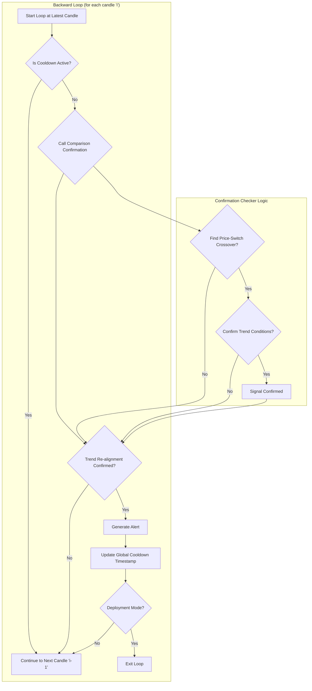

````markdown
# COMPARISON

## Objective

The **Comparison** strategy identifies trading opportunities by analyzing the relative momentum between a primary symbol (e.g., a stock) and a reference symbol (e.g., an index like `VN30`). It generates alerts when the primary symbol's trend re-aligns with the reference symbol's established trend after a brief period of divergence.

-   **BUY Signal:** Generated when the primary symbol shows renewed upward momentum, confirming it is following the reference symbol's broader uptrend.
-   **SELL Signal:** Generated when the primary symbol shows renewed downward momentum, confirming it is following the reference symbol's broader downtrend. This signal can be disabled via configuration.

This approach is effective for identifying entries where a stock "catches up" to the market's overall direction.

## Key Parameters

This approach is configured in `src/stockreports/config/signal_settings.py` under the `COMPARISON` key. A dedicated settings class, `ComparisonSignalSettings`, in `src/stockreports/alert/approach/comparison/settings.py` loads these parameters.

| Parameter | Example Value | Description |
| :--- | :--- | :--- |
| `REFERENCED_SYMBOL` | `"VN30"` | The symbol to use as the benchmark for the comparison. |
| `LOOKBACK_WINDOW` | 10 | The number of candles used for the trend confirmation logic. |
| `COOLDOWN_PERIOD` | 10 | The minimum time in **minutes** that must pass after an alert is fired before a new one can be generated for this approach. |
| `MA_SHORT_PERIOD` | 5 | The lookback period for the short-term Moving Average, used to gauge immediate momentum for both symbols. |
| `DISABLE_SELL_SIGNAL` | `True` | A boolean flag to enable (`False`) or disable (`True`) the generation of `SELL` signals. Defaults to `True`. |

## Step-by-Step Logic

The core logic resides in the `ComparisonExecutor` class (`executor.py`) and the `ComparisonConfirmation` class (`confirmation.py`).

1.  **Initialization**: The `ComparisonExecutor` is created for a specific symbol and loads its settings.

2.  **Data Preparation**: The `run` method loads and aligns historical data for both the primary and reference symbols by their timestamps.

3.  **Indicator Calculation**: A short-term Moving Average (MA) is calculated for the `close` price of both symbols to identify the immediate trend.

4.  **Reverse Loop Analysis**: The algorithm iterates backward through the aligned data. For each candle, it performs the following checks:

    *   **Cooldown Check**: It checks a class-level timestamp to ensure the `COOLDOWN_PERIOD` has passed since the last alert for this approach, preventing rapid-fire alerts.
    *   **Signal Confirmation**: It calls the `ComparisonConfirmation` helper to check for either a `BUY` or `SELL` signal.

5.  **Confirmation Logic (`ComparisonConfirmation`)**:
    *   **Find Price-Switch Reversal**: The first step is to scan backwards within the `LOOKBACK_WINDOW` to find a "price-switch" event.
        *   For a `BUY` signal, this is where the primary symbol's close price crosses *above* the reference symbol's close price.
        *   For a `SELL` signal, it's where the primary symbol's close price crosses *below* the reference's.
    *   **Confirm Trend Post-Switch**: If a price-switch is found, the algorithm then confirms if the trend is valid *at the current candle*:
        *   **For an Uptrend (BUY):**
            1.  The primary symbol must be on a **green (bullish)** candle.
            2.  The closing price of the primary symbol must be **above** its short-term MA.
            3.  The current closing price of the primary symbol must be **higher** than its price at the time of the price-switch, confirming sustained momentum.
            4.  The difference between the primary symbol's close and the reference symbol's close must be greater than or equal to `MIN_PRICE_DIFFERENCE`.
        *   **For a Downtrend (SELL):** (This check is skipped if `DISABLE_SELL_SIGNAL` is `True`)
            1.  The primary symbol must be on a **red (bearish)** candle.
            2.  The closing price of the primary symbol must be **below** its short-term MA.
            3.  The current closing price of the primary symbol must be **lower** than its price at the time of the price-switch.
            4.  The difference between the reference symbol's close and the primary symbol's close must be greater than or equal to `MIN_PRICE_DIFFERENCE`.

6.  **Alert Generation**: If all conditions are met, an `AlertData` object is created, and the global cooldown timestamp is updated. In `DEPLOYMENT` mode, the loop exits immediately after finding the first alert.

## Flow Diagram



## See Also

For more information on other strategies, please see the following documents:

-   [SUPPORT_RESISTANCE_BREAK.md](SUPPORT_RESISTANCE_BREAK.md)
-   [CONSECUTIVE_POWER_CANDLES.md](CONSECUTIVE_POWER_CANDLES.md)
-   [CONSISTENT_MOMENTUM.md](CONSISTENT_MOMENTUM.md)
-   [ICHIMOKU.md](ICHIMOKU.md)
-   [MOMENTUM_EXHAUSTION.md](MOMENTUM_EXHAUSTION.md)
-   [RCM.md](RCM.md)
-   [STRONG_CANDLE.md](STRONG_CANDLE.md)
````
