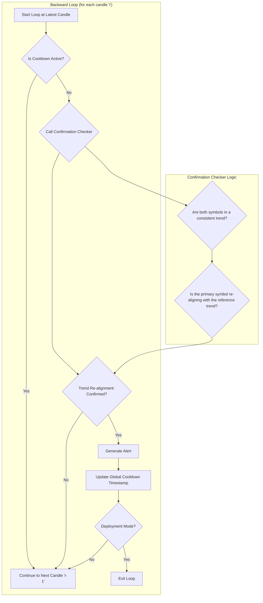

````markdown
# COMPARISON

## Objective

The **Comparison** strategy identifies trading opportunities by analyzing the relative momentum between a primary symbol (e.g., a stock) and a reference symbol (e.g., an index like `VN30`). It generates alerts when the primary symbol's trend re-aligns with the reference symbol's established trend after a brief period of divergence or weakness.

-   **BUY Signal:** Generated when the primary symbol shows renewed upward momentum, confirming it is following the reference symbol's broader uptrend.
-   **SELL Signal:** Generated when the primary symbol shows renewed downward momentum, confirming it is following the reference symbol's broader downtrend.

This approach is effective for identifying entries where a stock "catches up" to the market's overall direction.

## Key Parameters

This approach is configured in `src/stockreports/config/signal_settings.py` under the `COMPARISON` key, specified per-symbol.

| Parameter | Example Value | Description |
| :--- | :--- | :--- |
| `REFERENCED_SYMBOL` | `"VN30"` | The symbol to use as the benchmark for the comparison. |
| `LOOKBACK_WINDOW` | 10 | The number of candles used for the trend confirmation logic. |
| `COOLDOWN_PERIOD` | 10 | The minimum time in **minutes** that must pass after an alert is fired before a new one can be generated for this approach. |
| `MA_SHORT_PERIOD` | 5 | The lookback period for the short-term Moving Average, used to gauge immediate momentum for both symbols. |

## Step-by-Step Logic

The core logic resides in `src/stockreports/alert/approach/comparison/executor.py`. The analysis is performed in a backward loop, starting from the most recent data.

1.  **Data Preparation**: The executor loads historical data for both the primary symbol and the `REFERENCED_SYMBOL`. The two datasets are aligned by their timestamps to ensure a direct, candle-by-candle comparison.

2.  **Indicator Calculation**: A short-term Moving Average (MA) is calculated for the `close` price of both the primary and reference symbols. This MA helps smooth out price action and identify the immediate trend.

3.  **Reverse Loop Analysis**: The algorithm iterates backward through the aligned data. For each candle, it performs the following checks using the `ComparisonConfirmation` helper:

    *   **Cooldown Check**: Before any analysis, the algorithm checks a module-level (static) variable, `LATEST_ALERT_TIMESTAMP`, which stores when the last alert for this approach was fired. If the time elapsed between the current candle and the last alert is less than the configured `COOLDOWN_PERIOD`, the candle is skipped.
    *   **Trend Confirmation**: It checks if both symbols are in a consistent trend (e.g., for a `BUY` signal, both must be in an uptrend). This is determined by comparing their current price to their respective MAs and checking for confirming candle colors (e.g., green candles for an uptrend).
    *   **Re-alignment Check**: It looks for a specific pattern where the primary symbol demonstrates renewed strength that re-aligns with the reference symbol's trend. For a `BUY` signal, it confirms that the primary symbol's price is now moving decisively higher, catching up to the reference symbol's established upward momentum.

4.  **Alert Generation**: If all trend and re-alignment conditions are met and the cooldown is not active, an `AlertData` object is created with the corresponding `BUY` or `SELL` signal. The `LATEST_ALERT_TIMESTAMP` is then updated with the new alert's time. In `DEPLOYMENT` mode, the function returns immediately with the first alert found.

## Flow Diagram



## See Also

For more information on other strategies, please see the following documents:

-   [SUPPORT_RESISTANCE_BREAK.md](SUPPORT_RESISTANCE_BREAK.md)
-   [CONSECUTIVE_POWER_CANDLES.md](CONSECUTIVE_POWER_CANDLES.md)
-   [CONSISTENT_MOMENTUM.md](CONSISTENT_MOMENTUM.md)
-   [ICHIMOKU.md](ICHIMOKU.md)
-   [MOMENTUM_EXHAUSTION.md](MOMENTUM_EXHAUSTION.md)
-   [RCM.md](RCM.md)
-   [STRONG_CANDLE.md](STRONG_CANDLE.md)
````
