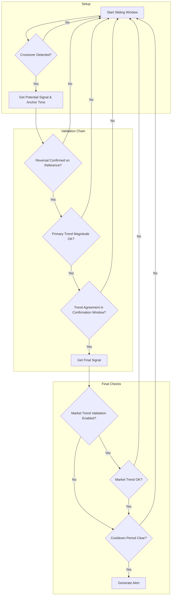

# COMPARISON Approach Documentation

## Objective

The **COMPARISON** approach is a technical analysis strategy designed to generate trading signals by comparing the price action of a `primary_symbol` against a `reference_symbol`. The core idea is to identify a **crossover** event between the two symbols and then validate a subsequent **reversal** and **trend confirmation** to ensure the signal's reliability.

This approach is particularly useful for pairs trading or for analyzing an asset's performance relative to a benchmark (e.g., a specific stock vs. a market index like VN30).

## Key Parameters

This approach is configured in `src/stockreports/config/signal_settings.py`. A dedicated settings class, `ComparisonSettings`, in `src/stockreports/alert/approach/COMPARISON/settings.py` loads these parameters.

| Parameter                         | Default      | Description                                                                                                                            |
| :-------------------------------- | :----------- | :------------------------------------------------------------------------------------------------------------------------------------- |
| `PRIMARY_SYMBOL`                  | `'VN30F1M'`  | The main symbol being analyzed.                                                                                                        |
| `REFERENCE_SYMBOL`                |              | The symbol or index used for comparison.                                                                                               |
| `LOOKBACK_WINDOW`                 |              | The number of candles in the rolling window used for crossover detection.                                                              |
| `MAX_PRIMARY_TREND_MAGNITUDE`     | `10.0`       | The maximum allowed price change for the primary symbol between the crossover and the alert.                                           |
| `COOLDOWN_WINDOW`                 |              | The number of minutes after an alert during which no new alert with the same signal can be generated.                                  |
| `DISABLE_BUY_SIGNAL`              | `False`      | If `True`, BUY alerts will not be generated.                                                                                           |
| `DISABLE_SELL_SIGNAL`             | `False`      | If `True`, SELL alerts will not be generated.                                                                                          |
| `MIN_ALERT_BODY_SIZE`             |              | The minimum body size (`abs(open - close)`) required for the alert candle during reversal validation (Step 2).                         |
| `MAX_DISTANCE_CLOSE_PRICE`        | `2.0`        | The maximum allowed distance between the close prices of the anchor and alert candles during reversal validation (Step 2).             |
| `ENABLE_MARKET_TREND_VALIDATION`  | `False`      | If `True`, enables the optional market trend validation (Step 6).                                                                      |
| `MIN_MARKET_PRICE_CHANGE`         | `0.0`        | The minimum price change required for symbols during the market trend validation.                                                      |

## Step-by-Step Logic

The core logic is implemented in the `ComparisonExecutor` class. The process is optimized for performance by starting with cheaper checks first.

### Step 1: Crossover Detection
-   **Objective**: Find a point within the `lookback_window` where the closing price of the `primary_symbol` crosses over or under the `reference_symbol`.
-   **Logic**: The code iterates backwards from the end of the window.
    -   A **BUY** signal is initiated if the primary symbol's price crosses from **below** to **above** the reference symbol's price.
    -   A **SELL** signal is initiated if the primary symbol's price crosses from **above** to **below** the reference symbol's price.
-   **Outcome**: If a crossover is found, its timestamp is marked as the `anchor_timestamp`, and a `potential_signal` is determined.

### Step 2: Reversal Confirmation on Reference Symbol
-   **Objective**: Confirm that the `reference_symbol` shows a valid reversal pattern *after* the crossover event.
-   **Logic**: This step uses the shared utility `validate_reversal_confirmation` on the reference symbol's data, starting from the `anchor_timestamp`.
-   **Outcome**: If a valid reversal is confirmed, the function returns the `alert_candle` and the `anchor_reversal_candle`. The timestamps of these candles (`alert_time` and `anchor_reversal_time`) are extracted.

### Step 3: Primary Trend Magnitude Check
-   **Objective**: Ensure the price movement of the `primary_symbol` between the crossover and the alert is not excessively large.
-   **Logic**: It calculates the absolute difference between the primary symbol's close at `alert_time` and its close at `anchor_timestamp` and checks it against `max_primary_trend_magnitude`.
-   **Outcome**: The process continues only if the magnitude is within the allowed limit.

### Step 4: Trend Validation in Confirmation Window
-   **Objective**: Verify that both the primary and reference symbols are trending in the same direction during the "confirmation window" (from `anchor_reversal_time` to `alert_time`).
-   **Logic**: The shared utility `validate_trend` is called for both symbols on this window's data.
-   **Outcome**: The process continues only if both symbols show a trend that matches the `potential_signal`.

### Step 5: Final Signal Agreement
-   **Objective**: Consolidate the results to determine the final, confirmed signal.
-   **Logic**: A `final_signal` is confirmed only if the `potential_signal` (Step 1) matches the trends of both symbols (Step 4) and the signal is not disabled.

### Step 6: Market Trend Validation (Optional)
-   **Objective**: If enabled, check if the broader market (defined by `IMPACT_SYMBOLS`) supports the signal.
-   **Logic**: Controlled by `enable_market_trend_validation`, this step uses `validate_market_trend` on the lookback `window_df`.

### Step 7: Cooldown Check
-   **Objective**: Prevent duplicate alerts.
-   **Logic**: It uses the shared utility `is_in_cooldown` to check if a recent alert with the same signal has been issued within the `cooldown_window`.

If all steps pass, an alert is generated.

## Flow Diagram

