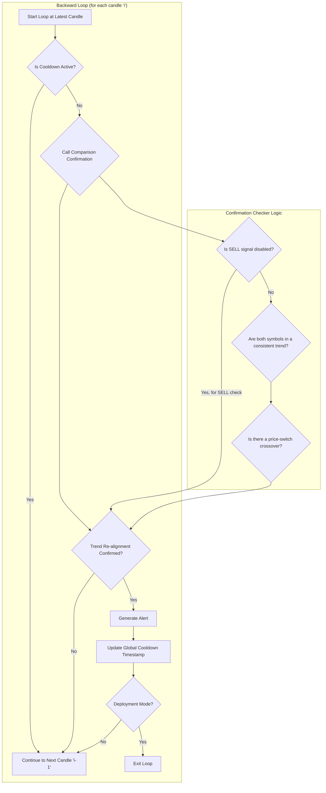

````markdown
# COMPARISON

## Objective

The **Comparison** strategy identifies trading opportunities by analyzing the relative momentum between a primary symbol (e.g., a stock) and a reference symbol (e.g., an index like `VN30`). It generates alerts when the primary symbol's trend re-aligns with the reference symbol's established trend after a brief period of divergence.

-   **BUY Signal:** Generated when the primary symbol shows renewed upward momentum, confirming it is following the reference symbol's broader uptrend.
-   **SELL Signal:** Generated when the primary symbol shows renewed downward momentum, confirming it is following the reference symbol's broader downtrend. This signal can be disabled via configuration.

This approach is effective for identifying entries where a stock "catches up" to the market's overall direction.

## Key Parameters

This approach is configured in `src/stockreports/config/signal_settings.py` under the `COMPARISON` key. A dedicated settings class, `ComparisonSignalSettings`, in `src/stockreports/alert/approach/comparison/settings.py` loads these parameters.

| Parameter | Example Value | Description |
| :--- | :--- | :--- |
| `REFERENCED_SYMBOL` | `"VN30"` | The symbol to use as the benchmark for the comparison. |
| `LOOKBACK_WINDOW` | 10 | The number of candles used for the trend confirmation logic. |
| `COOLDOWN_PERIOD` | 10 | The minimum time in **minutes** that must pass after an alert is fired before a new one can be generated for this approach. |
| `MA_SHORT_PERIOD` | 5 | The lookback period for the short-term Moving Average, used to gauge immediate momentum for both symbols. |
| `DISABLE_SELL_SIGNAL` | `False` | A boolean flag to enable (`False`) or disable (`True`) the generation of `SELL` signals. Defaults to `True`. |

## Step-by-Step Logic

The core logic resides in the `ComparisonExecutor` class in `src/stockreports/alert/approach/comparison/executor.py`. The analysis is performed in a backward loop, starting from the most recent data.

1.  **Initialization**: The `ComparisonExecutor` is instantiated for a specific symbol. It loads its configuration via the `ComparisonSignalSettings` class and validates that the executor's symbol matches the primary symbol in the settings.

2.  **Data Preparation**: The `run` method loads historical data for both the primary symbol and the `REFERENCED_SYMBOL`. The two datasets are aligned by their timestamps to ensure a direct, candle-by-candle comparison.

3.  **Indicator Calculation**: A short-term Moving Average (MA) is calculated for the `close` price of both the primary and reference symbols. This MA helps smooth out price action and identify the immediate trend.

4.  **Reverse Loop Analysis**: The algorithm iterates backward through the aligned data. For each candle, it performs the following checks using the `ComparisonConfirmation` helper:

    *   **Cooldown Check**: Before any analysis, the algorithm checks a **class-level** (static) variable, `LATEST_ALERT_TIMESTAMP`, which stores when the last alert for this approach was fired across all symbols. If the time elapsed is less than the configured `COOLDOWN_PERIOD`, the candle is skipped.
    *   **Trend Confirmation**: It checks if both symbols are in a consistent trend. For a `SELL` signal, it first checks if `DISABLE_SELL_SIGNAL` is `True`. If so, the check is skipped. Otherwise, it confirms synchronized trend conditions (e.g., for a `BUY` signal, both symbols must be in an uptrend).
    *   **Re-alignment Check**: It looks for a "price-switch" crossover event where the primary symbol's price crosses the reference symbol's price, indicating a re-alignment with the broader market trend.

5.  **Alert Generation**: If all conditions are met and the cooldown is not active, an `AlertData` object is created. The `LATEST_ALERT_TIMESTAMP` is then updated with the new alert's time. In `DEPLOYMENT` mode, the function returns immediately with the first alert found.

## Flow Diagram



## See Also

For more information on other strategies, please see the following documents:

-   [SUPPORT_RESISTANCE_BREAK.md](SUPPORT_RESISTANCE_BREAK.md)
-   [CONSECUTIVE_POWER_CANDLES.md](CONSECUTIVE_POWER_CANDLES.md)
-   [CONSISTENT_MOMENTUM.md](CONSISTENT_MOMENTUM.md)
-   [ICHIMOKU.md](ICHIMOKU.md)
-   [MOMENTUM_EXHAUSTION.md](MOMENTUM_EXHAUSTION.md)
-   [RCM.md](RCM.md)
-   [STRONG_CANDLE.md](STRONG_CANDLE.md)
````
