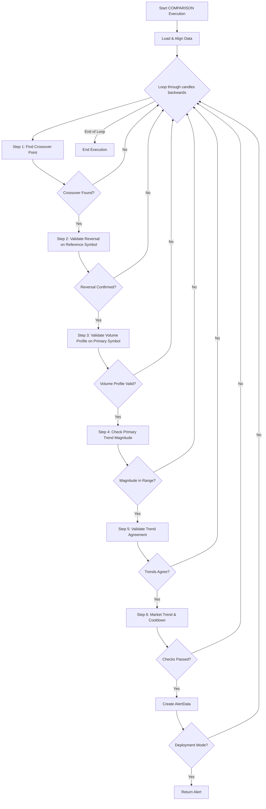

# COMPARISON Approach

## 1. Objective

The COMPARISON approach is a sophisticated strategy designed to generate trading signals for a `primary_symbol` (e.g., `VN30F1M`) by analyzing its price action relative to a `reference_symbol` (e.g., `VN30`). The core principle is to identify a "crossover" event where the price relationship between the two symbols flips. This crossover acts as an anchor, and the algorithm then waits for a series of confirmations—including a reversal on the reference symbol, a specific volume profile, and trend agreement—before issuing an alert.

This approach is unique because the final alert is triggered on the `primary_symbol`, but its validity is derived from a combination of events on both the primary and reference symbols.

## 2. Key Parameters

The behavior of the COMPARISON executor is controlled by the following parameters, which are configured in `src/stockreports/config/signal_settings.py`.

| Parameter                             | Default Value | Description                                                                                                                              |
| ------------------------------------- | ------------- | ---------------------------------------------------------------------------------------------------------------------------------------- |
| `PRIMARY_SYMBOL`                      | "VN30F1M"     | The symbol for which alerts will be generated.                                                                                           |
| `REFERENCE_SYMBOL`                    | "VN30"        | The symbol used as a benchmark for comparison.                                                                                           |
| `LOOKBACK_WINDOW`                     | 20            | The number of candles to include in the analysis window for finding the initial crossover.                                               |
| `MIN_ALERT_BODY_SIZE`                 | 0.5           | The minimum body size of the candles involved in the reversal confirmation pattern on the reference symbol.                                |
| `MAX_DISTANCE_CLOSE_PRICE`            | 2.0           | The maximum allowed price difference between the close prices of the candles in the reversal pattern on the reference symbol.              |
| `VOLUME_MULTIPLIER`                   | 2.5           | The maximum volume candle in the validation window must have a volume at least this many times greater than the minimum volume candle.     |
| `MIN_PRIMARY_TREND_MAGNITUDE`         | 0.2           | The minimum required price change on the primary symbol from the anchor to the alert candle.                                             |
| `MAX_PRIMARY_TREND_MAGNITUDE`         | 2.5           | The maximum allowed price change on the primary symbol. This acts as a filter to avoid overly volatile or erratic moves.                 |
| `COOLDOWN_WINDOW`                     | 3             | The number of candles to wait after an alert is generated before another alert of the same type can be issued.                           |
| `ENABLE_MARKET_TREND_VALIDATION`      | `False`       | If `True`, the alert will only be triggered if it aligns with the broader market trend. (Typically disabled as this is an intrinsic check). |
| `DISABLE_BUY_SIGNAL` / `DISABLE_SELL_SIGNAL` | `False`       | Master switches to disable BUY or SELL signals entirely for this approach.                                                               |

## 3. Step-by-Step Logic

The executor first loads and aligns the data for both the primary and reference symbols. It then scans backwards through the aligned data, performing the following validation steps for each window.

1.  **Crossover Point Detection**:
    *   The algorithm searches backwards within the `LOOKBACK_WINDOW` to find the most recent point where the price relationship between the primary and reference symbols "flips" (e.g., primary price was below reference, and now it's above).
    *   This crossover point becomes the `anchor_pos`, and the direction of the cross determines the `potential_signal` (`BUY` or `SELL`). If no crossover is found, the window is discarded.

2.  **Reversal Confirmation on Reference Symbol**:
    *   Using the timestamp of the crossover anchor, the algorithm looks for a reversal pattern on the `reference_symbol`'s data.
    *   **Validation**: It calls the shared `validate_reversal_confirmation` utility. A valid reversal that matches the `potential_signal` must be found. This step yields the `alert_candle_ref` and `anchor_reversal_candle_ref`.

3.  **Volume Profile Validation on Primary Symbol**:
    *   This is a multi-part validation performed on the `primary_symbol`'s data within a specific "volume window" (from the crossover anchor to the end of the lookback window).
    *   **Validation 1**: The candle with the minimum volume must occur *before* the candle with the maximum volume.
    *   **Validation 2**: The max volume must be significantly larger than the min volume (by a factor of `VOLUME_MULTIPLIER`).
    *   **Validation 3**: The final alert time must occur at or *after* the time of the maximum volume candle.
    *   **Validation 4**: The alert candle's volume must be greater than or equal to the volume of the candle immediately preceding it.

4.  **Primary Trend Magnitude Check**:
    *   The algorithm calculates the price change on the `primary_symbol` between the crossover anchor and the alert candle.
    *   **Validation**: This magnitude must fall within the range defined by `MIN_PRIMARY_TREND_MAGNITUDE` and `MAX_PRIMARY_TREND_MAGNITUDE`.

5.  **Trend Agreement Validation**:
    *   The algorithm defines a "confirmation window" (from the reversal anchor to the alert candle).
    *   It validates the trend direction within this window for both the primary and reference symbols independently using the `validate_trend` utility.
    *   **Validation**: The trend direction for both symbols must agree with the `potential_signal`. For example, for a `BUY` signal, both symbols must show a `BUY` trend.

6.  **Market Trend and Cooldown**:
    *   **Market Trend (Optional)**: If enabled, a final check against the broader market trend is performed.
    *   **Cooldown**: The standard cooldown logic is applied to prevent duplicate alerts.

7.  **Alert Generation**:
    *   If all validations pass, a new `AlertData` object is created for the `primary_symbol` and the alert is stored.

## 4. Flow Diagram

