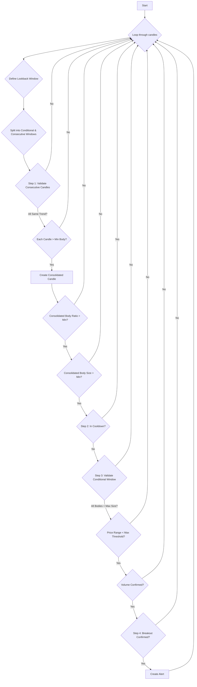

# CONSECUTIVE POWER CANDLES

## 1. Objective
The "Consecutive Power Candles" approach is designed to identify strong, directional market momentum that breaks out from a period of price consolidation. The core strategy is to detect a sequence of powerful, same-colored candles that emerge after a period of low-volatility, sideways movement. A valid signal indicates that the new trend is strong enough to have broken the prior consolidation range and is likely to continue.

## 2. Key Parameters
| Parameter | Default Value | Description |
|---|---|---|
| `LOOKBACK_WINDOW` | 15 | The total number of candles to include in the analysis window. |
| `CONSECUTIVE_WINDOW_SIZE` | 2 | The number of recent, consecutive "power" candles to analyze. |
| `MIN_CONSOLIDATED_BODY_RATIO` | 0.8 | The minimum ratio of body-to-total-range for the single candle created by consolidating the consecutive power candles. Enforces a decisive, low-wick candle. |
| `MIN_CONSECUTIVE_CANDLE_BODY_SIZE` | 1.5 | The minimum body size (in price points) required for each individual candle in the consecutive window. |
| `MIN_CONSOLIDATED_BODY_SIZE` | 3.5 | The minimum body size (in price points) required for the single consolidated candle. |
| `MAX_CONDITIONAL_CANDLE_BODY_SIZE` | 2.0 | The maximum body size allowed for any candle in the "conditional" window (the period before the power candles). Ensures the prior period was one of low volatility. |
| `MAX_DIFFERENCE_PRICE_THRESHOLD` | 4.0 | The maximum allowed price range (high - low) within the conditional window. Enforces that the market was trading sideways. |
| `VOLUME_MULTIPLIER` | 1.2 | The minimum volume of the weakest power candle must be at least this many times greater than the volume of the strongest candle in the conditional window. |
| `COOLDOWN_WINDOW` | 3 | The number of candles to wait before generating a new alert for the same signal. |

## 3. Step-by-Step Logic
1.  **Step 1: Consecutive & Consolidated Candle Validation**
    *   The logic first identifies the `consecutive_window` (the most recent N candles) and the `conditional_window` (the candles just before that).
    *   **Validation 1.1**: It verifies that all candles within the `consecutive_window` have the same trend (all green or all red).
    *   **Validation 1.2**: It checks that each individual candle in the `consecutive_window` has a body size greater than `MIN_CONSECUTIVE_CANDLE_BODY_SIZE`.
    *   **Validation 1.3**: The consecutive candles are merged into a single `consolidated_candle`. This candle's body-to-range ratio must exceed `MIN_CONSOLIDATED_BODY_RATIO`.
    *   **Validation 1.4**: The `consolidated_candle`'s body size must be greater than `MIN_CONSOLIDATED_BODY_SIZE`.
    *   If any of these checks fail, the window is invalid.

2.  **Step 2: Cooldown Validation**
    *   The system checks if a recent alert for the same signal has already been generated within the `COOLDOWN_WINDOW`. If so, a new alert is suppressed to prevent spam.

3.  **Step 3: Conditional Window (Consolidation) Validation**
    *   **Validation 3.1**: The logic ensures that all candles in the `conditional_window` have bodies smaller than `MAX_CONDITIONAL_CANDLE_BODY_SIZE`, confirming a prior state of low momentum.
    *   **Validation 3.2**: The total price range (max high - min low) of the `conditional_window` must not exceed the `MAX_DIFFERENCE_PRICE_THRESHOLD`, confirming a sideways channel.
    *   **Validation 3.3 (Volume Confirmation)**: The candle with the *minimum* volume in the `consecutive_window` must have a volume that is at least `VOLUME_MULTIPLIER` times larger than the candle with the *maximum* volume in the `conditional_window`. This confirms the breakout occurred with significant volume.
    *   If any of these checks fail, the window is invalid.

4.  **Step 4: Breakout Confirmation**
    *   The final check confirms a true breakout from the consolidation channel.
    *   For a **BUY** signal, the closing price of the last power candle must be **above** the highest high of the `conditional_window`.
    *   For a **SELL** signal, the closing price of the last power candle must be **below** the lowest low of the `conditional_window`.
    *   If this condition is met, an alert is created.

## 4. Flow Diagram

