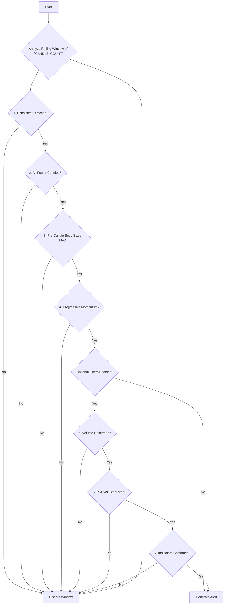

# CONSECUTIVE_POWER_CANDLES

## Objective

The **Consecutive Power Candles** strategy is a strong momentum-following pattern, often associated with formations like "Three White Soldiers" (bullish) or "Three Black Crows" (bearish). It aims to identify a decisive and powerful start to a new short-term trend by looking for a specific sequence of strong, consecutive, and directionally aligned candles.

## Key Parameters

This approach is configured in `src/stockreports/config/signal_settings.py`. A dedicated settings class, `ConsecutivePowerCandlesSettings`, in `src/stockreports/alert/approach/CONSECUTIVE_POWER_CANDLES/settings.py` loads these parameters.

| Parameter | Default | Description |
| :--- | :--- | :--- |
| `CANDLE_COUNT` | 3 | The number of consecutive candles required for the pattern. |
| `MIN_BODY_TO_RANGE_RATIO` | 0.7 | The minimum ratio of each candle's body to its total range. This ensures each candle is a "power candle" with a decisive body. |
| `MIN_PRE_CANDLE_BODY_SIZES` | `[]` | An array specifying the minimum body size for each "pre-candle" (all candles except the last one). The number of entries must match `CANDLE_COUNT - 1`. |
| `USE_VOLUME_CONFIRMATION` | `False` | If `True`, requires the final candle in the sequence to be accompanied by a significant volume spike. |
| `USE_LAST_CANDLE_MAX_VOLUME_CONFIRMATION` | `False` | If `True`, requires the final candle's volume to be the highest within the pattern's window. |
| `USE_RSI_EXHAUSTION_FILTER` | `False` | If `True`, checks the RSI of the candle *prior* to the pattern's start to prevent entering a move that is already overbought or oversold. |
| `USE_MA_CONFIRMATION`, `USE_MACD_CONFIRMATION`, etc. | `False` | Standard confirmation flags. If enabled, these indicators are checked on the **final candle** of the pattern to confirm the signal. |

## Step-by-Step Logic

The core logic resides in the `ConsecutivePowerCandlesExecutor` class in `src/stockreports/alert/approach/CONSECUTIVE_POWER_CANDLES/executor.py`. The algorithm analyzes a rolling window of `CANDLE_COUNT` candles. For a signal to be generated, all of the following checks must pass.

1.  **Consistent Direction:**
    *   All candles in the window must be bullish (`close > open`) for a `BUY` signal.
    *   All candles in the window must be bearish (`close < open`) for a `SELL` signal.

2.  **Power Candle Confirmation:**
    *   Each candle in the window must be a "power candle," meaning its body must make up at least `MIN_BODY_TO_RANGE_RATIO` of its total range. This filters out indecisive candles with long wicks.

3.  **Minimum Pre-Candle Body Size:**
    *   The algorithm iterates through the `MIN_PRE_CANDLE_BODY_SIZES` array.
    *   For each pre-candle (from the first to the second-to-last), it checks if its body size meets the corresponding minimum value specified in the array. This ensures the initial move has sufficient force.

4.  **Progressive Momentum (Key Logic):**
    *   This check confirms that momentum is being sustained without significant pullbacks. The logic iterates from the second candle to the last one.
    *   **For a Bullish Pattern:** The opening price of the current candle must be **above the midpoint** of the previous candle's body.
    *   **For a Bearish Pattern:** The opening price of the current candle must be **below the midpoint** of the previous candle's body.

5.  **Volume Confirmation (Optional):**
    *   If `USE_VOLUME_CONFIRMATION` is `True`, the final candle must be accompanied by a significant volume spike.
    *   If `USE_LAST_CANDLE_MAX_VOLUME_CONFIRMATION` is `True`, the final candle must have the highest volume within the window.

6.  **RSI Exhaustion Filter (Optional):**
    *   If `USE_RSI_EXHAUSTION_FILTER` is `True`, the algorithm examines the "setup candle" (the one immediately preceding the start of the pattern).
    *   It checks that this setup candle's RSI is not in an exhaustion zone (e.g., not overbought for a `BUY` signal). This acts as a preventative filter.

7.  **Standard Indicator Confirmation (Optional):**
    *   If any standard confirmation flags (like `USE_MA_CONFIRMATION`, `USE_MACD_CONFIRMATION`, etc.) are enabled, the algorithm checks these indicators on the **final candle** of the pattern.
    *   The signal (`BUY` or `SELL`) must be confirmed by the enabled indicators.

If this sequence of candles successfully passes all configured checks, an `AlertData` object is created, and a signal is generated.

## Flow Diagram

### Diagram Explanation

1.  **Analyze Rolling Window**: The algorithm processes the data in rolling windows of a size defined by `CANDLE_COUNT`.
2.  **Consistent Direction?**: Checks if all candles in the window are either all bullish or all bearish.
3.  **All Power Candles?**: Ensures every candle has a body-to-range ratio greater than `MIN_BODY_TO_RANGE_RATIO`.
4.  **Pre-Candle Body Sizes Met?**: Validates that the bodies of the "pre-candles" (all but the last) meet their minimum size requirements.
5.  **Progressive Momentum?**: Checks if each candle's open is beyond the midpoint of the previous candle's body, confirming sustained momentum.
6.  **Optional Filters**: If the core pattern is valid, the algorithm proceeds to a series of optional validation filters if they are enabled in the configuration.
7.  **Volume/RSI/Indicator Confirmed?**: These steps check for a volume spike, ensure the move isn't starting from an exhausted RSI level, and validate the signal with other standard indicators like MA or MACD.
8.  **Generate Alert**: If all mandatory and enabled optional checks pass, an alert is generated.
9.  **Discard Window**: If any check fails, the current window is discarded, and the algorithm moves to the next one.
