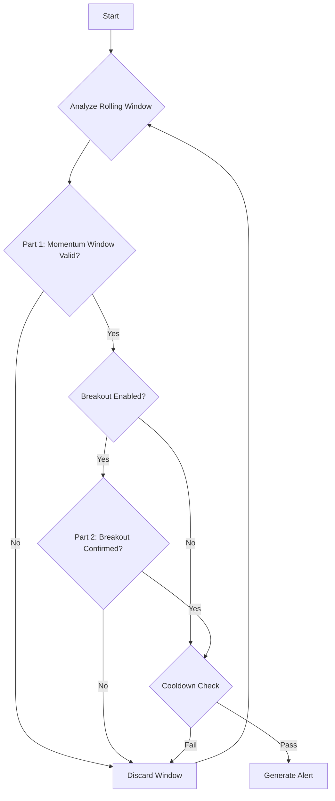

# CONSISTENT_MOMENTUM

## Objective

The **Consistent Momentum** strategy is designed to identify periods of strong, sustained, and high-quality directional movement. Unlike reversal strategies, its goal is to join a trend that is already demonstrating clear and consistent strength, confirmed by a breakout past a recent price structure. It validates this momentum through a series of strict checks, including candle patterns, breakout confirmation, volume, and optional indicator alignment.

## Key Parameters

This approach is configured in `src/stockreports/config/signal_settings.py`. A dedicated settings class, `ConsistentMomentumSettings`, in `src/stockreports/alert/approach/CONSISTENT_MOMENTUM/settings.py` loads these parameters.

| Parameter | Default | Description |
| :--- | :--- | :--- |
| `WINDOW_SIZE` | 5 | The number of consecutive candles that must all show consistent directional momentum. |
| `COOLDOWN_PERIOD` | 5 | The minimum time (in minutes) between consecutive alerts of the same direction. |
| `USE_BREAKOUT_CONFIRMATION` | `True` | If `True`, enables the Peak/Trough Breakout Confirmation step. |
| `PEAK_BOTTOM_LOOKBACK_PERIOD` | `None` | The number of minutes to look back from the alert candle to find a recent peak/trough. If `None`, it looks back through all available history. |
| `PEAK_TROUGH_PROMINENCE` | 5 | The prominence value used to detect peaks and troughs. A higher value requires a peak/trough to be more significant relative to its neighbors. |
| `BREAKOUT_FORWARD_WINDOW` | 15 | The maximum number of candles to look forward (including the alert candle) for breakout confirmation. |
| `BODY_TO_RANGE_MIN_RATIO` | 0.5 | The minimum ratio of a candle's body to its total range, used in the "Big Body" confirmation rule. |
| `USE_VOLUME_CONFIRMATION` | `False` | If `True`, requires the final candle in the momentum window to have a volume spike. |
| `USE_VOLUME_INCREASING_CONFIRMATION` | `False` | If `True`, requires the volume to be generally increasing across the momentum window. |
| `USE_LAST_CANDLE_MAX_VOLUME_CONFIRMATION` | `False` | If `True`, requires the final candle's volume to be the highest within the momentum window. |

## Step-by-Step Logic

The core logic resides in the `ConsistentMomentumExecutor` class. The algorithm first identifies a potential momentum pattern and then, if enabled, seeks to confirm it with a breakout.

### Part 1: Identifying the Momentum Window

The algorithm analyzes a rolling window of `WINDOW_SIZE` candles. For a window to be considered a valid momentum pattern, **all** of the following checks must pass:

1.  **Basic Momentum Check:**
    *   All candles within the window must be bullish (`close > open`) for a `BUY` signal.
    *   All candles must be bearish (`close < open`) for a `SELL` signal.

2.  **Consistent Trend (Average Price):**
    *   The average price `(open + close) / 2` is calculated for each candle in the window.
    *   For a `BUY` signal, this average price must be monotonically increasing.
    *   For a `SELL` signal, it must be monotonically decreasing.

3.  **Body Dominance Check:**
    *   The sum of the absolute body sizes of all candles in the window must be greater than the sum of all their wicks (upper and lower shadows combined). This ensures the move was driven by price conviction, not indecision.

4.  **Indicator Confirmation (Optional):**
    *   **RSI Exhaustion:** The RSI is checked on the *start and end* candles of the momentum window to ensure the move isn't starting from or ending in an overbought/oversold state.
    *   **Other Indicators:** MACD, MA, etc., are checked on the **final candle** of the window to confirm they align with the signal.

5.  **Volume Confirmation (Optional):**
    *   The logic checks up to three volume conditions on the momentum window if their respective flags are `True`:
        *   `USE_VOLUME_CONFIRMATION`: The final candle must have a volume spike.
        *   `USE_VOLUME_INCREASING_CONFIRMATION`: Volume must be trending upwards across the window.
        *   `USE_LAST_CANDLE_MAX_VOLUME_CONFIRMATION`: The final candle must have the highest volume in the window.

### Part 2: Breakout Confirmation (Optional)

If a valid momentum window is found and `USE_BREAKOUT_CONFIRMATION` is `True`, this critical step is executed.

1.  **Establish Breakout Price:**
    *   The algorithm looks back in time from the **last candle** of the momentum window (`PEAK_BOTTOM_LOOKBACK_PERIOD`).
    *   It identifies the **Highest Peak** (for a `BUY`) or **Lowest Trough** (for a `SELL`) on the **closing prices** using `scipy.signal.find_peaks`. This price becomes the `breakout_price`.
    *   If no peak/trough is found, the alert is considered confirmed by default at the last candle of the momentum window.

2.  **Scan Forward Window for Confirmation:**
    *   The algorithm scans a `BREAKOUT_FORWARD_WINDOW`, starting from the last candle of the momentum window.
    *   It iterates **backwards** from the end of this forward window.
    *   For each candle `j`, it checks two conditions in order:

    *   **Condition A: "Big Body" Confirmation**
        *   The candle `j` must have a body-to-range ratio >= `BODY_TO_RANGE_MIN_RATIO`.
        *   The candle `j` must have the same direction as the signal.
        *   The close price of candle `j` must be beyond the `breakout_price`.
        *   If all three are true, candle `j` is the confirmation candle.

    *   **Condition B: "Consistent Price Action" Confirmation**
        *   If Condition A fails, this is checked. It requires a 3-candle sequence (`j`, `j-1`, `j-2`).
        *   **For a BUY signal:**
            1.  The close prices of all three candles must be **above** the `breakout_price`.
            2.  The close prices must be consistently increasing: `close[j] > close[j-1] > close[j-2]`.
        *   **For a SELL signal:**
            1.  The close prices of all three candles must be **below** the `breakout_price`.
            2.  The close prices must be consistently decreasing: `close[j] < close[j-1] < close[j-2]`.
        *   If the pattern is found, candle `j` is the confirmation candle.

3.  **Finalization:**
    *   If a confirmation candle is found by either Condition A or B, the alert is generated with the timestamp and price of that confirmation candle.
    *   If the forward window is scanned and no confirmation is found, the alert is discarded.

### Part 3: Cooldown

*   After a valid alert is generated (with or without breakout), a cooldown period of `COOLDOWN_PERIOD` minutes is applied.
*   Any subsequent alert within this period that has the **same signal direction** (BUY/BUY or SELL/SELL) is ignored.

## Flow Diagram

### Diagram Explanation

1.  **Analyze Rolling Window**: The algorithm processes data in rolling windows of `WINDOW_SIZE` size.
2.  **Part 1: Momentum Window Valid?**: Checks if the current window of candles constitutes a valid momentum pattern.
3.  **Breakout Enabled?**: Determines if the optional breakout confirmation step is enabled.
4.  **Part 2: Breakout Confirmed?**: If enabled, this step checks if the momentum pattern has been confirmed by a breakout.
5.  **Cooldown Check**: Applies a cooldown period after a valid alert to prevent duplicate signals.
6.  **Generate Alert**: If all mandatory checks pass, an alert is generated.
7.  **Discard Window**: If any check fails, the current window is discarded.
