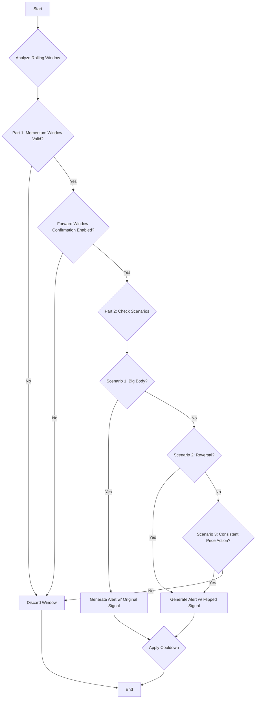

# CONSISTENT_MOMENTUM

## Objective

The **Consistent Momentum** strategy identifies a short-term, high-quality directional trend and then applies a sophisticated confirmation step to find high-probability reversal points.

Its primary goal is to first detect a clear momentum pattern and then, instead of joining it, wait for a specific volume and price action signature in the near future that signals the trend is exhausting and ready to reverse. It is, therefore, a **reversal strategy** that uses initial momentum as a prerequisite for entry.

It validates the initial momentum through a series of strict checks and then uses a forward-looking window to pinpoint the reversal confirmation.

## Key Parameters

This approach is configured in `src/stockreports/config/signal_settings.py`. A dedicated settings class, `ConsistentMomentumSettings`, in `src/stockreports/alert/approach/CONSISTENT_MOMENTUM/settings.py` loads these parameters.

| Parameter | Default | Description |
| :--- | :--- | :--- |
| `CONFIRMATION_WINDOW` | 3 | The number of consecutive candles that must all show consistent directional momentum. |
| `COOLDOWN_PERIOD` | 5 | The minimum time (in minutes) between consecutive alerts of the same direction. |
| `USE_FORWARD_WINDOW_CONFIRMATION` | `True` | **Mandatory.** If `True`, enables the forward-looking confirmation logic. If `False`, no alerts will be generated. |
| `PEAK_BOTTOM_LOOKBACK_PERIOD` | 60 | The number of minutes to look back from the alert candle to find a recent peak/trough for price comparison. |
| `PEAK_TROUGH_PROMINENCE` | 2 | The prominence value used to detect peaks and troughs. A higher value requires a peak/trough to be more significant relative to its neighbors. |
| `LONG_FORWARD_WINDOW` | 9 | The maximum number of candles to look forward (including the alert candle) for a reversal confirmation. |
| `SHORT_FORWARD_WINDOW` | 5 | A threshold to differentiate between short and long forward window logic. If the available forward window is smaller than this, the short-window logic is attempted first. |
| `REVERSAL_BODY_RATIO_THRESHOLD` | 0.7 | The minimum ratio of a candle's body to its total range required for a reversal candle to be considered "strong". |
| `REVERSAL_VOLUME_MULTIPLIER` | 2.5 | A multiplier used in reversal checks. For long-window, it compares max vs min volume. For short-window, it ensures the reversal candle's volume is significantly larger than preceding candles. |
| `REVERSAL_PRICE_DIFF_THRESHOLD` | 2.0 | In the long-window logic, this is the maximum allowed difference between the alert candle's price and the forward window's price extremes. |
| `SIGNIFICANT_PRICE_CHANGE_THRESHOLD` | 5.0 | The minimum price difference required between the alert candle and a recent peak/trough to pass the pre-confirmation filter. |
| `GAP_PRICE` | 0.5 | The maximum allowed price gap between the reversal candle and the previous candle in the short-window logic. |
| `USE_VOLUME_CONFIRMATION` | `False` | If `True`, requires the final candle in the momentum window to have a volume spike. |
| `USE_VOLUME_INCREASING_CONFIRMATION` | `False` | If `True`, requires the volume to be generally increasing across the momentum window. |
| `USE_LAST_CANDLE_MAX_VOLUME_CONFIRMATION` | `False` | If `True`, requires the final candle's volume to be the highest within the momentum window. |

## Step-by-Step Logic

The core logic resides in the `ConsistentMomentumExecutor` class. The algorithm first identifies a potential momentum pattern and then seeks to confirm a subsequent reversal.

### Part 1: Identifying the Momentum Window

The algorithm analyzes a rolling window of `CONFIRMATION_WINDOW` candles. For a window to be considered a valid momentum pattern, **all** of the following checks must pass:

1.  **Basic Momentum Check:**
    *   All candles within the window must be bullish (`close > open`) for a `BUY` signal.
    *   All candles must be bearish (`close < open`) for a `SELL` signal.

2.  **Consistent Trend (Average Price):**
    *   The average price `(open + close) / 2` is calculated for each candle in the window.
    *   For a `BUY` signal, this average price must be monotonically increasing.
    *   For a `SELL` signal, it must be monotonically decreasing.

3.  **Body Dominance Check:**
    *   The sum of the absolute body sizes of all candles in the window must be greater than the sum of all their wicks (upper and lower shadows combined). This ensures the move was driven by price conviction, not indecision.

4.  **Indicator Confirmation:**
    *   **RSI Exhaustion:** The RSI is checked on the *start and end* candles of the momentum window to ensure the move isn't starting from or ending in an overbought/oversold state.
    *   **Other Indicators:** MACD, MA, etc., are checked on the **final candle** of the window to confirm they align with the signal (if enabled in settings).

5.  **Volume Confirmation (Optional):**
    *   The logic checks up to three volume conditions on the momentum window if their respective flags are `True`:
        *   `USE_VOLUME_CONFIRMATION`: The final candle must have a volume spike.
        *   `USE_VOLUME_INCREASING_CONFIRMATION`: Volume must be trending upwards across the window.
        *   `USE_LAST_CANDLE_MAX_VOLUME_CONFIRMATION`: The final candle must have the highest volume in the window.

### Part 2: Reversal Confirmation (Mandatory)

If a valid momentum window is found, this critical two-stage process is **always** executed to find a reversal. The `USE_FORWARD_WINDOW_CONFIRMATION` flag must be `True` for any alert to be generated.

#### Stage 1: Pre-Filter - Significant Price Change

Before looking for complex patterns, a simple check is performed to ensure the momentum is meaningful.

1.  **Find Reference Point:** The algorithm looks back from the alert candle (`PEAK_BOTTOM_LOOKBACK_PERIOD`) to find the nearest significant price extreme:
    *   For a `SELL` signal, it finds the nearest **Peak**.
    *   For a `BUY` signal, it finds the nearest **Trough**.
2.  **Check Difference:** The absolute price difference between the alert candle's close and the price of the extreme point is calculated.
3.  **Validation:** This difference must be **greater than** `SIGNIFICANT_PRICE_CHANGE_THRESHOLD`. If not, the confirmation process is aborted, as the move is considered insignificant.

#### Stage 2: Forward Window Pattern Recognition

If the pre-filter is passed, the algorithm analyzes a forward-looking window (up to `LONG_FORWARD_WINDOW` candles) to find a specific reversal pattern. The logic is dispatched based on the available window size.

1.  **Dispatch Logic:**
    *   If the forward window has fewer candles than `SHORT_FORWARD_WINDOW`, the algorithm first attempts the **Short-Window Reversal** logic. If that fails, it will "fall back" and attempt the **Long-Window Reversal** logic if there are at least 3 candles available.
    *   Otherwise, it proceeds directly to the **Long-Window Reversal** logic.

2.  **Scenario A: Short-Window Reversal Logic**
    *   This logic applies to small forward windows (typically 2-4 candles). It looks for a quick, sharp reversal.
    *   **All** of the following conditions must be met in order:
    *   **1. Reversal Trend:** The **last candle** in the forward window must show a reversal trend (e.g., be bearish after a BUY signal).
    *   **2. Dominant Reversal Candle:** The reversal candle must be dominant among its peers.
        *   It must have a body size greater than or equal to the largest body of all other candles in the forward window *that share the same reversal trend*.
        *   It must have a volume greater than or equal to the largest volume of those same same-trend candles.
    *   **3. Valid Gap Price:** The gap between the previous candle's close and the reversal candle's open must be less than or equal to `GAP_PRICE`.
    *   **4. Volume Multiplier:** The reversal candle's volume multiplied by `REVERSAL_VOLUME_MULTIPLIER` must be greater than the maximum volume of all *other* candles in the forward window (i.e., excluding the reversal candle itself).
    *   **5. Strong Body:** The reversal candle's body must be at least `REVERSAL_BODY_RATIO_THRESHOLD` of its total range (high-low).
    *   If all five conditions pass, a reversal is confirmed at the last candle.

3.  **Scenario B: Long-Window Reversal Logic**
    *   This logic applies to larger forward windows (at least 3 candles) and identifies a more complex, multi-candle reversal pattern.
    *   **All** of the following conditions must be met:
    *   **1. Identify Key Candles:**
        *   `Max Volume Candle`: The candle with the highest volume *that follows the original trend* within the forward window.
        *   `Min Volume Candle`: The candle with the lowest volume *that also follows the original trend* and appears *after* the max volume candle but *before* the final candle.
        *   `J-Candle`: The very last candle of the forward window, which is the potential reversal candle.
    *   **2. Volume Ratio:** The volume of the `Max Volume Candle` must be >= the volume of the `Min Volume Candle` multiplied by `REVERSAL_VOLUME_MULTIPLIER`.
    *   **3. Strong Reversal Body:** The `J-Candle` must have a strong body, with its body-to-range ratio being >= `REVERSAL_BODY_RATIO_THRESHOLD`.
    *   **4. Price Proximity:** The alert candle's closing price must be "close" to the forward window's overall high/low. The difference between the alert price and the furthest extreme must be less than `REVERSAL_PRICE_DIFF_THRESHOLD`.
    *   **5. Failed New High/Low:** The `J-Candle` must fail to continue the trend.
        *   For a BUY-to-SELL reversal, the `J-Candle`'s high must be **lower** than the highest high in the forward window.
        *   For a SELL-to-BUY reversal, the `J-Candle`'s low must be **higher** than the lowest low in the forward window.
    *   If all five conditions pass, a reversal is confirmed at the `J-Candle`.

If either `Scenario A` or `Scenario B` confirms a reversal, an alert is generated with the **flipped signal**. If no pattern is confirmed, no alert is created.

### Part 3: Cooldown

*   After a valid alert is generated, a cooldown period of `COOLDOWN_PERIOD` minutes is applied.
*   Any subsequent alert within this period that has the **same final signal direction** is ignored.

## Flow Diagram

### Diagram Explanation

1.  **Analyze Rolling Window**: The algorithm processes data in rolling windows of `CONFIRMATION_WINDOW` size.
2.  **Part 1: Momentum Window Valid?**: Checks if the current window of candles constitutes a valid momentum pattern.
3.  **Forward Window Confirmation Enabled?**: Checks if the mandatory forward-looking confirmation step is enabled. If not, no alert can be generated.
4.  **Part 2: Check Scenarios**: If enabled, this step checks for a breakout or reversal pattern in the forward window.
5.  **Cooldown Check**: Applies a cooldown period after a valid alert to prevent duplicate signals.
6.  **Generate Alert**: If all mandatory checks pass, an alert is generated.
7.  **Discard Window**: If any check fails, the current window is discarded.
