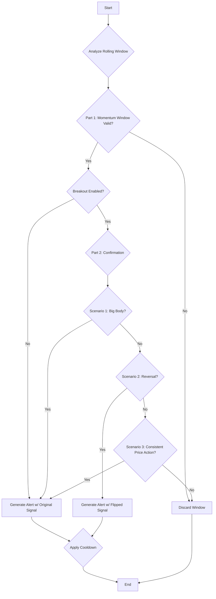

# CONSISTENT_MOMENTUM

## Objective

The **Consistent Momentum** strategy identifies a short-term, high-quality directional trend and then applies a sophisticated confirmation step to find high-probability reversal points.

Its primary goal is to first detect a clear momentum pattern and then, instead of joining it, wait for a specific volume and price action signature in the near future that signals the trend is exhausting and ready to reverse. It is, therefore, a **reversal strategy** that uses initial momentum as a prerequisite for entry.

It validates the initial momentum through a series of strict checks and then uses a forward-looking window to pinpoint the reversal confirmation.

## Key Parameters

This approach is configured in `src/stockreports/config/signal_settings.py`. A dedicated settings class, `ConsistentMomentumSettings`, in `src/stockreports/alert/approach/CONSISTENT_MOMENTUM/settings.py` loads these parameters.

| Parameter | Default | Description |
| :--- | :--- | :--- |
| `WINDOW_SIZE` | 5 | The number of consecutive candles that must all show consistent directional momentum. |
| `COOLDOWN_PERIOD` | 5 | The minimum time (in minutes) between consecutive alerts of the same direction. |
| `USE_BREAKOUT_CONFIRMATION` | `True` | If `True`, enables the Peak/Trough Breakout Confirmation step. |
| `PEAK_BOTTOM_LOOKBACK_PERIOD` | `None` | The number of minutes to look back from the alert candle to find a recent peak/trough. If `None`, it looks back through all available history. |
| `PEAK_TROUGH_PROMINENCE` | 5 | The prominence value used to detect peaks and troughs. A higher value requires a peak/trough to be more significant relative to its neighbors. |
| `BREAKOUT_FORWARD_WINDOW` | 15 | The maximum number of candles to look forward (including the alert candle) for confirmation. |
| `BODY_TO_RANGE_MIN_RATIO` | 0.5 | The minimum ratio of a candle's body to its total range, used in the "Big Body" confirmation rule. |
| `BREAKOUT_VOLUME_MULTIPLIER` | 0.8 | The multiplier for the "Consistent Price Action" reversal check. The latest candle's volume must be at least this much greater than the previous two candles' volumes. |
| `REVERSAL_VOLUME_MULTIPLIER` | 2.0 | The multiplier used in the advanced reversal logic. The max volume candle's volume must be at least this much greater than the min volume candle's volume within the forward window. |
| `USE_VOLUME_CONFIRMATION` | `False` | If `True`, requires the final candle in the momentum window to have a volume spike. |
| `USE_VOLUME_INCREASING_CONFIRMATION` | `False` | If `True`, requires the volume to be generally increasing across the momentum window. |
| `USE_LAST_CANDLE_MAX_VOLUME_CONFIRMATION` | `False` | If `True`, requires the final candle's volume to be the highest within the momentum window. |

## Step-by-Step Logic

The core logic resides in the `ConsistentMomentumExecutor` class. The algorithm first identifies a potential momentum pattern and then, if enabled, seeks to confirm a subsequent reversal.

### Part 1: Identifying the Momentum Window

The algorithm analyzes a rolling window of `WINDOW_SIZE` candles. For a window to be considered a valid momentum pattern, **all** of the following checks must pass:

1.  **Basic Momentum Check:**
    *   All candles within the window must be bullish (`close > open`) for a `BUY` signal.
    *   All candles must be bearish (`close < open`) for a `SELL` signal.

2.  **Consistent Trend (Average Price):**
    *   The average price `(open + close) / 2` is calculated for each candle in the window.
    *   For a `BUY` signal, this average price must be monotonically increasing.
    *   For a `SELL` signal, it must be monotonically decreasing.

3.  **Body Dominance Check:**
    *   The sum of the absolute body sizes of all candles in the window must be greater than the sum of all their wicks (upper and lower shadows combined). This ensures the move was driven by price conviction, not indecision.

4.  **Indicator Confirmation (Optional):**
    *   **RSI Exhaustion:** The RSI is checked on the *start and end* candles of the momentum window to ensure the move isn't starting from or ending in an overbought/oversold state.
    *   **Other Indicators:** MACD, MA, etc., are checked on the **final candle** of the window to confirm they align with the signal.

5.  **Volume Confirmation (Optional):**
    *   The logic checks up to three volume conditions on the momentum window if their respective flags are `True`:
        *   `USE_VOLUME_CONFIRMATION`: The final candle must have a volume spike.
        *   `USE_VOLUME_INCREASING_CONFIRMATION`: Volume must be trending upwards across the window.
        *   `USE_LAST_CANDLE_MAX_VOLUME_CONFIRMATION`: The final candle must have the highest volume in the window.

### Part 2: Reversal Confirmation (Optional)

If a valid momentum window is found and `USE_BREAKOUT_CONFIRMATION` is `True`, this critical step is executed to find a reversal.

1.  **Establish Reference Price:**
    *   The algorithm looks back in time from the **last candle** of the momentum window (`PEAK_BOTTOM_LOOKBACK_PERIOD`).
    *   It identifies the **Highest Peak** (for a `BUY` signal) or **Lowest Trough** (for a `SELL`) on the **closing prices** using `scipy.signal.find_peaks`. This price becomes the `breakout_price`, which serves as a reference level for the subsequent reversal patterns.
    *   If no peak/trough is found, the confirmation step is aborted.

2.  **Check Forward Window for Confirmation:**
    *   The algorithm defines a `BREAKOUT_FORWARD_WINDOW`, which starts at the last candle of the momentum window (the "alert candle").
    *   It then checks three specific scenarios in order. If any one passes, the alert is confirmed.

    *   **Scenario 1: "Big Body" Breakout on the Alert Candle**
        *   This check is performed only on the **alert candle**. It is the only scenario that confirms a **continuation** of the original trend, not a reversal.
        *   The candle must have a body-to-range ratio >= `BODY_TO_RANGE_MIN_RATIO`.
        *   The candle must have the same direction as the original signal.
        *   The close price of the candle must be beyond the `breakout_price`.
        *   If all three are true, the alert is confirmed with the **original signal**.

    *   **Scenario 2: Advanced Volume-Based Reversal**
        *   If Scenario 1 fails and the forward window has at least 3 candles, this complex reversal check is performed on the **entire forward window**.
        *   **Step 1: Identify Key Candles.**
            *   Find the candle with the maximum volume (`candle_mx`).
            *   Find the candle with the minimum volume (`candle_mn`).
            *   Identify the candle immediately following `candle_mn` as `candle_n`. If `candle_mn` is the last candle, this logic cannot proceed.
        *   **Step 2: Find the Reversal Price Level.**
            *   A lookback window is defined, consisting of up to 5 candles that occur *before* `candle_n`.
            *   Within this 5-candle window, the algorithm finds the peak `open` and `close` prices (for a SELL reversal) or the trough `open` and `close` prices (for a BUY reversal). These become the `peak_trough_open_price` and `peak_trough_close_price`.
        *   **Step 3: Check Conditions.**
            *   **Volume Condition:** `candle_mx.volume` must be >= `candle_mn.volume * REVERSAL_VOLUME_MULTIPLIER`. This identifies a volume exhaustion (`mn`) followed by a volume spike (`mx`) within the window.
            *   **Price Condition:**
                *   To reverse to **BUY**: `candle_n.close` > `peak_trough_close_price` AND `candle_n.open` > `peak_trough_open_price`.
                *   To reverse to **SELL**: `candle_n.close` < `peak_trough_close_price` AND `candle_n.open` < `peak_trough_open_price`.
            *   **Reversal Trend Condition:** The average price `(open + close) / 2` of `candle_n` must show a reversal against `candle_mn`.
                *   To reverse to **BUY**: `avg_price(candle_n)` > `avg_price(candle_mn)`.
                *   To reverse to **SELL**: `avg_price(candle_n)` < `avg_price(candle_mn)`.
        *   If **all three** conditions (Volume, Price, and Trend) are met, the alert is confirmed at `candle_n` with a **flipped signal**.

    *   **Scenario 3: "Consistent Price Action" Reversal (Fallback)**
        *   If both Scenarios 1 and 2 fail, this final check is performed on the **three most recent candles** of the forward window. Based on data analysis, this pattern now also signals a reversal. All of the following conditions must be met:
            1.  **Price Condition:** The close prices of all three candles must be above (for a BUY-to-SELL reversal) or below (for a SELL-to-BUY reversal) the `breakout_price`.
            2.  **Trend Condition:** The close price of the latest candle must be the highest (for a BUY-to-SELL reversal) or lowest (for a SELL-to-BUY reversal) of the three.
            3.  **Volume Condition:** The volume of the latest candle must be greater than or equal to the volume of the previous two candles, each multiplied by the `BREAKOUT_VOLUME_MULTIPLIER`.
        *   If this entire pattern is found, the alert is confirmed with a **flipped signal**.

3.  **Finalization:**
    *   If a confirmation candle is found by any scenario, the alert is generated with the timestamp, price, and final signal (original or flipped) of that confirmation candle.
    *   If no scenario finds a confirmation, the entire alert is discarded.

### Part 3: Cooldown

*   After a valid alert is generated, a cooldown period of `COOLDOWN_PERIOD` minutes is applied.
*   Any subsequent alert within this period that has the **same final signal direction** is ignored.

## Flow Diagram

### Diagram Explanation

1.  **Analyze Rolling Window**: The algorithm processes data in rolling windows of `WINDOW_SIZE` size.
2.  **Part 1: Momentum Window Valid?**: Checks if the current window of candles constitutes a valid momentum pattern.
3.  **Breakout Enabled?**: Determines if the optional breakout confirmation step is enabled.
4.  **Part 2: Confirmation**: If enabled, this step checks if the momentum pattern has been confirmed by a breakout or a reversal.
5.  **Cooldown Check**: Applies a cooldown period after a valid alert to prevent duplicate signals.
6.  **Generate Alert**: If all mandatory checks pass, an alert is generated.
7.  **Discard Window**: If any check fails, the current window is discarded.
