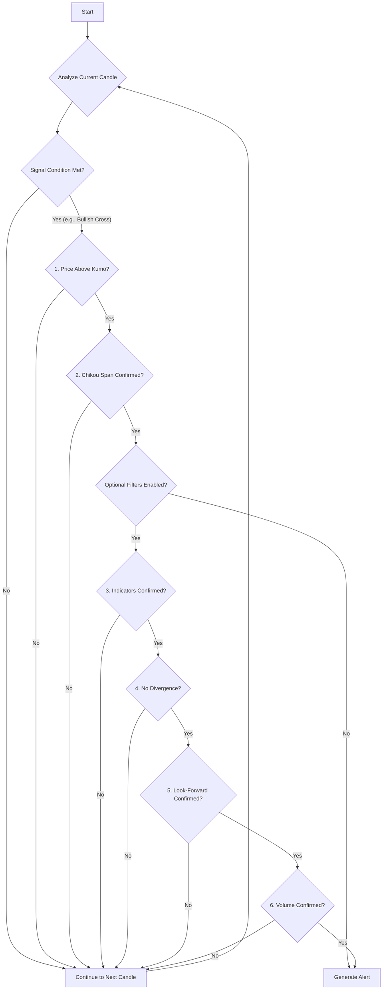

# ICHIMOKU

## Objective

The **Ichimoku Cloud** strategy is a comprehensive, all-in-one indicator that provides information about support/resistance, trend direction, and momentum. The goal of this approach is to identify strong, high-probability trades by waiting for all major components of the Ichimoku system to align, signaling a clear and confirmed trend.

## Key Parameters

This approach is configured in `src/stockreports/config/signal_settings.py`. A dedicated settings class, `IchimokuSettings`, in `src/stockreports/alert/approach/ICHIMOKU/settings.py` loads these parameters.

| Parameter | Default | Description |
| :--- | :--- | :--- |
| `TENKAN_PERIOD` | 9 | The lookback period for the Tenkan-sen (Conversion Line). |
| `KIJUN_PERIOD` | 26 | The lookback period for the Kijun-sen (Base Line). |
| `SENKOU_B_PERIOD` | 52 | The lookback period for the Senkou Span B (Leading Span B). |
| `CHIKOU_LAG` | 26 | The number of periods the Chikou Span (Lagging Span) is shifted back. |
| `MIN_BARS_BETWEEN_ALERTS` | 5 | A cooldown period; the minimum number of candles that must pass before a new alert can be generated. |
| `SKIP_CHIKOU_CONFIRMATION` | `False` | If `True`, the Chikou Span confirmation step is completely ignored. |
| `USE_DIVERGENCE_FILTER` | `False` | If `True`, checks for bearish divergence on `BUY` signals or bullish divergence on `SELL` signals and filters the alert if found. |
| `USE_CONFIRMATION_CANDLE_FILTER` | `False` | If `True`, enables a look-ahead check to ensure the trend continues for `CONFIRMATION_CANDLE_COUNT` candles. |
| `CONFIRMATION_CANDLE_COUNT` | 1 | The number of candles to look ahead for confirmation if the above filter is enabled. |
| `USE_VOLUME_CONFIRMATION` | `False` | If `True`, requires the signal candle to have a significant volume spike. |
| `USE_INCREASING_VOLUME_CONFIRMATION` | `False` | If `True`, requires volume to be increasing over the `VOLUME_CONFIRMATION_WINDOW`. |
| `USE_LAST_CANDLE_MAX_VOLUME_CONFIRMATION` | `False` | If `True`, requires the signal candle's volume to be the highest within the `VOLUME_CONFIRMATION_WINDOW`. |
| `USE_RSI_EXHAUSTION_FILTER`, `USE_MA_CONFIRMATION`, etc. | `False` | Standard confirmation flags. If enabled, these indicators are checked on the **signal candle** to confirm the signal. |

## Step-by-Step Logic

The core logic resides in the `IchimokuExecutor` class in `src/stockreports/alert/approach/ICHIMOKU/executor.py`. For a signal to be generated, a series of strict conditions must be met simultaneously on the current candle ("signal candle").

### Indicator Calculation

First, the algorithm calculates the five core components of the Ichimoku system:

1.  **Tenkan-sen (Conversion Line):** The midpoint of the `TENKAN_PERIOD` high and low.
2.  **Kijun-sen (Base Line):** The midpoint of the `KIJUN_PERIOD` high and low.
3.  **Senkou Span A (Leading Span A):** The midpoint of the Tenkan-sen and Kijun-sen, plotted `KIJUN_PERIOD` periods into the future.
4.  **Senkou Span B (Leading Span B):** The midpoint of the `SENKOU_B_PERIOD` high and low, plotted `KIJUN_PERIOD` periods into the future.
5.  **Kumo (Cloud):** The area between Senkou Span A and Senkou Span B.
6.  **Chikou Span (Lagging Span):** The current closing price, plotted `CHIKOU_LAG` periods in the *past*.

### Signal Generation Conditions

The algorithm then checks for a "perfect" bullish or bearish signal where all components align.

#### Bullish Signal (`BUY`)

A `BUY` signal is generated if **all three** of the following conditions are true on the signal candle:

1.  **Tenkan/Kijun Cross:** The Tenkan-sen (faster line) crosses **above** the Kijun-sen (slower line). This is the primary momentum trigger.
2.  **Price Above Kumo:** The signal candle's closing price is **above** both Senkou Span A and Senkou Span B, confirming the price is in bullish territory.
3.  **Chikou Confirmation:** The Chikou Span is **above the price** from `CHIKOU_LAG` periods ago. This confirms there is no major overhead resistance in the recent past. This check can be disabled with `SKIP_CHIKOU_CONFIRMATION`.

#### Bearish Signal (`SELL`)

A `SELL` signal is generated if **all three** of the following conditions are true:

1.  **Tenkan/Kijun Cross:** The Tenkan-sen crosses **below** the Kijun-sen.
2.  **Price Below Kumo:** The signal candle's closing price is **below** both Senkou Span A and Senkou Span B.
3.  **Chikou Confirmation:** The Chikou Span is **below the price** from `CHIKOU_LAG` periods ago.

### Final Validation Filters

If a `BUY` or `SELL` signal is triggered, it undergoes a series of final validation checks before an alert is created.

1.  **Indicator Confirmation (Optional):**
    *   **RSI Exhaustion:** Checks that the signal candle is not starting from an overbought/oversold level.
    *   **Standard Indicators:** Checks for alignment with other indicators like MA, MACD, etc., if enabled.
2.  **Divergence Filter (Optional):** If `USE_DIVERGENCE_FILTER` is `True`, the algorithm checks for and filters out signals that occur during price-indicator divergence.
3.  **Look-Forward Confirmation (Optional):** If `USE_CONFIRMATION_CANDLE_FILTER` is `True`, the algorithm "peeks" at the next `CONFIRMATION_CANDLE_COUNT` candles. For a `BUY`, their closes must remain above the signal candle's close. For a `SELL`, they must remain below. If the trend doesn't continue, the signal is discarded.
4.  **Volume Confirmation (Optional):** Checks for various volume patterns based on the enabled flags (`USE_VOLUME_CONFIRMATION`, `USE_INCREASING_VOLUME_CONFIRMATION`, etc.).

If all configured conditions are met, an `AlertData` object is created.

## Flow Diagram

### Diagram Explanation

1.  **Analyze Current Candle**: The algorithm processes each candle one by one.
2.  **Signal Condition Met?**: Checks for the primary trigger, which is the Tenkan-sen / Kijun-sen cross.
3.  **Price Above/Below Kumo?**: Confirms the price is on the correct side of the Ichimoku Cloud, establishing the trend direction.
4.  **Chikou Span Confirmed?**: Checks if the Lagging Span (Chikou) is free from historical price obstruction.
5.  **Optional Filters**: If the three core Ichimoku conditions align, the algorithm proceeds to a series of powerful optional filters.
6.  **Indicators/Divergence/Look-Forward/Volume**: These steps validate the signal with standard indicators (RSI, MA), check for price-indicator divergence, peek ahead to confirm the trend continues, and check for confirming volume patterns.
7.  **Generate Alert**: If all mandatory and enabled optional checks pass, an alert is generated.
8.  **Continue to Next Candle**: If any check fails, the current candle is discarded, and the algorithm moves to the next one.
