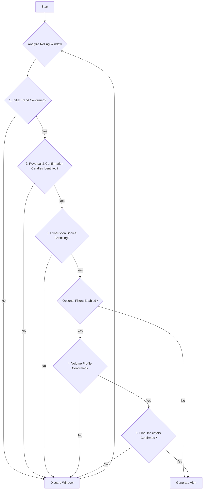

# MOMENTUM_EXHAUSTION

## Objective

The **Momentum Exhaustion** strategy is a reversal strategy that aims to identify when a strong trend is running out of steam and is likely to reverse. It looks for a specific visual pattern: a period of strong momentum followed by a period of weakening momentum (exhaustion), culminating in a reversal and a final confirmation.

## Key Parameters

This approach is configured in `src/stockreports/config/signal_settings.py`. A dedicated settings class, `MomentumExhaustionSettings`, in `src/stockreports/alert/approach/MOMENTUM_EXHAUSTION/settings.py` loads these parameters.

| Parameter | Default | Description |
| :--- | :--- | :--- |
| `MOMENTUM_CANDLE_COUNT` | 2 | The number of candles that define the initial strong trend phase. |
| `EXHAUSTION_CANDLE_COUNT` | 2 | The number of candles that define the subsequent "exhaustion" phase. |
| `SMA_SLOPE_THRESHOLD` | 0.05 | The minimum slope of a Simple Moving Average (SMA) over the momentum period required to confirm a valid initial trend. |
| `USE_VOLUME_CONFIRMATION` | `True` | If `True`, enables volume-based checks to confirm the pattern. |
| `USE_RSI_EXHAUSTION_FILTER`, `USE_MA_CONFIRMATION`, etc. | `False` | Standard confirmation flags. If enabled, these indicators are checked on the **final confirmation candle** to validate the new trend direction. |

## Step-by-Step Logic

The core logic resides in the `MomentumExhaustionExecutor` class in `src/stockreports/alert/approach/MOMENTUM_EXHAUSTION/executor.py`. The algorithm analyzes a rolling window of candles, looking for a specific four-part pattern to unfold.

The total window size is `MOMENTUM_CANDLE_COUNT` + `EXHAUSTION_CANDLE_COUNT` + 2 (for the reversal and confirmation candles).

### The Four-Part Pattern

1.  **The Momentum Phase:** The first part of the window, consisting of `MOMENTUM_CANDLE_COUNT` candles.
2.  **The Exhaustion Phase:** The next part of the window, with `EXHAUSTION_CANDLE_COUNT` candles.
3.  **The Reversal Candle:** The single candle immediately following the exhaustion phase.
4.  **The Confirmation Candle:** The final candle in the window, which confirms the reversal.

### Signal Generation Conditions

For an alert to be generated, all of the following checks must pass in sequence:

1.  **Confirm the Initial Trend:**
    *   The algorithm first establishes the direction of the initial trend during the **Momentum Phase**. It does this by calculating the slope of a Simple Moving Average (SMA) over these candles.
    *   The slope must be steeper than `SMA_SLOPE_THRESHOLD` to be considered a valid trend. A positive slope indicates a bullish trend; a negative slope indicates a bearish trend.

2.  **Identify the Reversal and Confirmation:**
    *   After a **bullish** trend, the algorithm requires the **Reversal Candle** to be bearish (`close < open`) and the final **Confirmation Candle** to also be bearish. This sequence confirms the reversal and triggers a `SELL` signal.
    *   After a **bearish** trend, it requires the **Reversal Candle** to be bullish (`close > open`) and the **Confirmation Candle** to also be bullish, triggering a `BUY` signal.

3.  **Check for Shrinking Bodies (Exhaustion):**
    *   The algorithm then verifies that the trend was indeed "exhausting" itself. It does this by examining the body sizes of the candles in the **Exhaustion Phase**.
    *   Each candle in this phase must have a smaller body than the one preceding it. This pattern of progressively shrinking candle bodies is the key indicator of momentum loss.

4.  **Volume Confirmation (Optional):**
    *   If `USE_VOLUME_CONFIRMATION` is `True`, two volume checks are performed:
        *   **Fading Volume:** The average volume during the **Exhaustion Phase** must be lower than the average volume during the **Momentum Phase**, indicating waning interest in the original trend.
        *   **Reversal Spike:** The **Reversal Candle** must be accompanied by a significant volume spike, indicating strong conviction behind the new, opposing move.

5.  **Final Indicator Confirmation (Optional):**
    *   If any standard confirmation flags (`USE_MA_CONFIRMATION`, etc.) are enabled, the algorithm performs a final check on the **Confirmation Candle**.
    *   **RSI Exhaustion:** It first ensures the new move is not *already* exhausted (e.g., not overbought for a `BUY` signal).
    *   **Standard Indicators:** It then checks if indicators like MA, MACD, etc., align with the new signal direction.

If this entire four-part pattern is successfully identified and all checks pass, an `AlertData` object is created and a signal is generated.

## Flow Diagram

### Diagram Explanation

1.  **Analyze Rolling Window**: The algorithm processes data in a rolling window large enough to contain the full Momentum -> Exhaustion -> Reversal -> Confirmation pattern.
2.  **Initial Trend Confirmed?**: Uses the slope of an SMA during the "Momentum Phase" to establish a clear initial trend direction.
3.  **Reversal & Confirmation Candles Identified?**: Checks if the candles following the trend and exhaustion phases show the correct reversal pattern (e.g., a bearish candle after a bullish trend).
4.  **Exhaustion Bodies Shrinking?**: The key logic step. Confirms that the candle bodies were progressively shrinking during the "Exhaustion Phase," indicating momentum loss.
5.  **Optional Filters**: If the core pattern is valid, the algorithm proceeds to optional validation filters.
6.  **Volume Profile Confirmed?**: Checks for the "fading volume" during exhaustion and the "volume spike" on the reversal candle.
7.  **Final Indicators Confirmed?**: Validates the new trend direction on the final confirmation candle using standard indicators like RSI, MA, and MACD.
8.  **Generate Alert**: If all mandatory and enabled optional checks pass, an alert is generated.
9.  **Discard Window**: If any check fails, the current window is discarded.
