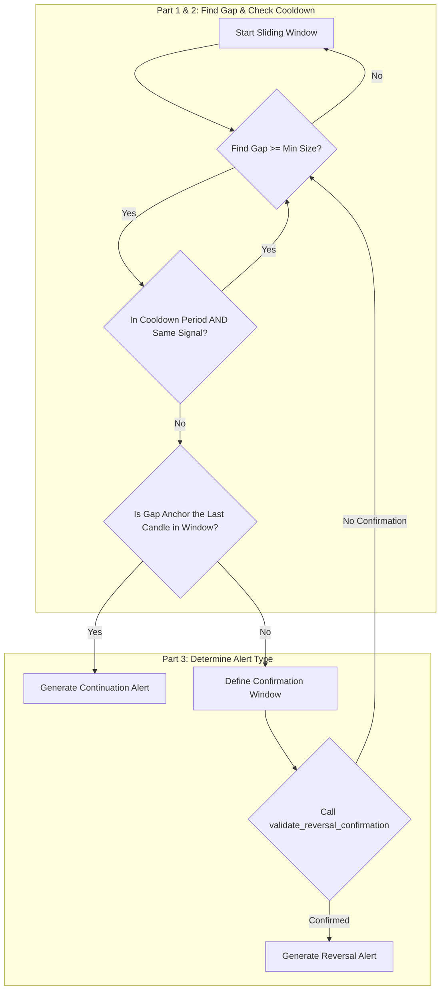

# Price Gap Approach

## 1. Objective

The **Price Gap** approach is designed to identify trading opportunities that arise from significant price gaps between two consecutive candles. The core logic is to find a gap and then determine if it will result in a **Continuation** of the gap's trend or a **Reversal** against it.

The logic operates on a sliding `LOOKBACK_WINDOW` of candles.

## 2. Key Parameters

This approach is configured in `src/stockreports/config/signal_settings.py` and loaded by the `PriceGapSettings` class.

| Parameter | Default | Description |
| :--- | :--- | :--- |
| `LOOKBACK_WINDOW` | 10 | The number of candles in the sliding window used to identify a pattern. |
| `MIN_GAP_SIZE` | 5.0 | The minimum price difference required between one candle's close and the next one's open to be considered a significant gap. |
| `MIN_ALERT_BODY_SIZE` | 0.3 | The minimum required body size for a candle to be considered a valid alert candle, specifically used in the reversal validation. |
| `COOLDOWN_WINDOW` | 3 | The minimum time (in minutes) that must pass before another alert with the same signal can be generated. |

## 3. Step-by-Step Logic

The core logic is implemented in the `PriceGapExecutor` class. It iterates through the data using a sliding window and performs the following checks for each window:

### Part 1: Find the Price Gap

1.  **Scan for Gap**: The algorithm iterates through the `LOOKBACK_WINDOW` to find the first occurrence of a price gap between two consecutive candles (`previous_candle` and `current_candle`).
    *   **Condition**: `abs(current_candle['open'] - previous_candle['close']) >= MIN_GAP_SIZE`.
2.  **Identify Gap Anchor**: The `current_candle` (the one that opens after the gap) is marked as the "Gap Anchor Candle".
3.  **Determine Gap Trend**: A trend is inferred from the gap direction (e.g., a gap up implies a `BUY` trend).

### Part 2: Check for Cooldown

4.  **Cooldown Validation**: Before proceeding, the system checks if a new alert is permissible based on the cooldown rules.
    *   **Condition**: An alert is **ignored** if the time since the last generated alert is less than the `COOLDOWN_WINDOW` **AND** the signal of the potential new alert is the same as the last one.

### Part 3: Determine Alert Type (Continuation vs. Reversal)

Once a valid, non-cooldown gap is found, the logic branches into two scenarios:

#### Scenario A: Continuation Alert

5.  **Condition**: This scenario occurs if the **Gap Anchor Candle** is also the **very last candle** in the `LOOKBACK_WINDOW`.
6.  **Alert Generation**: An alert is generated immediately.
    *   **Signal**: Same as the Gap Trend (e.g., gap up → `BUY` alert).
    *   **Alert Candle**: The Gap Anchor Candle itself.

#### Scenario B: Reversal Alert

7.  **Condition**: This scenario occurs if there are more candles in the window *after* the Gap Anchor Candle.
8.  **Define Confirmation Window**: A "confirmation window" is defined, starting from the Gap Anchor Candle to the end of the lookback window.
9.  **Validate Reversal**: The executor calls the standardized `validate_reversal_confirmation` utility on this confirmation window.
    *   **Important**: It checks for a signal that is the **opposite** of the initial Gap Trend (e.g., a gap up is followed by a search for a `SELL` reversal).
10. **Alert Generation**: If the utility finds a valid reversal pattern, an alert is generated.
    *   **Signal**: The reversal signal (opposite of the Gap Trend).
    *   **Alert Candle**: The confirming candle identified by the utility.

## 4. Flow Diagram

