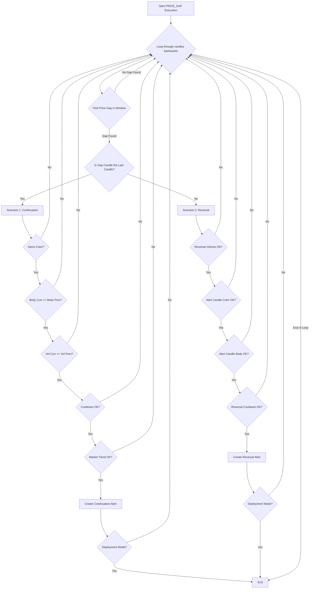

# PRICE_GAP Approach

## 1. Objective

The PRICE_GAP approach is a dual-scenario strategy that capitalizes on significant price gaps between consecutive candles. A price gap occurs when the opening price of a candle is substantially higher or lower than the previous candle's closing price, indicating a strong shift in market sentiment. The approach can trigger two types of alerts:

1.  **Continuation Alert**: If a strong gap occurs and the price continues to move in the same direction, an alert is fired, signaling a potential continuation of the new trend.
2.  **Reversal Alert**: If a strong gap occurs but is then followed by a confirmed price reversal against the direction of the gap, an alert is fired, signaling a potential exhaustion of the initial move and the start of a new trend in the opposite direction.

## 2. Key Parameters

The behavior of the PRICE_GAP executor is controlled by the following parameters, which are configured in `src/stockreports/config/signal_settings.py`.

| Parameter                             | Default Value | Description                                                                                                                              |
| ------------------------------------- | ------------- | ---------------------------------------------------------------------------------------------------------------------------------------- |
| `LOOKBACK_WINDOW`                     | 10            | The number of candles to include in the analysis window to search for a price gap.                                                       |
| `MIN_GAP_SIZE`                        | 1.5           | The minimum price difference required between the previous candle's body and the current candle's open to be considered a valid gap.       |
| `MIN_ALERT_BODY_SIZE`                 | 1.0           | The minimum body size of the alert candle in reversal scenarios.                                                                         |
| `COOLDOWN_WINDOW`                     | 3             | The number of candles to wait after an alert is generated before another alert of the same type can be issued.                           |
| `ENABLE_MARKET_TREND_VALIDATION`      | `True`        | If `True`, the alert will only be triggered if it aligns with the broader market trend (e.g., a BUY signal during a market uptrend).       |
| `IMPACT_SYMBOLS_MIN_BODY_TO_RANGE_RATIO` | 0.3           | When validating against the market trend, this is the minimum body-to-range ratio required for the candles of impact symbols (like VN30). |
| `VOLUME_MULTIPLIER`                   | 1.5           | The minimum volume multiplier required for the max volume candle relative to the pre-reversal average volume in reversal scenarios.      |

## 3. Step-by-Step Logic

The executor scans backwards through the data. For each window, it looks for a price gap and then evaluates the two possible scenarios (Continuation or Reversal).

1.  **Step 1: Price Gap Detection**:
    *   The algorithm iterates through the `LOOKBACK_WINDOW` to find a candle whose opening price creates a significant gap relative to the previous candle's body (high or low).
    *   **Validation**: The absolute size of this gap must be greater than or equal to `MIN_GAP_SIZE`.
    *   If a valid gap is found, the candle causing the gap is marked as `anchor_candle_A`, and the direction of the gap determines the `gap_trend_signal` (`BUY` for an upward gap, `SELL` for a downward gap).

2.  **Scenario Evaluation**: The logic then splits based on where the `anchor_candle_A` is located.

    *   **Scenario 1: Continuation Alert**
        *   This occurs if the `anchor_candle_A` is the *last candle* in the window.
        *   **Step 2a - Continuation Candle Characteristics Validation**:
            - **Validation 1**: The previous candle and current candle must have the same color (both green or both red).
            - **Validation 2**: The body of the current candle must be >= the body of the previous candle. Body is calculated as `abs(close - open)`.
            - **Validation 3**: The volume of the current candle must be <= the volume of the previous candle.
        *   **Step 3a - Cooldown Check**: A cooldown check is performed to ensure the alert is not within the cooldown period from the last alert.
        *   **Step 4a - Market Trend Validation (Optional)**: If enabled, it checks if the `gap_trend_signal` aligns with the broader market trend.
        *   **Step 5a - Alert Generation**: If all validations pass, a "Continuation" alert is created.

    *   **Scenario 2: Reversal Alert**
        *   This occurs if the `anchor_candle_A` is *not* the last candle in the window, meaning there are subsequent candles to analyze for a reversal.
        *   **Step 3b - Validate Reversal Confirmation by Volume**:
            - **Validation 1**: The alert candle must be the last candle in the window.
            - **Validation 2**: Define reversal window starting from the gap candle and pre-reversal window before the gap.
            - **Validation 3**: Calculate the average volume of the pre-reversal window.
            - **Validation 4**: Find the max volume candle in the reversal window.
            - **Validation 5a**: The max volume candle must be at or before the alert candle (not after).
            - **Validation 5b**: The volume of the max volume candle must meet the threshold by comparing with the average of the pre-reversal window. The multiplier is controlled by `VOLUME_MULTIPLIER`.
        *   **Step 3c - Validate Alert Candle Characteristics**:
            - **Validation 1**: Alert candle color must be compatible with the reversal signal (for BUY reversal: green candle, for SELL reversal: red candle).
            - **Validation 2**: Alert candle body must be >= `MIN_ALERT_BODY_SIZE`.
        *   **Step 4b - Cooldown Check**: A cooldown check is performed on the reversal alert.
        *   **Step 5b - Alert Generation**: If all validations pass, a "Reversal" alert is created.

3.  **Loop Control**:
    *   Once an alert (either Continuation or Reversal) is found and generated within a window, the inner loop breaks, and the process moves to the next outer window.
    *   In `DEPLOYMENT` mode, the entire function returns immediately after the first alert is found.

## 4. Flow Diagram

