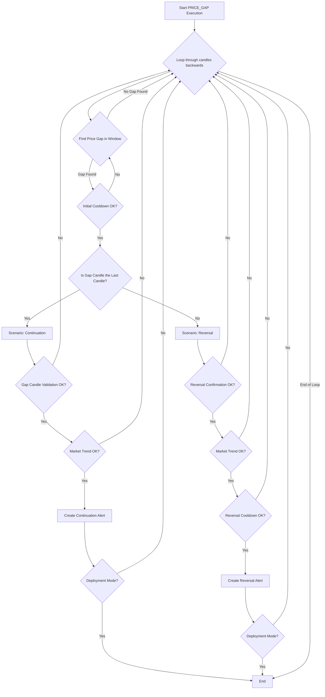

# PRICE_GAP Approach

## 1. Objective

The PRICE_GAP approach is a dual-scenario strategy that capitalizes on significant price gaps between consecutive candles. A price gap occurs when the opening price of a candle is substantially higher or lower than the previous candle's closing price, indicating a strong shift in market sentiment. The approach can trigger two types of alerts:

1.  **Continuation Alert**: If a strong gap occurs and the price continues to move in the same direction, an alert is fired, signaling a potential continuation of the new trend.
2.  **Reversal Alert**: If a strong gap occurs but is then followed by a confirmed price reversal against the direction of the gap, an alert is fired, signaling a potential exhaustion of the initial move and the start of a new trend in the opposite direction.

## 2. Key Parameters

The behavior of the PRICE_GAP executor is controlled by the following parameters, which are configured in `src/stockreports/config/signal_settings.py`.

| Parameter                             | Default Value | Description                                                                                                                              |
| ------------------------------------- | ------------- | ---------------------------------------------------------------------------------------------------------------------------------------- |
| `LOOKBACK_WINDOW`                     | 10            | The number of candles to include in the analysis window to search for a price gap.                                                       |
| `MIN_GAP_SIZE`                        | 1.5           | The minimum price difference required between the previous candle's body and the current candle's open to be considered a valid gap.       |
| `MIN_ALERT_BODY_SIZE`                 | 1.0           | The minimum body size of the candles involved in the reversal or continuation confirmation pattern.                                      |
| `COOLDOWN_WINDOW`                     | 3             | The number of candles to wait after an alert is generated before another alert of the same type can be issued.                           |
| `MAX_DISTANCE_CLOSE_PRICE`            | 2.0           | In a reversal scenario, this is the maximum allowed price difference between the close prices of the candles in the reversal pattern.      |
| `ENABLE_MARKET_TREND_VALIDATION`      | `True`        | If `True`, the alert will only be triggered if it aligns with the broader market trend (e.g., a BUY signal during a market uptrend).       |
| `IMPACT_SYMBOLS_MIN_BODY_TO_RANGE_RATIO` | 0.3           | When validating against the market trend, this is the minimum body-to-range ratio required for the candles of impact symbols (like VN30). |

## 3. Step-by-Step Logic

The executor scans backwards through the data. For each window, it looks for a price gap and then evaluates the two possible scenarios (Continuation or Reversal).

1.  **Price Gap Detection**:
    *   The algorithm iterates through the `LOOKBACK_WINDOW` to find a candle whose opening price creates a significant gap relative to the previous candle's body (high or low).
    *   **Validation**: The absolute size of this gap must be greater than or equal to `MIN_GAP_SIZE`.
    *   If a valid gap is found, the candle causing the gap is marked as `anchor_candle_A`, and the direction of the gap determines the `gap_trend_signal` (`BUY` for an upward gap, `SELL` for a downward gap).

2.  **Initial Cooldown Check**:
    *   A cooldown check is immediately performed on the gap event itself to prevent over-alerting on the same initial move.

3.  **Scenario Evaluation**: The logic then splits based on where the `anchor_candle_A` is located.

    *   **Scenario A: Continuation Alert**
        *   This occurs if the `anchor_candle_A` is the *last candle* in the window.
        *   **Step 1: Gap Candle Validation**: The gap candle itself is validated to ensure it's a strong, decisive candle (checking its body size, body-to-range ratio, and direction).
        *   **Step 2: Market Trend Validation (Optional)**: If enabled, it checks if the `gap_trend_signal` aligns with the broader market trend.
        *   **Step 3: Alert Generation**: If validations pass, a "Continuation" alert is created.

    *   **Scenario B: Reversal Alert**
        *   This occurs if the `anchor_candle_A` is *not* the last candle in the window, meaning there are subsequent candles to analyze for a reversal.
        *   **Step 1: Define Reversal**: A `reversal_signal` is defined as the opposite of the `gap_trend_signal`. The analysis window is narrowed to the `confirmation_df`, starting from the gap candle.
        *   **Step 2: Validate Reversal Confirmation**: The shared `validate_reversal_confirmation` utility is called to find a valid reversal pattern within the `confirmation_df`.
        *   **Step 3: Market Trend Validation (Optional)**: If a reversal is confirmed and the feature is enabled, it checks if the `reversal_signal` aligns with the broader market trend.
        *   **Step 4: Reversal Cooldown Check**: A final cooldown check is performed for the reversal alert itself.
        *   **Step 5: Alert Generation**: If all validations pass, a "Reversal" alert is created.

4.  **Loop Control**:
    *   Once an alert (either Continuation or Reversal) is found and generated within a window, the inner loop breaks, and the process moves to the next outer window.
    *   In `DEPLOYMENT` mode, the entire function returns immediately after the first alert is found.

## 4. Flow Diagram

