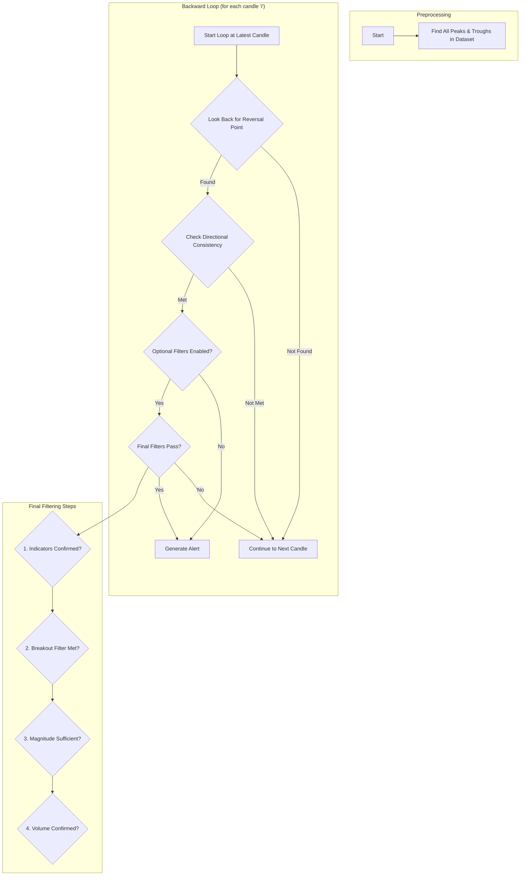

# RCM (Reversal Confirmation Model)

## Objective

The **Reversal Confirmation Model (RCM)** is a trend-following strategy designed to identify and act on significant market reversals. Its primary goal is to detect when a prevailing trend has likely ended and a new trend in the opposite direction is beginning. It does this by first identifying a potential reversal point (a significant peak or trough) and then waiting for a confirmation of momentum in the new direction before generating a signal.

The logic operates with a **backward loop**, starting from the most recent candle and working backward to find a recently completed RCM pattern.

## Key Parameters

This approach is configured in `src/stockreports/config/signal_settings.py`. A dedicated settings class, `RCMSettings`, in `src/stockreports/alert/approach/RCM/settings.py` loads these parameters.

| Parameter | Default | Description |
| :--- | :--- | :--- |
| `PEAK_TROUGH_PROMINENCE` | 5 | **(Crucial)** The prominence of a peak/trough. This value determines how much a peak/trough must stand out from the surrounding data to be considered significant. A higher value filters out minor fluctuations. |
| `CONFIRMATION_WINDOW` | 3 | The number of candles *after* a peak or trough during which the algorithm will look for a confirmation signal. |
| `CONFIRMATION_MIN_CONSISTENCY` | 2 | The minimum number of candles that must move in the signal's direction within the confirmation window. |
| `PEAK_BOTTOM_LOOKBACK_PERIOD` | `None` | If set, requires the confirmation candle to break out of the price range established in this many candles *before* the reversal point. |
| `MIN_ALERT_MAGNITUDE` | 0 | The minimum required price change (magnitude) between the reversal point and the confirmation candle's close. |
| `USE_VOLUME_CONFIRMATION` | `False` | If `True`, requires the confirmation candle to have a significant volume spike. |
| `USE_INCREASING_VOLUME_CONFIRMATION` | `False` | If `True`, requires the volume during the confirmation window to be generally increasing. |
| `USE_LAST_CANDLE_MAX_VOLUME_CONFIRMATION` | `False` | If `True`, requires the final confirmation candle to have the highest volume within its local window. |
| `USE_RSI_EXHAUSTION_FILTER`, `USE_MA_CONFIRMATION`, etc. | `False` | Standard confirmation flags. If enabled, these indicators are checked on the **final confirmation candle** to validate the new trend direction. |

## Step-by-Step Logic (Backward Loop)

The core logic is implemented in the `RCMExecutor` class in `src/stockreports/alert/approach/RCM/executor.py`. The algorithm first identifies all significant peaks and troughs in the dataset and then iterates backward through the candles.

### Step 1: Identify All Potential Reversal Points

1.  **Find Peaks and Troughs:** The algorithm first scans the `close` price data to identify all potential reversal points using `scipy.signal.find_peaks`. By analyzing the closing prices, it focuses on the confirmed end-of-period sentiment rather than intra-period volatility (highs and lows).
2.  **Apply Prominence Filter:** It uses the `PEAK_TROUGH_PROMINENCE` setting to filter these points, ensuring that only price swings more significant than this threshold are considered. The locations of these valid peaks and troughs are stored for quick lookup.

### Step 2: Backward Scan for a Reversal-Confirmation Pattern

The main loop iterates backward, treating each candle `i` as a potential **confirmation candle**.

1.  **Look for a Prior Reversal:** For each candle `i`, the code looks backward within the `CONFIRMATION_WINDOW` for a previously identified peak or trough.
2.  **Check Directional Consistency:** If a reversal point (e.g., a trough) is found, the algorithm examines the window of candles between the reversal and the confirmation candle. It checks if at least `CONFIRMATION_MIN_CONSISTENCY` candles within this window moved in the expected direction (e.g., bullish candles after a trough).
3.  **Signal Identified:** If the consistency check passes, a potential signal is identified, and the algorithm proceeds to the final filtering stage.

### Step 3: Final Filtering and Signal Generation

Once a potential Reversal -> Confirmation pattern is identified, a final series of checks is performed on the confirmation candle `i`:

1.  **Indicator Confirmation (Optional):**
    *   **RSI Exhaustion:** Checks that the confirmation candle is not signaling a move that is already overbought/oversold.
    *   **Standard Indicators:** Checks for alignment with other indicators like MA, MACD, etc., if enabled.
2.  **Breakout Filter (Optional):** If `PEAK_BOTTOM_LOOKBACK_PERIOD` is set, it checks that the confirmation candle's close has broken above the highs (for a BUY) or below the lows (for a SELL) of the specified lookback window *prior* to the reversal point.
3.  **Magnitude Filter:** The price change between the **`close` price of the reversal candle** and the `close` price of the confirmation candle must be greater than `MIN_ALERT_MAGNITUDE`.
4.  **Volume Filters (Optional):** If any of the volume settings are enabled, the following checks are performed:
    *   `USE_VOLUME_CONFIRMATION`: Checks for a significant volume spike on the confirmation candle `i`.
    *   `USE_INCREASING_VOLUME_CONFIRMATION`: Checks for a generally increasing volume trend within the confirmation window (from the reversal to candle `i`).
    *   `USE_LAST_CANDLE_MAX_VOLUME_CONFIRMATION`: Checks if the confirmation candle `i` has the highest volume within the confirmation window.

If all enabled filters pass, an `AlertData` object is created with the signal (`BUY` or `SELL`). In deployment mode, the function returns immediately with this latest alert. In development mode, the loop continues to find all historical occurrences of the pattern.

## Flow Diagram

### Diagram Explanation

1.  **Find All Peaks & Troughs**: Before starting, the algorithm scans the entire dataset once to identify all significant price swings based on `PEAK_TROUGH_PROMINENCE`. This is a performance optimization.
2.  **Start Loop at Latest Candle**: The main logic begins at the most recent candle and works its way backward in time. Each candle `i` is treated as a potential final confirmation of a pattern.
3.  **Look Back for Reversal Point**: For each candle `i`, the code looks back within the `CONFIRMATION_WINDOW` to see if one of the pre-identified peaks or troughs exists.
4.  **Check Directional Consistency**: If a reversal point is found (e.g., a trough), it checks if the candles between the trough and candle `i` show consistent bullish movement.
5.  **Final Filters Pass?**: If the basic pattern is confirmed, the signal is subjected to a final series of rigorous, optional checks on the confirmation candle `i`.
6.  **Indicators/Breakout/Magnitude/Volume**: These steps validate the signal with standard indicators, check for a breakout of a prior price range, ensure the move has sufficient price change, and confirm volume patterns.
7.  **Generate Alert**: If all mandatory and enabled optional checks pass, an alert is generated.
8.  **Continue to Next Candle**: If any check fails, the algorithm moves to the previous candle (`i-1`) and repeats the process.
