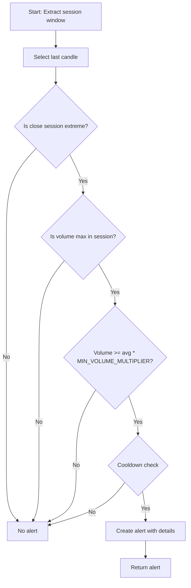

# SESSION_EXTREME_VOLUME_REVERSAL Approach Documentation

## Objective
Identify alert candles that are session extremes in close and volume, with config-driven validation. The approach scans from 09:30:00 to the current candle and triggers an alert if the last candle is both the session's close extreme (in trend direction) and has the maximum volume, with volume exceeding a configurable multiplier of the session average. Cooldown logic and all thresholds are fully config-driven.

## Key Parameters
| Parameter              | Default | Description                                                      |
|------------------------|---------|------------------------------------------------------------------|
| LOOKBACK_WINDOW        | 10      | Number of candles in the session window                          |
| MIN_VOLUME_MULTIPLIER  | 3.5     | Minimum multiplier for alert candle volume vs. average session volume |
| MAGNITUDE_THRESHOLD    | 3.0     | Magnitude threshold for alert creation (used as final_magnitude) |
| COOLDOWN_WINDOW        | 3       | Minimum number of candles between alerts                         |

## Step-by-Step Logic
1. **Extract session window**: From 09:30:00 to the last candle, length = `LOOKBACK_WINDOW`.
2. **Alert candidate**: The last candle in the session window.
3. **Trend extreme validation**: The alert candle's close is the session's highest (if uptrend) or lowest (if downtrend).
4. **Max volume validation**: The alert candle has the maximum volume in the session window.
5. **Volume threshold validation**: The alert candle's volume is at least `MIN_VOLUME_MULTIPLIER` times the average session volume.
6. **Cooldown check**: No alert if within `COOLDOWN_WINDOW` of the last alert.
7. **Alert creation**: If all validations pass, create an alert with details and set `final_magnitude` to `MAGNITUDE_THRESHOLD`.

## Flow Diagram

## Example Usage & Debug
- Ensure the approach is registered in `signal_settings.py`.
- Use the generic debug executor to test with historical data.
- Example: `python -m src.stockreports.alert.symbol_alert_manager --approach SESSION_EXTREME_VOLUME_REVERSAL --symbol SYMBOL`

## Checklist: Rule Compliance
- [x] All parameters centralized in config/settings
- [x] No hardcoded values in executor
- [x] Each validation is a separate function, tracked with step/validation counters
- [x] All validation failures logged with full context
- [x] Alert creation uses base class helpers
- [x] Cooldown logic enforced
- [x] Documentation matches code logic exactly
