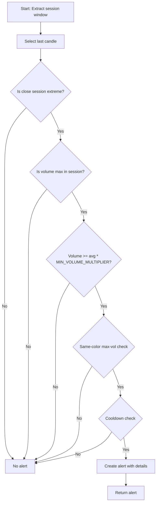

# SESSION_EXTREME_VOLUME_REVERSAL Approach Documentation

## Objective
Identify alert candles that are session extremes in close and volume, with config-driven validation. The approach scans from 09:30:00 to the current candle and triggers an alert if the last candle is both the session's close extreme (in trend direction) and has the maximum volume, with volume exceeding a configurable multiplier of the session average, and is supported by a same-directioned high-volume candle. Cooldown logic and all thresholds are fully config-driven.

## Key Parameters
| Parameter                          | Default | Description                                                      |
|------------------------------------|---------|------------------------------------------------------------------|
| LOOKBACK_WINDOW                    | 10      | Number of candles in the session window                          |
| MIN_VOLUME_MULTIPLIER              | 3.5     | Minimum multiplier for alert candle volume vs. average session volume |
| MIN_SAME_COLOR_MAX_VOLUME_MULTIPLIER | 2.5   | Minimum multiplier for alert candle vs same-color max-volume candle |
| MAGNITUDE_THRESHOLD                | 6.5     | Magnitude threshold for alert creation (used as final_magnitude) |
| COOLDOWN_WINDOW                    | 3       | Minimum number of candles between alerts                         |

## Step-by-Step Logic
1. **Extract session window**: From 09:30:00 to the last candle, length = `LOOKBACK_WINDOW`.
2. **Alert candidate**: The last candle in the session window.
3. **Trend extreme validation**: The alert candle's close is the session's highest (if uptrend) or lowest (if downtrend).
4. **Max volume validation**: The alert candle has the maximum volume in the session window.
5. **Volume threshold validation**: The alert candle's volume is at least `MIN_VOLUME_MULTIPLIER` times the average session volume.
6. **Same-color max-volume validation**: The alert candle's volume meets the multiplier threshold vs. the maximum-volume candle among same-color candles:
   - Find all candles with the same color (green/red) as the alert candle
   - Identify the candle with maximum volume among same-color candles
   - Validate: `alert_volume >= same_color_max_volume * MIN_SAME_COLOR_MAX_VOLUME_MULTIPLIER`
   - Ensures directional momentum is supported by the strongest same-directioned candle
7. **Cooldown check**: No alert if within `COOLDOWN_WINDOW` of the last alert.
8. **Alert creation**: If all validations pass, create an alert with details and set `final_magnitude` to `MAGNITUDE_THRESHOLD`.

## Validation Details

### Step 6: Same-Color Max-Volume Validation

**Purpose**: Verify that the alert candle's volume is aligned with the strongest same-directioned candle in the session.

**Algorithm**:
1. Determine alert candle color: GREEN if (close > open), RED if (close < open)
2. Filter session window to candles with same color (excluding alert candle)
3. Find the candle with maximum volume among filtered same-color candles
4. Calculate threshold: `max_same_color_volume * MIN_SAME_COLOR_MAX_VOLUME_MULTIPLIER`
5. Validate: `alert_volume >= threshold`

**Example**:
```
Alert Candle:        GREEN (close > open), volume = 15000
Session Window:
  - Candle 1: RED (close < open), volume = 8000
  - Candle 2: GREEN (close > open), volume = 12000 ← MAX among GREEN
  - Candle 3: RED (close < open), volume = 9000
  - Alert:    GREEN (close > open), volume = 15000

Max-Volume Green Candle: 12000
Threshold: 12000 * 2.5 = 30000
Validation: 15000 >= 30000 ? FAIL

Alternative with multiplier=1.2:
Threshold: 12000 * 1.2 = 14400
Validation: 15000 >= 14400 ? PASS ✓
```

**Configuration**:
- Default multiplier: 2.5 (stricter, requires alert to be 2.5x same-color max)
- Typical range: 1.0 - 2.5
- 1.0 = allow equal to same-color max-volume
- 1.5 = require 150% of same-color max-volume

## Flow Diagram


## Example Usage & Debug
- Ensure the approach is registered in `signal_settings.py`.
- Use the generic debug executor to test with historical data.
- Example: `python -m src.stockreports.alert.symbol_alert_manager --approach SESSION_EXTREME_VOLUME_REVERSAL --symbol SYMBOL`

## Tuning Guide

### Alert Volume Impact
- **Increase multiplier** (e.g., 3.0): Fewer alerts (stricter), requires alert volume to be significantly higher
- **Decrease multiplier** (e.g., 1.2): More alerts (permissive), allows alert volume to be just slightly higher

### Configuration Examples

**Conservative (Stricter)**:
```python
"MIN_VOLUME_MULTIPLIER": 4.0,
"MIN_SAME_COLOR_MAX_VOLUME_MULTIPLIER": 2.5
```

**Balanced (Default)**:
```python
"MIN_VOLUME_MULTIPLIER": 3.5,
"MIN_SAME_COLOR_MAX_VOLUME_MULTIPLIER": 2.5
```

**Permissive (More Alerts)**:
```python
"MIN_VOLUME_MULTIPLIER": 3.0,
"MIN_SAME_COLOR_MAX_VOLUME_MULTIPLIER": 1.2
```

## Checklist: Rule Compliance
- [x] All parameters centralized in config/settings
- [x] No hardcoded values in executor
- [x] Each validation is a separate function, tracked with step/validation counters
- [x] All validation failures logged with full context
- [x] Alert creation uses base class helpers
- [x] Same-color max-volume validation ensures directional alignment
- [x] Multiplier-based thresholds provide flexible tuning
- [x] Cooldown logic enforced
- [x] Documentation matches code logic exactly
