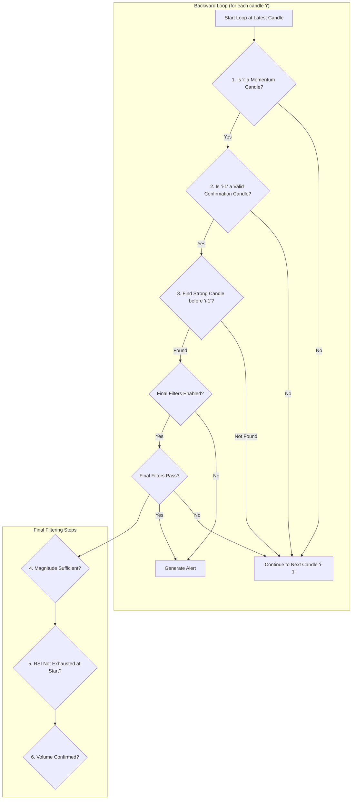

# STRONG_CANDLE

## Objective

The **Strong Candle** strategy is designed to identify moments of decisive, high-conviction momentum. It operates by identifying a specific three-part sequence that unfolds over time: a powerful initial move (the "Strong Candle"), a period of indicator-based confirmation, and finally, immediate follow-through momentum. This ensures the signal is not just a random spike but the start of a potentially sustainable move.

The logic uses a **backward loop**, which is more performant for real-time analysis. It starts from the most recent candle and works backward to identify if the complete pattern has just finished.

## Key Parameters

This approach is configured in `src/stockreports/config/signal_settings.py` and uses the following key parameters:

| Parameter | Default | Description |
| :--- | :--- | :--- |
| `CONFIRMATION_WINDOW` | 4 | The number of candles to look back from the confirmation candle to find the initial "Strong Candle". |
| `MIN_ALERT_MAGNITUDE` | 0 | The minimum price change required from the start of the pattern (the "Strong Candle") to the end (the "Momentum Candle"). |
| `TREND_STRENGTH_STRONG_CLOSE_TAIL_RATIO` | 0.4 | A global setting that defines how small a candle's opposing wick must be relative to its body to be considered "strong." |
| `USE_VOLUME_CONFIRMATION` | `False` | If `True`, requires the final momentum candle to have a significant volume spike. |
| `USE_INCREASING_VOLUME_CONFIRMATION` | `False` | If `True`, requires volume to be generally increasing across the entire pattern sequence. |
| `USE_LAST_CANDLE_MAX_VOLUME_CONFIRMATION` | `False` | If `True`, requires the final momentum candle to have the highest volume within the pattern window. |
| `USE_RSI_EXHAUSTION_FILTER`, `USE_MA_CONFIRMATION`, etc. | `False` | Standard confirmation flags. These are used to validate the "Confirmation Candle" and to filter the "Strong Candle". |

## Step-by-Step Logic (Backward Loop)

The core logic resides in the `_find_strong_candle_alerts` function in `src/stockreports/alert/approach/STRONG_CANDLE/executor.py`. The algorithm iterates backward from the most recent candle. For each candle `i`, it treats it as a potential "Momentum Candle" and works backward to find the preceding parts of the pattern.

### The Three-Part Pattern (Identified in Reverse)

1.  **The Momentum Candle:** The final candle of the pattern (`i`).
2.  **The Confirmation Candle:** The candle immediately preceding the momentum candle (`i-1`).
3.  **The Strong Candle:** A candle found within a lookback window *before* the confirmation candle.

### Signal Generation Conditions

1.  **Identify the Momentum Candle:**
    *   The loop starts at the latest data point. Each candle `i` is a candidate for the final step.
    *   It must show momentum by closing higher than the previous candle `i-1` (for a `BUY`) or lower (for a `SELL`). If not, the loop continues to the next candle.

2.  **Validate the Confirmation Candle:**
    *   If momentum is found, the algorithm checks the "Confirmation Candle" (`i-1`).
    *   This candle must receive a valid signal from the standard indicator checks (`is_signal_confirmed`), which evaluates MACD, MA, etc., based on the enabled flags. If the indicators do not confirm the trend on this candle, the pattern is invalid.

3.  **Find the Initial Strong Candle:**
    *   If the confirmation candle is valid, the algorithm searches backward from candle `i-2` for up to `CONFIRMATION_WINDOW` candles to find the "Strong Candle".
    *   A "Strong Candle" is defined as having:
        *   A body size larger than the minimum profit loss setting.
        *   A small opposing wick (tail), based on `TREND_STRENGTH_STRONG_CLOSE_TAIL_RATIO`.
    *   Once the first valid "Strong Candle" is found, the search stops. If none is found in the window, the pattern is invalid.

### Final Validation and Signal Generation

If the full backward pattern (Momentum -> Confirmation -> Strong Candle) is identified:

1.  **Magnitude Check:** The total price change from the `start_price` of the "Strong Candle" to the `alert_price` of the "Momentum Candle" is checked against `MIN_ALERT_MAGNITUDE`.
2.  **RSI Exhaustion Filter:** The algorithm checks the candle *immediately preceding* the "Strong Candle" to ensure the move didn't start from an already overbought or oversold position.
3.  **Volume Check (Optional):** If enabled, it checks for a volume spike, increasing volume, or max volume on the "Momentum Candle" relative to the pattern's duration.

If all checks pass, an `AlertData` object is created, and a signal is generated.

## Flow Diagram

### Diagram Explanation

1.  **Start Loop at Latest Candle**: The algorithm begins at the most recent candle and works backward, treating each candle `i` as the potential end of the three-part pattern.
2.  **Is 'i' a Momentum Candle?**: Checks if candle `i` shows follow-through momentum relative to the previous candle (`i-1`).
3.  **Is 'i-1' a Valid Confirmation Candle?**: If momentum exists, it validates the preceding candle (`i-1`) using standard indicators (MA, MACD, etc.) to confirm the underlying trend.
4.  **Find Strong Candle before 'i-1'?**: If the confirmation is valid, it searches back within the `CONFIRMATION_WINDOW` to find the initial "Strong Candle" that kicked off the move.
5.  **Final Filters Pass?**: If the complete three-part pattern is found, it undergoes a final set of optional checks.
6.  **Magnitude/RSI/Volume**: These steps ensure the move had sufficient price change, check that the move didn't start from an exhausted state, and confirm volume patterns.
7.  **Generate Alert**: If all mandatory and enabled optional checks pass, an alert is generated.
8.  **Continue to Next Candle**: If any check fails, the algorithm moves to the previous candle (`i-1`) and repeats the process.
