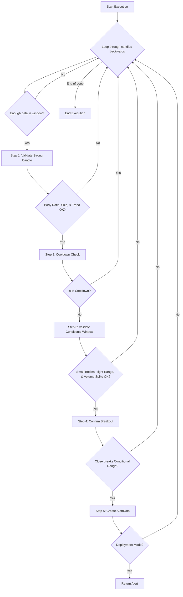

# STRONG_CANDLE Approach

## 1. Objective

The STRONG_CANDLE approach is designed to identify significant market breakouts following a period of consolidation. It operates by detecting a "strong candle"—characterized by its large body and high volume—that emerges after a "conditional window" of low volatility and tight price range. The core strategy is to capture momentum-driven moves that signal the start of a new, decisive trend.

## 2. Key Parameters

The behavior of the STRONG_CANDLE executor is controlled by the following parameters, configured in `src/stockreports/config/signal_settings.py`.

| Parameter                          | Default Value | Description                                                                                                                              |
| ---------------------------------- | ------------- | ---------------------------------------------------------------------------------------------------------------------------------------- |
| `LOOKBACK_WINDOW`                  | 6             | The total number of candles in the analysis window, which includes the conditional window plus the strong candle.                          |
| `MIN_BODY_RATIO`                   | 0.7           | The minimum ratio of the candle's body to its total range (high-low) for it to be considered a "strong candle".                            |
| `MIN_BODY_SIZE`                    | 1.0           | The minimum absolute size (price points) of the strong candle's body.                                                                    |
| `MAX_CONDITIONAL_CANDLE_BODY_SIZE` | 0.8           | The maximum body size allowed for any candle within the "conditional window" (the period before the strong candle).                        |
| `MAX_DIFFERENCE_PRICE_THRESHOLD`   | 3.0           | The maximum price range (high-low) allowed within the conditional window. This enforces that the breakout occurs from a tight consolidation. |
| `VOLUME_MULTIPLIER`                | 1.5           | The strong candle's volume must be at least this many times greater than the maximum volume of any candle in the conditional window.       |
| `COOLDOWN_WINDOW`                  | "120min"      | A time duration after an alert is generated during which no new alert for the same symbol and signal can be issued.                        |

## 3. Step-by-Step Logic

The executor analyzes data in a reverse loop. For each `LOOKBACK_WINDOW`, it performs the following validation steps sequentially.

1.  **Step 1: Strong Candle Validation**
    *   The last candle in the window is designated as the potential "strong candle."
    *   **Validation A (Body Ratio)**: The candle's body-to-range ratio must be `>= MIN_BODY_RATIO`.
    *   **Validation B (Body Size)**: The candle's absolute body size must be `>= MIN_BODY_SIZE`.
    *   **Validation C (Trend)**: The candle must be clearly bullish (green) or bearish (red) to determine a `potential_signal` (`BUY` or `SELL`).
    *   If any of these checks fail, the window is discarded.

2.  **Step 2: Cooldown Validation**
    *   The algorithm checks if an alert with the same symbol and `potential_signal` has already been issued within the `COOLDOWN_WINDOW`.
    *   If it is in cooldown, the window is discarded.

3.  **Step 3: Conditional Window Validation**
    *   The "conditional window" is defined as all candles in the `LOOKBACK_WINDOW` *except* for the strong candle.
    *   **Validation A (Small Bodies)**: All candles within this conditional window must have a body size `<= MAX_CONDITIONAL_CANDLE_BODY_SIZE`.
    *   **Validation B (Tight Range)**: The total price range (highest high to lowest low) of the conditional window must be `<= MAX_DIFFERENCE_PRICE_THRESHOLD`.
    *   **Validation C (Volume Spike)**: The volume of the strong candle must be `>=` the maximum volume found in the conditional window, multiplied by the `VOLUME_MULTIPLIER`.
    *   If any of these checks fail, the window is discarded.

4.  **Step 4: Breakout Confirmation**
    *   This final check confirms the strong candle has decisively broken out of the conditional window's range.
    *   **For a BUY signal**: The strong candle's `close` price must be `>` the `high` of the entire conditional window.
    *   **For a SELL signal**: The strong candle's `close` price must be `<` the `low` of the entire conditional window.
    *   If this check fails, the window is discarded.

5.  **Step 5: Alert Generation**
    *   If all steps pass, a new `AlertData` object is created.
    *   The `LATEST_ALERT` is updated to manage the cooldown state for subsequent checks.

## 4. Flow Diagram

