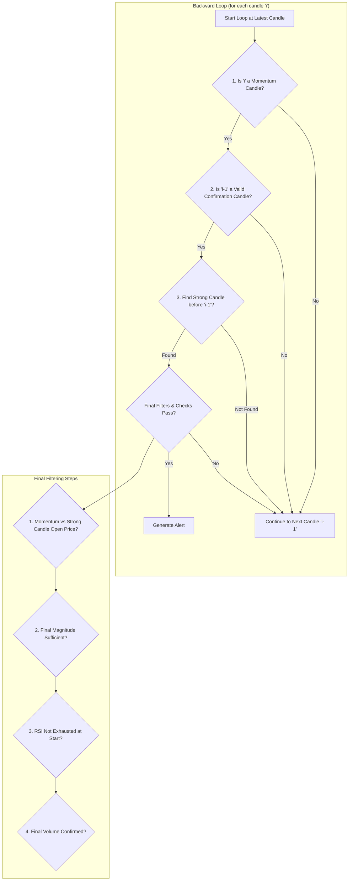

# STRONG_CANDLE

## Objective

The **Strong Candle** strategy is designed to identify moments of decisive, high-conviction momentum. It operates by identifying a specific three-part sequence that unfolds over time: a powerful initial move (the "Strong Candle"), a period of indicator-based confirmation, and finally, immediate follow-through momentum. This ensures the signal is not just a random spike but the start of a potentially sustainable move.

The logic uses a **backward loop**, which is more performant for real-time analysis. It starts from the most recent candle and works backward to identify if the complete pattern has just finished.

## Key Parameters

This approach is configured in `src/stockreports/config/signal_settings.py`. A dedicated settings class, `StrongCandleSettings`, in `src/stockreports/alert/approach/STRONG_CANDLE/settings.py` loads these parameters.

| Parameter | Default | Description |
| :--- | :--- | :--- |
| `CONFIRMATION_WINDOW` | 1 | The number of candles to look back from the confirmation candle to find the initial "Strong Candle". |
| `MIN_ALERT_MAGNITUDE` | 4 | The minimum price change required from the **close** of the strong candle to the **close** of the momentum candle. |
| `TREND_STRENGTH_STRONG_CLOSE_TAIL_RATIO` | 0.4 | A global setting that defines how small a candle's opposing wick must be relative to its body to be considered "strong." |
| `USE_DIVERGENCE_CONFIRMATION` | `False` | If `True`, checks for and requires price/indicator divergence to be present for the signal to be valid. |
| `USE_VOLUME_CONFIRMATION` | `False` | If `True`, requires the final momentum candle to have a significant volume spike. |
| `USE_INCREASING_VOLUME_CONFIRMATION` | `False` | If `True`, requires volume to be generally increasing across the entire pattern sequence. |
| `USE_LAST_CANDLE_MAX_VOLUME_CONFIRMATION` | `False` | If `True`, requires the final momentum candle to have the highest volume within the pattern window. |
| `USE_RSI_EXHAUSTION_FILTER`, `USE_MA_CONFIRMATION`, etc. | `False` | Standard confirmation flags. These are used to validate the "Confirmation Candle" and to filter the "Strong Candle". |

## Step-by-Step Logic (Backward Loop)

The core logic resides in the `StrongCandleExecutor` class in `src/stockreports/alert/approach/STRONG_CANDLE/executor.py`. The algorithm iterates backward from the most recent candle. For each candle `i`, it treats it as a potential "Momentum Candle" and applies a series of filters to see if a valid pattern has just completed.

### Signal Generation Conditions (Filtering in Reverse)

1.  **Identify Potential Momentum:**
    *   The loop starts at the latest data point. Each candle `i` is a candidate for the final "Momentum Candle".
    *   It must show momentum by closing higher than the previous candle `i-1` (for a `BUY`) or lower (for a `SELL`). If not, the pattern is invalid for this candle.

2.  **Validate the Confirmation Candle:**
    *   The algorithm checks the "Confirmation Candle" (`i-1`).
    *   This candle must receive a valid signal from the standard indicator checks (`is_signal_confirmed`), which evaluates MACD, MA, etc., based on the enabled flags. If the indicators do not confirm the trend on this candle, the pattern is invalid.

3.  **Initial Filtering (Volume, Divergence, Magnitude):**
    *   Before searching for the strong candle, a series of preliminary checks are run on the momentum candle `i`:
        *   **Volume & Divergence (Optional):** If enabled, it checks for volume spikes and price/indicator divergence.

4.  **Find the Initial Strong Candle:**
    *   If the preliminary filters pass, the algorithm searches backward from candle `i-2` for up to `CONFIRMATION_WINDOW` candles to find the "Strong Candle".
    *   A "Strong Candle" is defined as having:
        *   A body size larger than the global `MIN_EXPECTED_PROFIT_LOSS` setting.
        *   A small opposing wick (tail), based on `TREND_STRENGTH_STRONG_CLOSE_TAIL_RATIO`. For a BUY, the upper wick must be small; for a SELL, the lower wick must be small.
    *   Once the first valid "Strong Candle" is found, the search stops. If none is found in the window, the pattern is invalid.

### Final Validation and Signal Generation

If the full backward pattern (Momentum -> Confirmation -> Strong Candle) is identified, a new set of strict conditions are checked:

1.  **Momentum vs. Strong Candle Open Price:**
    *   For a **BUY** signal, the `open` of the "Momentum Candle" must be *higher* than the `open` of the "Strong Candle".
    *   For a **SELL** signal, the `open` of the "Momentum Candle" must be *lower* than the `open` of the "Strong Candle".
    *   This confirms that the final momentum started from a more advantageous price point, showing clear progression.

2.  **Final Magnitude Check:**
    *   The total price change from the **`close`** of the "Strong Candle" to the **`close`** of the "Momentum Candle" is checked against `MIN_ALERT_MAGNITUDE`. This validates the strength of the entire move.

3.  **RSI Exhaustion Filter:** The algorithm checks the candle *immediately preceding* the "Strong Candle" to ensure the move didn't start from an already overbought or oversold position.

4.  **Final Volume Check (Optional):** If enabled, it performs a more comprehensive check for a volume spike, increasing volume, or max volume across the full window from the Strong Candle to the Momentum Candle.

If all checks pass, an `AlertData` object is created, and a signal is generated.

## Flow Diagram

### Diagram Explanation

1.  **Start Loop at Latest Candle**: The algorithm begins at the most recent candle and works backward.
2.  **Is 'i' a Momentum Candle?**: Checks if candle `i` shows follow-through momentum.
3.  **Is 'i-1' a Valid Confirmation Candle?**: Validates the preceding candle (`i-1`) using standard indicators (MA, MACD, etc.).
4.  **Find Strong Candle before 'i-1'?**: If confirmation is valid, it searches back to find the initial "Strong Candle".
5.  **Final Filters & Checks Pass?**: If the complete pattern is found, it undergoes a final, rigorous set of checks.
6.  **Open Price/Magnitude/RSI/Volume**: These steps validate the signal by comparing open prices, ensuring sufficient price change, checking for exhaustion, and confirming volume patterns.
7.  **Generate Alert**: If all checks pass, an alert is generated.
8.  **Continue to Next Candle**: If any check fails, the algorithm moves to the previous candle (`i-1`).
