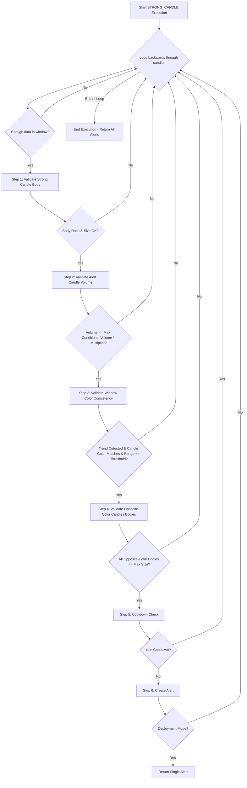

# STRONG_CANDLE Approach (Refactored v2)

## 1. Objective

The STRONG_CANDLE approach is designed to identify significant breakout signals by detecting a "strong candle" that emerges after a period of consolidation. It operates by:

1. **Identifying a strong candle** - the last candle in the lookback window with significant body size and body ratio
2. **Validating volume pattern** - ensuring the strong candle's volume doesn't exceed the maximum volume in the conditional window (all preceding candles) times a multiplier
3. **Confirming trend consistency** - ensuring the strong candle's color (green/red) matches the trend direction determined by close price extremes in the lookback window
4. **Validating opposite-color candles** - confirming that contra-trend candles in the conditional window have small bodies and don't challenge the dominant trend
5. **Applying cooldown logic** - preventing alert spam by enforcing a minimum time between alerts for the same symbol and signal

This approach captures momentum-driven moves that signal the start of a new, decisive trend.

## 2. Key Parameters

The behavior of the STRONG_CANDLE executor is controlled by the following parameters, configured in `src/stockreports/config/signal_settings.py`.

| Parameter                            | Default Value | Description                                                                                                                                                                         |
| ------------------------------------ | ------------- | ----------------------------------------------------------------------------------------------------------------------------------------------------------------------------------- |
| `LOOKBACK_WINDOW`                    | 10            | The total number of candles in the analysis window, including both the conditional window and the strong candle.                                                                     |
| `MIN_BODY_RATIO`                     | 0.8           | The minimum ratio of the candle's body to its total range (high-low) for the strong candle to qualify. Range: (0.0, 1.0].                                                          |
| `MIN_BODY_SIZE`                      | 2.5           | The minimum absolute size (price points) of the strong candle's body to qualify as "strong".                                                                                        |
| `MAX_OPPOSITE_COLOR_CANDLE_BODY_SIZE` | 2.0           | The maximum body size allowed for any candle with opposite color to the strong candle. Ensures contra-trend candles are weak and don't challenge the dominant trend.                 |
| `MAX_DIFFERENCE_PRICE_THRESHOLD`     | 2.0           | The maximum price range (high-low) allowed within the full window. Enforces that the breakout occurs from a tight consolidation.                                                     |
| `MAX_VOLUME_MULTIPLIER`              | 1.5           | The strong candle's volume must not exceed the maximum volume in the conditional window (all preceding candles) times this multiplier. Prevents false signals from isolated spike candles.                             |
| `COOLDOWN_WINDOW`                    | 3             | Time window in minutes after an alert is generated during which no new alert for the same symbol and signal can be issued. Prevents alert spam.                                     |

## 3. Step-by-Step Logic

The executor analyzes data in a reverse loop, starting from the most recent candle. For each `LOOKBACK_WINDOW`, it performs the following validation steps sequentially.

### Step 1: Validate Strong Candle Body
*   The last candle in the window is designated as the potential "strong candle" (alert candle).
*   **Validation A (Body Ratio)**: The candle's body-to-range ratio must be `>= MIN_BODY_RATIO`.
*   **Validation B (Body Size)**: The candle's absolute body size must be `>= MIN_BODY_SIZE`.
*   If either validation fails, the window is discarded and the loop continues.
*   **Returns**: `body_size` - the actual body size of the alert candle.

### Step 2: Validate Alert Candle Volume
*   Compares the strong candle's volume against the maximum volume found in the conditional window (all candles except the strong candle).
*   **Validation**: `alert_candle_volume <= max_conditional_window_volume * MAX_VOLUME_MULTIPLIER`.
*   This check prevents false breakout signals from isolated spike candles by ensuring the strong candle's volume is not disproportionately larger than the preceding consolidation period.
*   If validation fails, the window is discarded.

### Step 3: Validate Window Color Consistency
*   Determines the overall trend of the full `LOOKBACK_WINDOW` using `window_utils.get_window_size_and_trend_by_close_extremes()`:
    - Identifies the minimum close price and maximum close price within the window
    - **UPTREND**: Minimum close is encountered before maximum close (prices trending upward)
    - **DOWNTREND**: Maximum close is encountered before minimum close (prices trending downward)
*   Also validates that the window's price range (high - low) does not exceed `MAX_DIFFERENCE_PRICE_THRESHOLD`.
*   **Validation A**: The strong candle's color must match the window trend:
    - **UPTREND**: Strong candle must be GREEN → Signal = **BUY**
    - **DOWNTREND**: Strong candle must be RED → Signal = **SELL**
*   If any validation fails, the window is discarded.
*   **Returns**: `(signal, window_trend)` - the determined signal and trend.

### Step 4: Validate Opposite-Color Candles' Bodies
*   Filters candles in the conditional window (all candles except the strong candle) that have **opposite color** to the strong candle.
*   These are the contra-trend (pullback/resistance) candles that must be weak for the dominant trend to be established.
*   **Validation**: Every opposite-color candle must have `body_size <= MAX_OPPOSITE_COLOR_CANDLE_BODY_SIZE`.
*   This confirms that pullback/counter-trend candles are weak and don't challenge the strong candle's dominance.
*   If validation fails, the window is discarded.

### Step 5: Cooldown Check
*   Checks if an alert with the same symbol and signal has already been issued within the `COOLDOWN_WINDOW` time period.
*   Uses the base class's `_step_cooldown_check()` method, which calls `is_in_cooldown()` utility.
*   Compares against `StrongCandleExecutor.LATEST_ALERT` (class-level state variable).
*   If the alert is in cooldown, the window is discarded.
*   If the alert passes cooldown, a `Validation` object is recorded.

### Step 6: Alert Creation
*   If all previous steps pass, constructs the alert details dictionary including:
    - `body_size`: The strong candle's body size
    - `window_trend`: The overall window trend (UPTREND or DOWNTREND)
    - `strong_candle_time`: ISO format timestamp of the strong candle
*   Calls `_create_alert_with_details()` (from base class) to construct the `AlertData` object.
*   Appends the alert to `self.alerts` and updates `StrongCandleExecutor.LATEST_ALERT`.
*   **Deployment Mode**: Returns immediately after the first valid alert.
*   **Development Mode**: Continues looping to find all valid alerts in the historical data.

## 4. Validation Tracking

All validations follow the standardized pattern defined in the executor rules:

- **Configuration-Tied Validations Only**: Only `Validation` objects are created for checks tied to configuration settings (e.g., `MIN_BODY_RATIO`, `MAX_VOLUME_MULTIPLIER`, etc.).
- **Automated Naming**: Each `Validation` uses `nameof()` to set the name to the exact config variable name.
- **Serialization**: All validations are serialized to JSON and included in the `AlertData.details` field as a `validations` array.

**Validations tracked**:
1. `min_body_ratio` - Step 1
2. `min_body_size` - Step 1
3. `max_volume_multiplier` - Step 2
4. `max_window_size_threshold` - Step 3
5. `candle_trend_consistency` - Step 3 (logic-based, not config-tied, but tracked for completeness)
6. `max_opposite_color_candle_body_size` - Step 4

## 5. Flow Diagram

## 6. Architecture & Best Practices

The refactored STRONG_CANDLE executor adheres to the following architectural patterns:

### Standardized Logging & Context Management
- Uses centralized `log()` factory from `src/stockreports/utils/log_factory.py`
- Maintains context variables: `current_step`, `current_window_start_time`, `current_window_end_time`
- Context is reset at each loop iteration using `get_window_context()` base class utility

### Standardized Loop Setup
- Uses `get_loop_setup()` from base class to prepare indexed DataFrame and loop boundaries
- Calculates loop boundaries in DEVELOPMENT mode (all alerts) vs DEPLOYMENT mode (first alert only)

### Cooldown Management
- Uses standardized `is_in_cooldown()` utility function with class-level `LATEST_ALERT` state variable
- Ensures consistent cooldown behavior across all executors

### Step Function Encapsulation
- Each validation step is implemented as a dedicated private method (e.g., `_step_validate_alert_candle_body()`)
- Step methods handle their own logging and validation tracking
- Main loop remains clean and focused on orchestration

### Alert Data Encapsulation
- Complex `AlertData` object creation is handled by base class's `_create_alert_with_details()` method
- Details dictionary is passed separately for clean separation of concerns

## 7. Code Cleanup & Removed Elements

**Removed during refactoring**:
- Old `_validate_open_extremes()` method (was checking extremes of open prices - logic not required by new design)
- `TREND_WINDOW_EDGE_SLICE` configuration parameter (was used by old extremes validation)
- Manual loop setup code (replaced with base class utility)
- Inline context variable management (replaced with base class utility)
- Redundant validation step tracking (standardized to use `next_step()` and `next_validation()`)

**Architecture improvements**:
- Lines of code reduced by ~50% through utility consolidation
- Cleaner separation between orchestration (main loop) and validation (step methods)
- Consistent with CVA and VRA executor patterns
