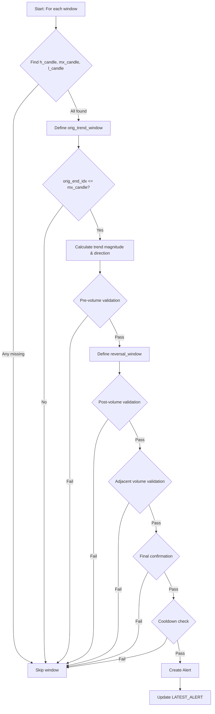

# TREND_REVERSAL Approach

## 1. Objective

The TREND_REVERSAL approach is designed to identify high-confidence market reversals by analyzing a sequence of price and volume patterns within a configurable lookback window. It detects situations where a strong trend, confirmed by magnitude and volume multipliers, is followed by a reversal window that meets strict validation criteria. The goal is to capture turning points in the market with robust, stepwise validation and minimal false positives.

## 2. Key Parameters

The behavior of the TREND_REVERSAL executor is controlled by the following parameters, configured in `src/stockreports/config/signal_settings.py`.

| Parameter                   | Default Value | Description                                                                                      |
|-----------------------------|---------------|--------------------------------------------------------------------------------------------------|
| `LOOKBACK_WINDOW`           | 15            | Number of candles to include in the analysis window.                                             |
| `MIN_PRE_VOLUME_MULTIPLIER` | 5.0           | Minimum ratio of pre-trend volume required for validation.                                       |
| `MIN_POST_VOLUME_MULTIPLIER`| 2.0           | Minimum ratio of post-trend volume required for validation.                                      |
| `MIN_ADJACENT_VOLUME_MULTIPLIER` | 2.0      | Minimum ratio for adjacent volume validation in the reversal window.                             |
| `MIN_TREND_MAGNITUDE`       | 4.5           | Minimum price change required for a trend to be considered significant.                          |
| `COOLDOWN_WINDOW`           | 3             | Number of candles to wait before issuing another alert for the same symbol and signal.           |

## 3. Step-by-Step Logic

The TREND_REVERSAL executor processes data in reverse, starting from the most recent candle. For each analysis window, it performs the following steps:

1. **Step 1: Pre-requisite Candle Identification**
   - Identify the highest close (`h_candle`), highest volume (`mx_candle`), and lowest close (`l_candle`) within the lookback window.
   - If any are missing, skip the window.

2. **Step 2: Trend Window & Pre-Validations**
   - Define the original trend window between `h_candle` and `l_candle`.
   - Validate that the trend window ends before the max-volume candle.
   - Calculate the trend magnitude and direction.
   - Validate pre-trend volume using `MIN_PRE_VOLUME_MULTIPLIER`.

3. **Step 3: Post-Trend & Reversal Window Validations**
   - Define the reversal window starting from the max-volume candle.
   - Validate post-trend volume using `MIN_POST_VOLUME_MULTIPLIER`.
   - Validate adjacent volume using `MIN_ADJACENT_VOLUME_MULTIPLIER`.

4. **Step 4: Final Confirmation**
   - Confirm that the potential alert candle's close is between the lowest and highest close in the window.
   - Additional checks for cooldown period and alert uniqueness.

5. **Step 5: Cooldown Check**
   - Ensure no similar alert has been issued within the `COOLDOWN_WINDOW`.

6. **Step 6: Alert Creation**
   - If all validations pass, create a new alert with detailed context and update the latest alert.

## 4. Flow Diagram

