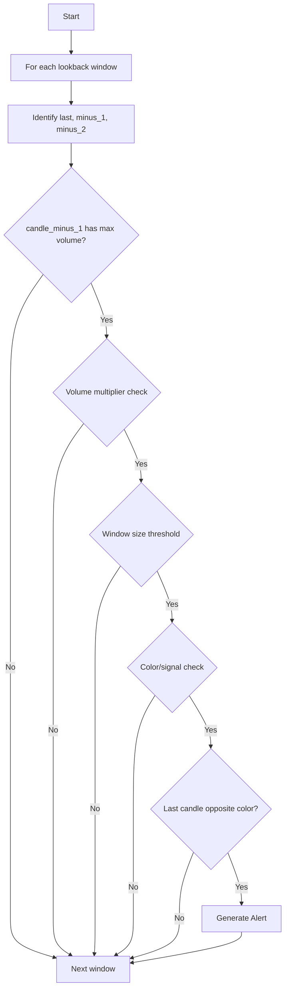

# VOLUME_REVERSAL Approach Documentation

## Objective
Detects reversal signals based on volume spikes and candle color/signal patterns in a configurable lookback window.

## Key Parameters
| Parameter                  | Default | Description                                                        |
|----------------------------|---------|--------------------------------------------------------------------|
| LOOKBACK_WINDOW            | 20      | Number of candles in the lookback window                           |
| MAX_VOLUME_MULTIPLIER      | 2.0     | Upper bound multiplier for volume comparison                       |
| MIN_VOLUME_MULTIPLIER      | 1.2     | Lower bound multiplier for volume comparison                       |
| MAX_WINDOW_SIZE_THRESHOLD  | 2.0     | Upper bound for window size (trend magnitude)                      |
| MIN_WINDOW_SIZE_THRESHOLD  | 0.5     | Lower bound for window size (trend magnitude)                      |

## Step-by-Step Logic
1. For each window in the lookback period:
    - Identify the lookback window and extract the last three candles: last, minus_1, minus_2.
    - Validation 1: Build a consistent trend window ending at `candle_minus_1` (last-1), going backward until a candle with the opposite trend is found. The trend window must have at least 2 candles.
    - Validation 2: `candle_minus_1` has the max volume in the lookback window.
    - Validation 3: The min volume in the trend window is used for the volume multiplier check: `MAX_VOLUME_MULTIPLIER * min_volume > max_volume > MIN_VOLUME_MULTIPLIER * min_volume`.
    - Validation 4: If `trend_1` is UPTREND, `max_vol_candle` has the highest close price in the trend window. If DOWNTREND, `max_vol_candle` has the lowest close price in the trend window.
    - Validation 5: Window size threshold: `MAX_WINDOW_SIZE_THRESHOLD > window size > MIN_WINDOW_SIZE_THRESHOLD`.
    - Validation 6: The last candle has the opposite trend to `candle_minus_1`.
    - If all validations pass, generate an alert.

## Flow Diagram

## Example Usage
- Configure the approach in `signal_settings.py`.
- Use the generic debug executor to test with historical data.

## Checklist
- [x] All validations and logging follow codebase rules
- [x] Centralized settings and configuration
- [x] Debug script compatible
- [x] Documentation and code in sync
- [x] Edge cases (insufficient data, color/signal mismatches) handled
