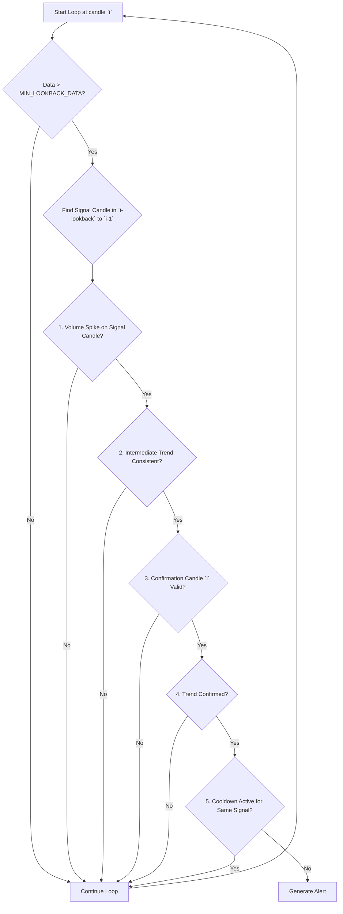

# VOLUME_SPIKE_CONFIRMATION

## Objective

The **Volume Spike Confirmation** strategy is designed to identify potentially significant market moves that are initiated by a sudden surge in trading volume and immediately confirmed by a strong follow-up candle. The core idea is to filter out random noise by requiring two distinct events in sequence: a volume anomaly followed by price conviction.

## Key Parameters

This approach is configured in `src/stockreports/config/signal_settings.py`. A dedicated settings class, `VolumeSpikeConfirmationSettings`, in `src/stockreports/alert/approach/VOLUME_SPIKE_CONFIRMATION/settings.py` loads these parameters.

| Parameter | Default | Description |
| :--- | :--- | :--- |
| `SIGNAL_LOOKBACK_PERIOD` | 3 | The number of candles to look back from the confirmation candle to find the signal candle (the one with the highest volume). |
| `VOLUME_SPIKE_MULTIPLIER` | 2.5 | The volume of the "signal candle" must be at least this many times greater than the average intraday volume calculated up to that point. |
| `MIN_CONFIRMATION_BODY_SIZE` | 1.0 | The minimum absolute size (in price points) of the body of the "confirmation candle". |
| `MIN_CONFIRMATION_BODY_RATIO` | 0.6 | The minimum ratio of the confirmation candle's body to its total range (`body / (high - low)`). This ensures the candle is decisive. |
| `COOLDOWN_PERIOD` | 2 | The number of minutes to wait after an alert of the same signal (BUY/SELL) before firing another one. |
| `MIN_LOOKBACK_DATA` | 30 | The minimum number of candles required in the dataset to ensure a reliable average volume calculation. |

## Step-by-Step Logic (Backward Loop)

The core logic resides in the `VolumeSpikeConfirmationExecutor` class. It uses a reverse loop for real-time efficiency. For each candle `i`, it treats it as a potential "confirmation candle" and searches for a "signal candle" in the preceding window.

The process begins with a data sufficiency check:
- **Minimum Data Check:** Before any analysis, the executor verifies that it has at least `MIN_LOOKBACK_DATA` candles. If not, it logs a warning and exits, preventing calculations on an unreliable sample size.

The pattern consists of two key candles:
1.  **The Confirmation Candle (at index `i`):** The candle that validates the move and triggers the alert.
2.  **The Signal Candle (within `i-lookback` to `i-1`):** The candle within the lookback window that has the highest trading volume.

### Signal Generation Conditions

1.  **Identify Signal Candle:**
    *   For each potential confirmation candle `i`, the algorithm first examines the window of `SIGNAL_LOOKBACK_PERIOD` candles immediately preceding it.
    *   It identifies the single candle within this window that has the highest volume. This becomes the `signal_candle`.

2.  **Check for Volume Spike:**
    *   The algorithm calculates the average volume of all candles that occurred *before* this `signal_candle`.
    *   It checks if the volume of the `signal_candle` is greater than or equal to this average volume multiplied by `VOLUME_SPIKE_MULTIPLIER`.
    *   If there is no volume spike, the pattern is invalid, and the loop continues.

3.  **Validate Intermediate Trend Consistency:**
    *   After a valid volume spike, the algorithm enforces a strict trend consistency rule.
    *   It examines all candles in the window starting from the `signal_candle` up to, but not including, the `confirmation_candle`.
    *   All candles within this intermediate window must have the same direction (i.e., they must all be green or all be red).
    *   If there is any mix of green and red candles, the pattern is considered invalid, and the loop continues.

4.  **Validate Confirmation Candle:**
    *   If the intermediate trend is consistent, the algorithm then validates the confirmation candle (`i`):
        *   **Body Size:** Its absolute body size (`abs(close - open)`) must be greater than or equal to `MIN_CONFIRMATION_BODY_SIZE`.
        *   **Body-to-Range Ratio:** Its body must make up at least `MIN_CONFIRMATION_BODY_RATIO` of its total range.

5.  **Determine Signal Trend:**
    *   If the confirmation candle is valid, the final check determines the signal direction:
        *   **BUY Signal:** The confirmation candle must be green (`close > open`) AND its closing price must be higher than the closing price of the signal candle.
        *   **SELL Signal:** The confirmation candle must be red (`close < open`) AND its closing price must be lower than the closing price of the signal candle.

    *   If all conditions are met, an `AlertData` object is created.

## Cooldown Logic

To prevent alert spam, a cooldown mechanism is implemented:
- The executor tracks the timestamp and signal (`BUY` or `SELL`) of the last alert.
- If a new alert is about to be generated, it checks if the signal is the same as the last one.
- If the signals are the same, it calculates the time elapsed since the last alert. If this duration is less than `COOLDOWN_PERIOD` minutes, the new alert is suppressed.
- An alert with a different signal will always be triggered, regardless of the cooldown.

## Flow Diagram

