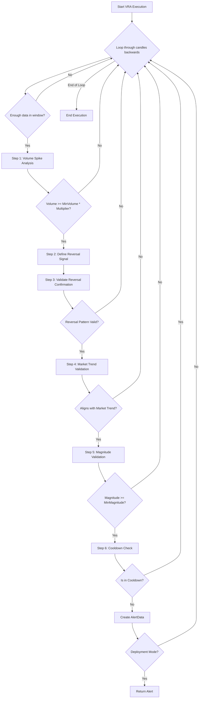

````markdown
# VRA (Volume-Reversal-Anchor) Approach

## 1. Objective

The VRA (Volume-Reversal-Anchor) approach is designed to identify significant trend reversals by pinpointing a specific sequence of market events. The core idea is to find a moment of capitulation or exhaustion, marked by a massive volume spike, which then serves as an "anchor" for a subsequent, confirmed price reversal. This strategy is particularly effective at capturing sharp turns in the market.

## 2. Key Parameters

The behavior of the VRA executor is controlled by the following parameters, which are configured in `src/stockreports/config/signal_settings.py`.

| Parameter                             | Default Value | Description                                                                                                                              |
| ------------------------------------- | ------------- | ---------------------------------------------------------------------------------------------------------------------------------------- |
| `LOOKBACK_WINDOW`                     | 10            | The number of candles to include in the analysis window.                                                                                 |
| `MIN_TREND_MAGNITUDE`                 | 7.0           | The minimum price change (magnitude) required from the anchor candle to the reversal candle for the trend to be considered significant.      |
| `VOLUME_MULTIPLIER`                   | 4.0           | The volume of the anchor candle must be at least this many times greater than the minimum volume in the preceding part of the window.       |
| `MIN_ALERT_BODY_SIZE`                 | 0.3           | The minimum body size of the candles involved in the reversal confirmation pattern.                                                      |
| `MAX_DISTANCE_CLOSE_PRICE`            | 2.0           | The maximum allowed price difference between the close prices of the candles in the reversal pattern.                                    |
| `COOLDOWN_WINDOW`                     | 3             | The number of candles to wait after an alert is generated before another alert of the same type can be issued.                           |
| `ENABLE_MARKET_TREND_VALIDATION`      | `True`        | If `True`, the alert will only be triggered if it aligns with the broader market trend (e.g., a BUY signal during a market uptrend).       |
| `IMPACT_SYMBOLS_MIN_BODY_TO_RANGE_RATIO` | 0.3           | When validating against the market trend, this is the minimum body-to-range ratio required for the candles of impact symbols (like VN30). |

## 3. Step-by-Step Logic

The VRA executor analyzes the data in a reverse loop, starting from the most recent candle and moving backward. For each analysis window, it performs the following validation steps in a specific order for maximum efficiency.

1.  **Volume Spike Analysis**:
    *   The algorithm first identifies the candle with the highest volume within the `LOOKBACK_WINDOW`. This is the "volume anchor".
    *   It then finds the candle with the minimum volume in the period *before* the volume anchor.
    *   **Validation**: The volume of the anchor candle must be greater than or equal to the minimum volume multiplied by the `VOLUME_MULTIPLIER`. If not, the window is discarded.

2.  **Reversal Signal Definition**:
    *   A confirmation window is defined, starting from the volume anchor candle to the end of the lookback window.
    *   The potential reversal signal (`BUY` or `SELL`) is determined by comparing the close price of the volume anchor to the close price of the first candle in the lookback window.

3.  **Reversal Confirmation**:
    *   The algorithm calls the shared `validate_reversal_confirmation` utility on the confirmation window.
    *   **Validation**: This utility checks for a valid reversal pattern (e.g., a strong bullish candle after a downtrend). It must find a valid `alert_candle` and `anchor_candle` for the reversal. If no pattern is found, the window is discarded.

4.  **Market Trend Validation (Optional)**:
    *   If `ENABLE_MARKET_TREND_VALIDATION` is `True`, the executor checks if the identified `reversal_signal` aligns with the concurrent trend of the broader market (e.g., VN30).
    *   **Validation**: If the signal opposes the market trend, the window is discarded.

5.  **Magnitude Validation**:
    *   The magnitude of the price move is calculated.
        *   For a `SELL` signal, it's the difference between the anchor candle's close and the lowest close in the window.
        *   For a `BUY` signal, it's the difference between the highest close in the window and the anchor candle's close.
    *   **Validation**: The calculated magnitude must be greater than or equal to `MIN_TREND_MAGNITUDE`.

6.  **Cooldown Check**:
    *   The algorithm checks if a similar alert (same symbol and signal) has been issued within the `COOLDOWN_WINDOW`.
    *   **Validation**: If the alert is within the cooldown period, it is suppressed.

7.  **Alert Generation**:
    *   If all the above validations pass, a new `AlertData` object is created and stored.
    *   In `DEPLOYMENT` mode, the function returns immediately with the new alert. In `DEVELOPMENT` mode, the loop continues to find all historical alerts.

## 4. Flow Diagram


````
