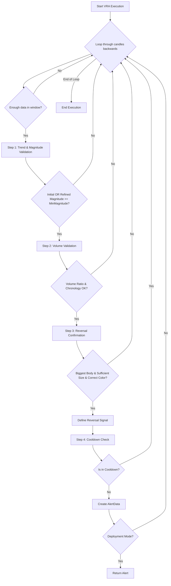

# VRA (Volume-Reversal-Anchor) Approach v2

## 1. Objective

The VRA (Volume-Reversal-Anchor) approach identifies high-probability trend reversals by detecting a sequence of a significant trend, a volume spike, and a decisive reversal candle. It aims to capture market turning points by ensuring the initial move has sufficient momentum (magnitude), is accompanied by a surge in volume (the "anchor"), and is followed by a clear, confirmed reversal pattern.

## 2. Key Parameters

The behavior of the VRA executor is controlled by the following parameters, configured in `src/stockreports/config/signal_settings.py`.

| Parameter             | Default Value | Description                                                                                                                                                              |
| --------------------- | ------------- | ------------------------------------------------------------------------------------------------------------------------------------------------------------------------ |
| `LOOKBACK_WINDOW`     | 10            | The number of candles to include in the analysis window.                                                                                                                 |
| `MIN_TREND_MAGNITUDE` | 7.0           | The minimum price change required for a trend to be considered significant. This is validated against both the full window and a refined window starting from a peak/trough. |
| `VOLUME_MULTIPLIER`   | 4.0           | The volume of the highest-volume candle must be at least this many times greater than the volume of the lowest-volume candle within the lookback window.                  |
| `COOLDOWN_WINDOW`     | "120min"      | A time duration (e.g., "120min") after an alert is generated during which no new alert for the same symbol and signal can be issued.                                      |

## 3. Step-by-Step Logic

The VRA executor analyzes data in a reverse loop, starting from the most recent candle. For each analysis window, it performs the following validation steps sequentially.

1.  **Step 1: Trend & Magnitude Validation**
    *   The algorithm first determines the trend and magnitude of the entire `LOOKBACK_WINDOW`.
    *   It then refines this by identifying the highest peak (for downtrends) or lowest trough (for uptrends) and recalculating the magnitude from that point to the end of the window.
    *   **Validation**: The check passes if **either** the initial full-window magnitude **or** the refined peak/trough-based magnitude meets the `MIN_TREND_MAGNITUDE` threshold. If not, the window is discarded.
    *   An `original_signal` (`BUY` for an uptrend, `SELL` for a downtrend) is determined based on the validated trend.

2.  **Step 2: Volume Validation**
    *   It identifies the candles with the maximum and minimum volume within the entire window.
    *   **Validation A (Ratio)**: The volume of the max-volume candle must be greater than or equal to the min-volume candle's volume multiplied by `VOLUME_MULTIPLIER`.
    *   **Validation B (Chronology)**: The min-volume candle must occur chronologically *before* the max-volume candle.
    *   If either volume validation fails, the window is discarded.

3.  **Step 3: Reversal Confirmation**
    *   The alert candle is the last candle in the analysis window. No additional checks for biggest body, minimum body size, or color consistency are performed in the current implementation.

4.  **Step 4: Final Checks & Alert Generation**
    *   If all previous steps pass, a `reversal_signal` is defined as the opposite of the `original_signal`.
    *   **Cooldown Check**: The algorithm checks if a similar alert (same symbol and `reversal_signal`) has been issued within the `COOLDOWN_WINDOW`. If so, the alert is suppressed.
    *   **Alert Generation**: If the cooldown check passes, a new `AlertData` object is created with the `reversal_signal`, and the class-level `LATEST_ALERT` is updated.

## 4. Flow Diagram

