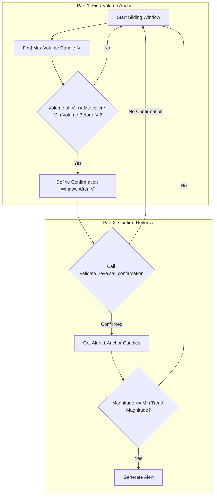

````markdown
# VRA (Volume-Reversal-Anchor)

## Objective

The **Volume-Reversal-Anchor (VRA)** approach is a reversal strategy designed to identify significant trend changes that are anchored by a decisive volume spike. It operates by first identifying a candle with exceptionally high volume within a lookback window and then validating that a clear, confirmed reversal pattern emerges immediately following that volume event.

The logic operates on a sliding window, analyzing a `LOOKBACK_WINDOW` of candles at a time.

## Key Parameters

This approach is configured in `src/stockreports/config/signal_settings.py`. A dedicated settings class, `VraSettings`, in `src/stockreports/alert/approach/VRA/settings.py` loads these parameters.

| Parameter | Default | Description |
| :--- | :--- | :--- |
| `LOOKBACK_WINDOW` | 10 | The number of candles in the sliding window used to identify a pattern. |
| `VOLUME_MULTIPLIER` | 4.0 | The factor by which the anchor volume candle must exceed the minimum volume that occurred *before* it in the window. |
| `MIN_ALERT_BODY_SIZE` | 0.3 | The minimum required body size (open-close difference) of the final alert candle to ensure it's a decisive move. |
| `MAX_DISTANCE_CLOSE_PRICE` | 2.0 | The maximum allowed price difference between the close of the anchor candle and the close of the alert candle during a reversal confirmation. |
| `MIN_TREND_MAGNITUDE` | 10.0 | The minimum price change required between the anchor candle and the window's peak/trough to be considered a valid trend. |

## Step-by-Step Logic

The core logic is implemented in the `VraExecutor` class in `src/stockreports/alert/approach/VRA/executor.py`. The process is optimized for performance by starting with the highest-impact checks first.

### Part 1: Identifying the Volume Anchor

1.  **Locate Volume Anchor (Candle V):**
    *   Within the `LOOKBACK_WINDOW`, the algorithm identifies the candle with the absolute maximum volume. This is the "Volume Anchor" (Candle V).

2.  **Validate Volume Spike:**
    *   The algorithm finds the minimum volume in the period *before* Candle V.
    *   **Condition:** The volume of Candle V must be `>= VOLUME_MULTIPLIER` times this preceding minimum volume. This ensures the volume spike is a significant escalation, not just part of a high-volume period. If not, the window is discarded.

### Part 2: Confirming the Reversal

3.  **Define Confirmation Window & Signal:**
    *   A "confirmation window" is defined, starting from Candle V to the end of the lookback window.
    *   A potential signal is inferred by comparing Candle V's price to the first candle of the lookback window. If Candle V is higher, a `SELL` reversal is anticipated; if lower, a `BUY` reversal is anticipated.

4.  **Validate Reversal Confirmation:**
    *   The logic calls the standardized `validate_reversal_confirmation` function on the confirmation window.
    *   **Condition 1:** This function checks if a valid reversal pattern exists after the volume spike. It looks for a new candle (the "Alert Candle") that confirms the reversal direction and has a body size of at least `MIN_ALERT_BODY_SIZE`.
    *   **Condition 2:** It also validates that the price distance between the reversal's anchor candle and the final alert candle is no more than `MAX_DISTANCE_CLOSE_PRICE`.
    *   If no confirmed reversal is found, the window is discarded.

5.  **Final Magnitude Validation:**
    *   The algorithm calculates the price difference (magnitude) between the anchor candle and the peak/trough of the trend it is reversing.
        *   For a `SELL` signal, this is `abs(Anchor Close - Window's Min Close)`.
        *   For a `BUY` signal, this is `abs(Window's Max Close - Anchor Close)`.
    *   **Condition:** The magnitude must be `>= MIN_TREND_MAGNITUDE`.

If all conditions are met, an alert is generated based on the Alert Candle identified in step 4.

## Flow Diagram


````
